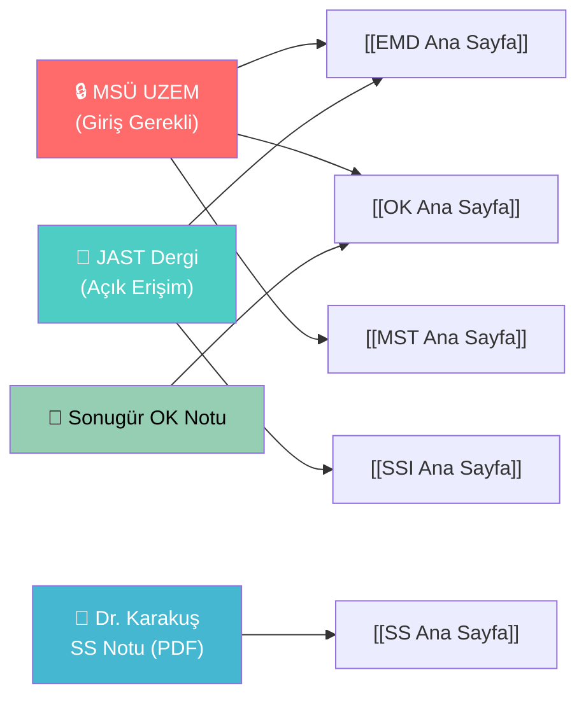

# Dış Kaynaklar ve MSÜ Rehberi

← [[HOME]]

> OSINT ile bulunan herkese açık ve MSÜ'ye ait akademik kaynaklar

---

## MSÜ Hava Harp Okulu — Erişim Rehberi

### UZEM Platformu (uzem.msu.edu.tr)

> [!warning] Giriş Gerekli
> UZEM tamamen kurumsal SSO ile korunuyor. Misafir erişimi yok. **MSÜ hesabınla giriş yap.**

| Bölüm | URL | İçerik |
|-------|-----|--------|
| **Havacılık & Uzay Müh.** | [categoryid=309](https://uzem.msu.edu.tr/course/index.php?categoryid=309) | Uçak sistemleri, aerodinamik |
| **Endüstri & Sistem Müh.** | [categoryid=81](https://uzem.msu.edu.tr/course/index.php?categoryid=81) | Sistem mühendisliği |
| **Tüm Kurslar** | [categoryid=47](https://uzem.msu.edu.tr/course/index.php?categoryid=47) | Lisans eğitim portali |
| **Ana Sayfa** | [uzem.msu.edu.tr](https://uzem.msu.edu.tr/) | Giriş noktası |

**Önerilen adımlar:**
1. `uzem.msu.edu.tr` → MSÜ hesabınla giriş
2. Elektronik Mühendisliği bölümüne git
3. Sinyaller, EMD, Kontrol derslerini bul → ders notlarını ve slaytları indir

---

### JAST — Journal of Aeronautics and Space Technologies

> HHO'nun açık erişim hakemli dergisi — **tam metin PDF ücretsiz**

- **Ana Sayfa:** [jast.hho.msu.edu.tr](https://jast.hho.msu.edu.tr/)
- **ISSN:** 1304-0448 · 2003'ten beri yayında
- **İndeksler:** Google Scholar, DOAJ, ULAKBİM TR Dizin, EBSCOhost

**İlgili Makaleler (doğrudan açık erişim):**

| Makale | Konu | Link |
|--------|------|------|
| C-Band 2×2 ve 3×3 Phased Array Patch Anten | Anten tasarımı, EM | [Görüntüle](https://jast.hho.msu.edu.tr/index.php/JAST/article/view/562) |
| Radar Sistemlerine Negatif Etkiler | Radar, EMI | [İndir](https://dergipark.org.tr/en/pub/ijast/article/1602017) |
| Malzeme Karakterizasyonu (8-12 GHz) | Elektromanyetik ölçüm | [İndir](https://jast.hho.msu.edu.tr/index.php/JAST/article/download/79/74/189) |

> JAST'ta arama yap: `"elektromanyetik"`, `"sinyal"`, `"kontrol sistemi"`, `"radar"`, `"ILS"`, `"autopilot"`

---

### HHO Ders İçerikleri (Halka Açık Sayfalar)

| Bölüm | URL | İlgili Ders |
|-------|-----|-------------|
| **Elektronik Müh. Bölümü** | [hho.msu.edu.tr](https://hho.msu.edu.tr/sayfadetay.aspx?SayfaId=9&ParentMenuId=43) | Elektromanyetik, Sinyal |
| **Ders İçerikleri Sayfası** | [hho.msu.edu.tr](https://hho.msu.edu.tr/sayfadetay.aspx?SayfaId=38&ParentMenuId=18) | Tüm bölümler |
| **Lisans Programları** | [hho.msu.edu.tr](https://hho.msu.edu.tr/sayfadetay.aspx?SayfaId=30&ParentMenuId=18) | Program tanımları |
| **HHO Kütüphanesi** | [hho.msu.edu.tr](https://hho.msu.edu.tr/sayfadetay.aspx?SayfaId=2&ParentMenuId=1) | Basılı ve elektronik kaynaklar |

---

## Halka Açık Türkçe Ders Notları (Ücretsiz)

### Sinyaller ve Sistemler

| Kaynak | İçerik | Erişim |
|--------|--------|--------|
| **Dr. Cahit Karakuş (2018)** | CT/DT sinyal, Fourier, Laplace, Z-dönüşüm, Matlab | `DATASET/Sinyaller Ve Sistemler/Dr_Cahit_Karakus_SinyallerSistemler_2018.pdf` ✅ |
| atasevinc.net | DZD özellikleri, fark denklemleri, konvolüsyon | [atasevinc.net/dersler.php](https://atasevinc.net/dersler.php) |
| Oppenheim (İngilizce) | Klasik ders kitabı | `DATASET/Sinyaller Ve Sistemler/Signals_and_Systems_2nd_Edition_by_Oppen.pdf` ✅ |

### Otomatik Kontrol

| Kaynak | İçerik | Erişim |
|--------|--------|--------|
| **Doç. Dr. Güray Sonugür** | Sistem tasarımı, PID, MATLAB, sınav yanıtları (2025-2026) | [guraysonugur.aku.edu.tr](https://guraysonugur.aku.edu.tr/2022/05/30/otomatik-kontrol-ders-notlari/) |
| EMO Kontrol Ders Notu | Temel kontrol, kararlılık | [emo.org.tr](https://www.emo.org.tr/ekler/a8f19b3900fcc6c_ek.pdf) |
| Fırat Üniversitesi | Kontrol sistemleri | [firat.edu.tr](https://eemtf.firat.edu.tr/ee.tek.firat.edu.tr/files/Otomatik_Kontrol.pdf) |

### Elektromanyetik Dalga Teorisi

| Kaynak | İçerik | Erişim |
|--------|--------|--------|
| Sakarya Üniv. (Çağlar Gül) | Özet notlar | [Scribd](https://www.scribd.com/doc/251852320/Elektromanyetik-Dalga-Teorisi-Sakarya-Universitesi-Ca%C4%9Flar-GUL-Ders-Notu) |
| Sakarya EEE PDF | Tam ders notu | [eee.sakarya.edu.tr](https://eee.sakarya.edu.tr/sites/eee.sakarya.edu.tr/file/ELEKTROMANYETIK_DALGA_TEORISI.pdf) |
| Kocaeli Üniv. | Ders notları | [Scribd](https://www.scribd.com/document/251852315/Elektromanyetik-Dalga-Teorisi-Kocaeli-Universitesi-Ders-Notlar%C4%B1) |
| TÜBİTAK Açık Ders | EM dalga PDF bölüm 2 | [acikders.tuba.gov.tr](https://acikders.tuba.gov.tr/) |

### Sayısal Sinyal İşleme

| Kaynak | İçerik | Erişim |
|--------|--------|--------|
| **Ankara Üniv. Açık Ders** | 14 haftalık DSP, Z-dönüşüm, DFT, FFT, MATLAB | [ankara.edu.tr](https://acikders.ankara.edu.tr/course/view.php?id=837) |

---

## Kaynakları Vault'a Bağlantıları

---

## MSÜ UZEM'e Giriş Sonrası Yapılacaklar

UZEM'e giris yaptıktan sonra şu dersleri ara:

1. **ELK xxx — Elektromanyetik Dalga Teorisi** → Slayt + soru bankası
2. **ELK xxx — Sinyaller ve Sistemler** → Haftalık notlar
3. **ELK xxx — Sayısal Sinyal İşleme** → Lab ve ödevler
4. **ELK xxx — Otomatik Kontrol** → Simülasyon dosyaları (MATLAB/Simulink)
5. **ELK xxx — Mühendislik Sistem Tasarımı** → Proje dökümanları

İndirilen materyaller → `DATASET/<ders>/` klasörüne at → Vault otomatik embed eder.
