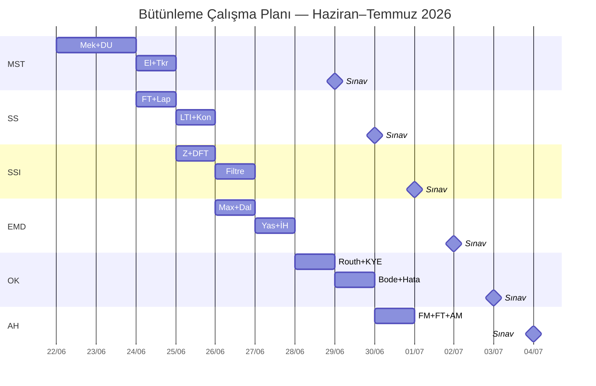

# Sınav Takvimi ve Çalışma Stratejisi

← [[HOME]]

## Sınav Tarihleri (Resmi Takvim)

| Tarih          | Sınav                                                             | Saat  | Sınav Gecesi                                                                    |
| -------------- | ----------------------------------------------------------------- | ----- | ------------------------------------------------------------------------------- |
| **29 Haz Pzt** | [[MST Ana Sayfa\|MST&B]] | 09:00 | [[MST Sınav Gecesi\|MST Sınav Gecesi]] |
| **30 Haz Sal** | [[Sİnyaller ve Sistemler/SS Ana Sayfa\|SS]]                       | 09:00 | [[Sİnyaller ve Sistemler/SS Sınav Gecesi\|SS Sınav Gecesi]]                     |
| **1 Tem Çar**  | [[Sayısal Sinyal İşleme/SSI Ana Sayfa\|SSİ]]                      | 09:00 | [[Sayısal Sinyal İşleme/SSI Sınav Gecesi\|SSI Sınav Gecesi]]                    |
| **2 Tem Per**  | [[Elektromanyetik Dalga Teorisi/EMD Ana Sayfa\|EMD]]              | 09:00 | [[Elektromanyetik Dalga Teorisi/EMD Sınav Gecesi\|EMD Sınav Gecesi]]            |
| **3 Tem Cum**  | [[Otomatik Kontrol/OK Ana Sayfa\|OK]]                             | 09:00 | [[Otomatik Kontrol/OK Sınav Gecesi\|OK Sınav Gecesi]]                           |
| **4 Tem Cmt**  | [[Analog Haberleşme/AH Ana Sayfa\|AH]]                           | 14:00 | [[Analog Haberleşme/AH Sınav Gecesi\|AH Sınav Gecesi]]                          |

> Bugün: `=dateformat(today, "dd MMMM")` — ilk sınava **`=round(date("2026-06-29") - today)`** gün kaldı.

---

## Günlük Çalışma Planı

---

## Sınav Stratejisi

### Formül Sayfaları
Her dersin [[../Elektromanyetik Dalga Teorisi/EMD Formül Sayfası|Formül Sayfası]] notunu çıkar ve yanında tut.

### Önce Konular, Sonra Sorular
1. Hub notunu oku (genel bakış)
2. Her bölümü hızlıca tara
3. Formül sayfasını ezberle
4. Örnek soruları çöz

### Ortak Temalar (Tüm Derslerde Geçerli)
- **Laplace dönüşümü** → OK, MST&B, SS hepsinde
- **Transfer fonksiyonu** → OK, MST&B
- **Fourier analizi** → SS, SSİ
- **Diferansiyel denklemler** → EMD, MST&B, OK

---

## El Yazısı Materyaller

Vault'a eklenmiş görsel materyaller:

| Ders | Görsel Dosyalar |
|------|----------------|
| EMD | `DATASET/Elektromanyetik Dalga Teorisi/*.jpg` (22 görsel) |
| MST&B | `DATASET/Mühendislik Sistem Tasarımı/*.jpg` (20+ görsel) |
| OK | `DATASET/Otomatik Kontrol/*.pdf` (el yazısı defterleri) |
| SSİ | `DATASET/Sayısal Sinyal İşleme/*.jpg` (12 görsel) |
| SS | `DATASET/Sinyaller Ve Sistemler/*.jpg` (14 görsel) |
