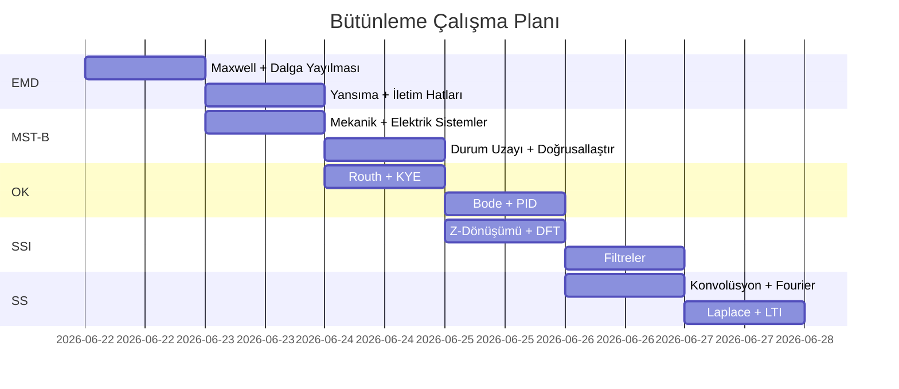

# Sınav Takvimi ve Çalışma Stratejisi

← [[HOME]]

## Dersler ve Öncelik

> Hangi derse daha az hazırsın? O dersi önce çalış.

| # | Ders | Kaynak | Öncelik |
|---|------|--------|---------|
| 1 | [[Elektromanyetik Dalga Teorisi/EMD Ana Sayfa\|EMD]] | bolum 1-4 PDF + EMT_Mega_Kopya | 🔴 Yüksek |
| 2 | [[Mühendislik Sİstem Tasarımı ve Benzetimi/MST Ana Sayfa\|MST&B]] | Kimi_Agent kitabı + örnek çözümler | 🔴 Yüksek |
| 3 | [[Otomatik Kontrol/OK Ana Sayfa\|OK]] | 1-16 PDF + çalışma soruları | 🟡 Orta |
| 4 | [[Sayısal Sinyal İşleme/SSI Ana Sayfa\|SSİ]] | Ecmel notları + DSP formül kartı | 🟡 Orta |
| 5 | [[Sİnyaller ve Sistemler/SS Ana Sayfa\|SS]] | SinyallerveSistemler ders notu | 🟢 Düşük |

---

## Günlük Çalışma Planı

---

## Sınav Stratejisi

### Formül Sayfaları
Her dersin [[../Elektromanyetik Dalga Teorisi/EMD Formül Sayfası|Formül Sayfası]] notunu çıkar ve yanında tut.

### Önce Konular, Sonra Sorular
1. Hub notunu oku (genel bakış)
2. Her bölümü hızlıca tara
3. Formül sayfasını ezberle
4. Örnek soruları çöz

### Ortak Temalar (Tüm Derslerde Geçerli)
- **Laplace dönüşümü** → OK, MST&B, SS hepsinde
- **Transfer fonksiyonu** → OK, MST&B
- **Fourier analizi** → SS, SSİ
- **Diferansiyel denklemler** → EMD, MST&B, OK

---

## El Yazısı Materyaller

Vault'a eklenmiş görsel materyaller:

| Ders | Görsel Dosyalar |
|------|----------------|
| EMD | `DATASET/Elektromanyetik Dalga Teorisi/*.jpg` (22 görsel) |
| MST&B | `DATASET/Mühendislik Sistem Tasarımı/*.jpg` (20+ görsel) |
| OK | `DATASET/Otomatik Kontrol/*.pdf` (el yazısı defterleri) |
| SSİ | `DATASET/Sayısal Sinyal İşleme/*.jpg` (12 görsel) |
| SS | `DATASET/Sinyaller Ve Sistemler/*.jpg` (14 görsel) |
