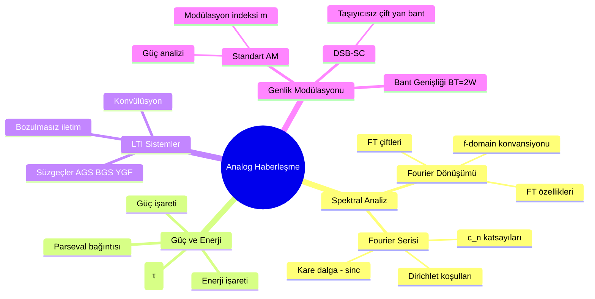
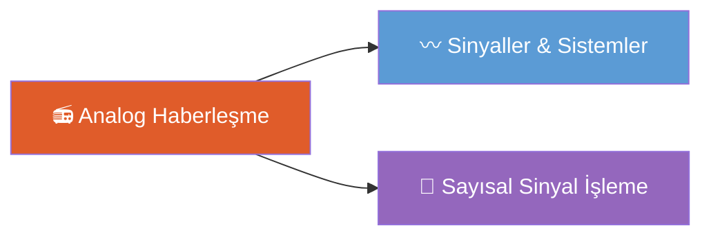

# Analog Haberleşme — Ana Sayfa

← [[HOME]]

## Konu Haritası

## Konu Anlatımları

| # | Konu | Bağlantı |
|---|------|----------|
| 1 | Genel Haberleşme Sistemi | [[Konu Anlatımları/01 Genel Haberleşme Sistemi]] |
| 2 | Fourier Analizi | [[Konu Anlatımları/02 Fourier Analizi]] |
| 3 | Periyodik İşaretler ve Fourier Serisi | [[Konu Anlatımları/03 Periyodik İşaretler ve Fourier Serisi]] |
| 4 | Güç, Enerji ve LTI Sistemler | [[Konu Anlatımları/04 Güç Enerji ve LTI Sistemler]] |
| 5 | Genlik Modülasyonu | [[Konu Anlatımları/05 Genlik Modülasyonu]] |
| 📄 | Formül Özeti | [[AH Formül Sayfası]] |

## Örnek Sorular

| # | Konu | Bağlantı |
|---|------|----------|
| 1 | Fourier Analizi Örnekleri | [[Örnek Sorular/01 Fourier Analizi Örnekleri]] |
| 2 | Enerji, Güç ve LTI Örnekleri | [[Örnek Sorular/02 Enerji Güç ve LTI Örnekleri]] |
| 3 | Modülasyon Örnekleri | [[Örnek Sorular/03 Modülasyon Örnekleri]] |
| 4 | **AraSınav Soruları (Çözümlü)** | [[Örnek Sorular/04 AraSınav Soruları (Çözümlü)]] |

## Diğer Derslerle Bağlantı

- **[[../Sİnyaller ve Sistemler/SS Ana Sayfa|Sinyaller ve Sistemler]]** — Fourier, konvülüsyon, LTI temel
- **[[../Sayısal Sinyal İşleme/SSI Ana Sayfa|Sayısal Sinyal İşleme]]** — DFT, ayrık Fourier bağlantısı

## Temel Formüller (Hızlı Erişim)

**Fourier Dönüşümü (f-konvansiyonu):**
$$X(f) = \int_{-\infty}^{\infty} x(t)\,e^{-j2\pi ft}\,dt$$

**Dikdörtgen darbe:** $A\,\Pi(t/\tau) \leftrightarrow A\tau\,\text{sinc}(f\tau)$

**Standart AM:** $x_c(t) = A_c[1 + m\,x(t)]\cos(2\pi f_c t)$

**DSB-SC:** $x_{DSB}(t) = A_c\,x(t)\cos(2\pi f_c t)$

**Bant genişliği:** $B_T = 2W$
