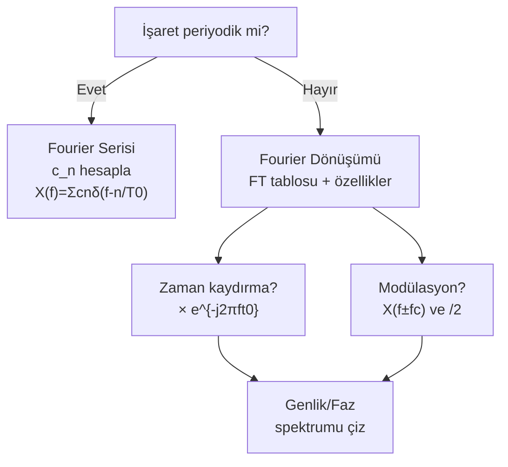

# AH — Formül Sayfası

← [[AH Ana Sayfa]]

---

## Fourier Dönüşümü (f-Konvansiyonu)

$$\boxed{X(f) = \int_{-\infty}^{\infty} x(t)\,e^{-j2\pi ft}\,dt}$$
$$\boxed{x(t) = \int_{-\infty}^{\infty} X(f)\,e^{j2\pi ft}\,df}$$

---

## Temel FT Çiftleri

| $x(t)$ | $X(f)$ |
|--------|--------|
| $\delta(t)$ | $1$ |
| $\delta(t-t_0)$ | $e^{-j2\pi ft_0}$ |
| $1$ | $\delta(f)$ |
| $e^{j2\pi f_0 t}$ | $\delta(f-f_0)$ |
| $\cos(2\pi f_0 t)$ | $\tfrac{1}{2}[\delta(f-f_0)+\delta(f+f_0)]$ |
| $\sin(2\pi f_0 t)$ | $\tfrac{1}{2j}[\delta(f-f_0)-\delta(f+f_0)]$ |
| $A\,\Pi(t/\tau)$ | $A\tau\,\text{sinc}(f\tau)$ |
| $A\tau\,\text{sinc}(\tau t)$ | $A\,\Pi(f/\tau)$ |
| $e^{-at}u(t)$, $a>0$ | $\dfrac{1}{a+j2\pi f}$ |
| $e^{-a|t|}$, $a>0$ | $\dfrac{2a}{a^2+(2\pi f)^2}$ |
| $u(t)$ | $\tfrac{1}{2}\delta(f)+\dfrac{1}{j2\pi f}$ |

---

## FT Özellikleri

| Özellik          | Zaman                 | Frekans               |        |              |     |        |
| ---------------- | --------------------- | --------------------- | ------ | ------------ | --- | ------ |
| Doğrusallık      | $ax+by$               | $aX+bY$               |        |              |     |        |
| Zaman kaydırma   | $x(t-t_0)$            | $e^{-j2\pi ft_0}X(f)$ |        |              |     |        |
| Frekans kaydırma | $x(t)e^{j2\pi f_0 t}$ | $X(f-f_0)$            |        |              |     |        |
| Ölçekleme        | $x(at)$               | $                     | a      | ^{-1}X(f/a)$ |     |        |
| Konvülüsyon      | $x(t)*h(t)$           | $X(f)H(f)$            |        |              |     |        |
| Çarpma           | $x(t)h(t)$            | $X(f)*H(f)$           |        |              |     |        |
| Türev            | $x^{(n)}(t)$          | $(j2\pi f)^nX(f)$     |        |              |     |        |
| Parseval         | $\int                 | x                     | ^2 dt$ | $\int        | X   | ^2 df$ |
| Dualite          | $X(t)$                | $x(-f)$               |        |              |     |        |

---

## Fourier Serisi

$$x(t) = \sum_{n=-\infty}^{\infty} c_n\,e^{jn\omega_0 t}, \qquad \omega_0 = 2\pi/T_0$$

$$\boxed{c_n = \frac{1}{T_0}\int_0^{T_0} x(t)\,e^{-jn\omega_0 t}\,dt}$$

**Kare dalga:** $c_n = \dfrac{A\tau}{T_0}\,\text{sinc}\!\left(\dfrac{n\tau}{T_0}\right)$

**Periyodik işaret FD:** $X(f) = \displaystyle\sum_{n} c_n\,\delta\!\left(f - \dfrac{n}{T_0}\right)$

---

## Sinc Fonksiyonu

$$\boxed{\text{sinc}(x) = \frac{\sin(\pi x)}{\pi x}, \qquad \text{sinc}(0) = 1}$$

Sıfırları: $x = \pm 1, \pm 2, \pm 3, \ldots$

---

## Güç ve Enerji

| Tür | Koşul | Formül |
|-----|-------|--------|
| Enerji işareti | $E < \infty$ | $E = \int x^2 dt = \int |X|^2 df$ |
| Güç işareti | $P < \infty$ | $P = \lim\frac{1}{T}\int_{-T/2}^{T/2}x^2 dt$ |
| $\cos(\omega_0 t)$ gücü | — | $P = 1/2$ |
| $A$ sabit gücü | — | $P = A^2$ |

**Özilişki:** $R(\tau) = \lim\frac{1}{T}\int x(t)x(t+\tau)dt$, $R(0)=P$

**PSD:** $G(f) = \mathcal{F}\{R(\tau)\}$, $\quad S_y(f) = |H(f)|^2 S_x(f)$

---

## Genlik Modülasyonu

### Standart AM

$$\boxed{x_c(t) = A_c[1+m\,x(t)]\cos(2\pi f_c t)}$$

$$X_c(f) = \frac{A_c}{2}[\delta(f-f_c)+\delta(f+f_c)] + \frac{A_c m}{2}[X(f-f_c)+X(f+f_c)]$$

$$\boxed{m = \frac{C_{\max}-C_{\min}}{C_{\max}+C_{\min}}}$$

**Güç:** $P_T = \dfrac{A_c^2}{2}\!\left(1 + \dfrac{m^2}{2}\right)$ (tek ton, $A_m=1$)

**Verimlilik:** $\eta = \dfrac{m^2/2}{1+m^2/2}$ → $m=1$: $\eta = 1/3$

### DSB-SC

$$\boxed{x_{DSB}(t) = A_c\,x(t)\cos(2\pi f_c t)}$$

$$P_{DSB} = \frac{A_c^2}{2}\langle x^2\rangle, \qquad \eta = 1$$

### SSB (Tek Yan Bant)

$$x_c(t) = \frac{A_c}{2}\,x(t)\cos(2\pi f_c t) \mp \frac{A_c}{2}\,\hat{x}(t)\sin(2\pi f_c t)$$

- $-$: USB (Üst Yan Bant), $+$: LSB (Alt Yan Bant)
- $\hat{x}(t)$: Hilbert dönüşümü ($\sin\to-\cos$, $\cos\to\sin$)
- $B_{SSB} = W$ (AM/DSB'nin yarısı)

### Modülasyon Karşılaştırma

| Tür | $C_1$ | $C_2$ | $g(t)$ | $BW$ | $\eta$ |
|-----|-------|-------|--------|------|--------|
| AM | $A_c$ | $mA_c$ | $0$ | $2W$ | $<1$ |
| DSB-SC | $0$ | $A_c$ | $0$ | $2W$ | $1$ |
| SSB | $0$ | $A_c/2$ | $\pm\hat{x}$ | $W$ | $1$ |

### Bant Genişlikleri

| Mod | $B_T$ |
|-----|-------|
| AM, DSB-SC | $2W$ |
| SSB | $W$ |

---

## Süzgeçler

| Tür | Geçiren | $H(f)$ |
|-----|---------|--------|
| AGS (LPF) | $|f| \leq f_2$ | $k\,e^{-j2\pi ft_0}$ |
| BGS (BPF) | $f_2 \leq |f| \leq f_{\ddot{u}}$ | $k\,e^{-j2\pi ft_0}$ |
| YGF (HPF) | $|f| \geq f_2$ | $k\,e^{-j2\pi ft_0}$ |

**Bozulmasız iletim:** $|H(f)| = k$ sabit, $\angle H(f) = -2\pi ft_0$ doğrusal

---

## Soru Çözme Sırası

