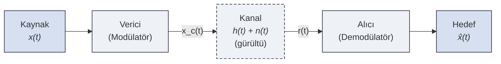
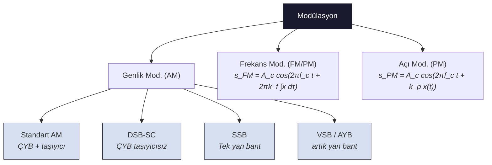

# 01 — Genel Haberleşme Sistemi

← [[../AH Ana Sayfa]] | Sonraki: [[02 Fourier Analizi]]

---

## Haberleşme Sistemi Blok Diyagramı

| Blok | Görev |
|------|-------|
| **Kaynak** | İletilecek bilgi — ses, görüntü, veri |
| **Verici (Modülatör)** | Mesajı taşıyıcıya bindirip iletim kanalına uygun hale getirir |
| **Kanal** | Fiziksel ortam — kablo, hava, fiber; gürültü ve parazit ekler |
| **Alıcı (Demodülatör)** | Kanaldan gelen sinyali işleyip mesajı geri çıkarır |
| **Hedef** | Alınan mesajın tüketicisi |

---

## Modülasyon Nedir?

> [!tanim] Modülasyon
> Mesaj sinyalinin $x(t)$ bilgisini yüksek frekanslı bir **taşıyıcı sinyal** üzerine bindirme işlemidir.
> $$x_c(t) = f\bigl(x(t),\; A_c\cos(2\pi f_c t)\bigr)$$

---

## Modülasyon Neden Gerekli?

> [!sinav] 3 Temel Neden — Sınavda sorulur!

**1. Uzak mesafe iletimi:**
- Düşük frekanslı ses sinyalleri (~300 Hz – 3 kHz) havada hızla söner
- Yüksek frekanslı elektromanyetik dalgalar ($f_c$ MHz – GHz) çok daha uzağa gider
- $\lambda = c/f$: frekans arttıkça dalga boyu kısalır → anten boyutu küçülür

**2. Kanal paylaşımı (Frekans Çoklama / FDM):**
- Farklı yayıncılar farklı taşıyıcı frekanslarına ($f_{c1}, f_{c2}, \ldots$) yerleşir
- Her biri $B_T$ bant genişliği kaplar → kanallar çakışmaz
- Radyo, TV, cep telefonu hepsi aynı havayı paylaşır

**3. Gürültüye karşı direnç:**
- Uygun modülasyon türü seçilerek gürültü etkisi azaltılır
- FM ve PM, AM'e göre gürültüde daha başarılıdır

---

## Temel Büyüklükler

| Sembol | İsim | Tipik değer |
|--------|------|-------------|
| $x(t)$ | Mesaj (modüle edici) işaret | Bant sınırlı: $\|f\| \leq W$ |
| $A_c$ | Taşıyıcı genliği | Sabit |
| $f_c$ | Taşıyıcı frekansı | $f_c \gg W$ |
| $W$ | Mesaj bant genişliği | Hz cinsinden |
| $B_T$ | İletim bant genişliği | $B_T = 2W$ (AM için) |

---

## Modülasyon Türleri

> [!warning] Kapsam
> Bu derste **Standart AM** ve **DSB-SC** ağırlıklı. FM/PM kapsam dışı.

---

> [!sinav] Sınav İpucu
> - Verici çıkışı: $x_c(t)$ → modüle edilmiş işaret
> - Kanal çıkışı: $r(t) = x_c(t) * h(t) + n(t)$
> - Modülasyonun amacını 3 maddede bilmek yeterli
