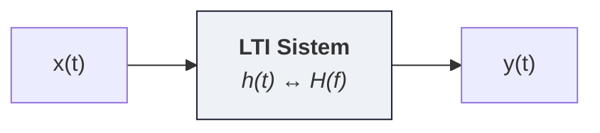

# 04 — Güç, Enerji ve LTI Sistemler

← [[../AH Ana Sayfa]] | Önceki: [[03 Periyodik İşaretler ve Fourier Serisi]] | Sonraki: [[05 Genlik Modülasyonu]]

---

## Enerji ve Güç İşaretleri

> [!tanim] Enerji İşareti
> $$E = \int_{-\infty}^{\infty} x^2(t)\,dt < \infty$$
> Enerji sonlu → güç sıfır. Örnek: dikdörtgen darbe, üstel bozunan işaret.

> [!tanim] Güç İşareti
> $$P = \lim_{T\to\infty}\frac{1}{T}\int_{-T/2}^{T/2} x^2(t)\,dt < \infty$$
> Güç sonlu → enerji sonsuz. Örnek: periyodik işaretler, sabit işaret.

### Örnekler

| İşaret | Enerji | Güç | Tür |
|--------|--------|-----|-----|
| $A$ (sabit) | $\infty$ | $A^2$ | Güç |
| $\cos(\omega_0 t)$ | $\infty$ | $1/2$ | Güç |
| $A\,\Pi(t/\tau)$ | $A^2\tau$ | $0$ | Enerji |
| $e^{-at}u(t)$, $a>0$ | $1/(2a)$ | $0$ | Enerji |

---

## Parseval Bağıntısı

> [!tanim] Parseval (Enerji)
> $$E = \int_{-\infty}^{\infty} x^2(t)\,dt = \int_{-\infty}^{\infty} |X(f)|^2\,df$$

$S(f) = |X(f)|^2$: **enerji spektral yoğunluğu**

**Özellikleri:**
- $S(f) \geq 0$ (her zaman negatif olmayan)
- $S(f) = S(-f)$ (çift simetri)

---

## Özilişki Fonksiyonu

> [!tanim] Özilişki
> $$R(\tau) \triangleq \lim_{T\to\infty}\frac{1}{T}\int_{-T/2}^{T/2} x(t)\,x(t+\tau)\,dt$$

**Özellikleri:**
- $R(0) = P$ (toplam güç)
- $R(\tau) = R(-\tau)$ (çift fonksiyon)
- $x(t)$, $T_0$ ile periyodik ise $R(\tau)$ da $T_0$ ile periyodik

**Güç spektral yoğunluğu:** $G(f) = \mathcal{F}\{R(\tau)\}$

$$P = \int_{-\infty}^{\infty} G(f)\,df, \qquad S_y(f) = |H(f)|^2 \cdot S_x(f)$$

---

## LTI Sistemler ve Konvülüsyon

*Zaman: $y(t) = x(t) * h(t)$  ·  Frekans: $Y(f) = X(f)\cdot H(f)$*

$$\boxed{y(t) = x(t) * h(t) = \int_{-\infty}^{\infty} x(\tau)\,h(t-\tau)\,d\tau}$$

$$\boxed{Y(f) = X(f) \cdot H(f), \qquad H(f) = \frac{Y(f)}{X(f)}}$$

**Zaman:** konvülüsyon → **Frekans:** çarpım

---

## Bozulmasız İletim

$y(t) = k\,x(t - t_0)$ ise sistem **bozulmasız** iletir:

$$H(f) = k\,e^{-j2\pi ft_0}$$

- **Genlik:** $|H(f)| = k$ (tüm frekanslarda sabit)
- **Faz:** $\angle H(f) = -2\pi ft_0$ (doğrusal faz → sabit gecikme)

**Bozulma türleri:**

| Tür | Sebep | Etki |
|-----|-------|------|
| Genlik bozulması | $\|H(f)\|$ frekansa göre değişir | Bileşenler farklı kazanç → şekil bozulur |
| Faz bozulması | Faz doğrusal değil | Her frekans farklı gecikme → şekil bozulur |

---

## Süzgeçler (Filtreler)

### 1 — Alçak Geçiren Süzgeç (AGS / LPF)

$$H(f) = \begin{cases} k\,e^{-j2\pi ft_0} & |f| \leq f_2 \\ 0 & |f| > f_2 \end{cases}$$

Sadece $\pm f_2$ altındaki frekansları geçirir. **Modülasyon sonrası demodülasyonda** kullanılır.

### 2 — Band Geçiren Süzgeç (BGS / BPF)

$$H(f) \neq 0 \quad \text{yalnızca} \quad f_2 \leq |f| \leq f_{\ddot{u}}$$

$f_c$ etrafındaki bandı seçer → AM alıcısında kanal seçimi için kullanılır.

### 3 — Yüksek Geçiren Filtre (YGF / HPF)

$$H(f) = \begin{cases} k\,e^{-j2\pi ft_0} & |f| \geq f_2 \\ 0 & |f| < f_2 \end{cases}$$

---

## Konvülüsyon Hesaplama — Adım Adım

**Kayan pencere yöntemi:**

1. $h(\tau)$'yu çiz
2. $h(t-\tau)$'yu elde et: önce $h(-\tau)$ (ayna), sonra $t$ kadar kaydır
3. Her $t$ için $x(\tau) \cdot h(t-\tau)$ alanını hesapla (örtüşme bölgeleri)
4. $y(t)$ grafiğini çiz

**İpucu:** $x(t)$ ve $h(t)$ dikdörtgen ise çıkış **trapez veya üçgen** olur.

### Örnek

$x(t)$: $[0, 3]$'te genlik 1 &emsp; $h(t)$: $[0, 2]$'de genlik 1

| Bölge | $y(t)$ |
|-------|--------|
| $t < 0$ | $0$ |
| $0 \leq t < 2$ | $t$ |
| $2 \leq t < 3$ | $2$ |
| $3 \leq t < 5$ | $5 - t$ |
| $t \geq 5$ | $0$ |

*Çıkış trapez şeklinde: yükselme 0→2 (eğim 1), düz bölge 2→3, iniş 3→5 (eğim -1)*

---

> [!sinav] Sınav İpucu
> - Konvülüsyon: dikdörtgen ★ dikdörtgen = trapez (veya üçgen, eğer genişlikler eşitse)
> - Çıkış süresi: $t_{başlangıç} = t_{x,başl} + t_{h,başl}$, $t_{bitiş} = t_{x,bitiş} + t_{h,bitiş}$
> - $G(f) = |H(f)|^2 \cdot G_x(f)$: sistem çıkış PSD'si
> - Parseval: enerjiyi frekans veya zaman domeninde eşit hesapla
