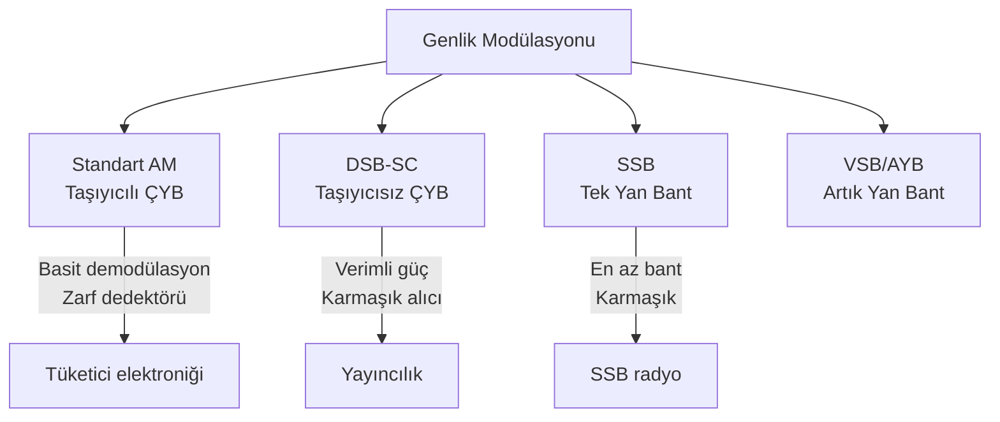

# 05 — Genlik Modülasyonu

← [[../AH Ana Sayfa]] | Önceki: [[04 Güç Enerji ve LTI Sistemler]]

---

## Modülasyon Türleri (Genlik)

**Mesaj işareti:** $x(t)$, $|f| \leq W$'de bant sınırlı, $|x(t)| \leq 1$

---

## Standart AM

> [!tanim] Standart AM
> $$\boxed{x_c(t) = A_c\bigl[1 + m\,x(t)\bigr]\cos(2\pi f_c t)}$$
> - $A_c$: taşıyıcı genliği
> - $f_c$: taşıyıcı frekansı ($f_c \gg W$)
> - $m$: modülasyon indeksi ($0 < m \leq 1$)

---

## Modülasyon İndeksi

$$C_{\max} = A_c(1 + m), \qquad C_{\min} = A_c(1 - m)$$

$$\boxed{m = \frac{C_{\max} - C_{\min}}{C_{\max} + C_{\min}}}$$

**Zarf:** $A(t) = A_c[1 + m\,x(t)]$

- $m < 1$: tam modülasyon değil, zarf hiç sıfırlanmaz → kolay demodülasyon
- $m = 1$: tam modülasyon, zarf minimum sıfıra iner
- $m > 1$: **aşırı modülasyon** → zarf negatife girer → bozulma!

---

## Genelleştirilmiş Modülasyon İndeksi

Normalize edilmemiş mesaj $x_1(t) = a + b\,x(t)$ için:

$$m = \frac{kb}{1 + ka}, \qquad A_c = A_1(1 + ka)$$

- $a = \langle x_1(t)\rangle$: ortalama değer
- $b = x_{1,\max} - a$: maksimum sapma

**Örnek:** $x_c(t) = 2[1 + \frac{3}{2}x_1(t)]\cos(2\pi f_c t)$, $x_1(t)$ ortalama 2, max sapma 1.5

$$a = 2, \quad b = 1.5, \quad k = 3/2$$
$$m = \frac{(3/2)(3/2)}{1 + (3/2)(2)} = \frac{9/4}{4} = \frac{9}{16}, \qquad A_c = 2(1 + 3) = 8$$

---

## AM Frekans Spektrumu

$$x_c(t) = A_c\cos(2\pi f_c t) + A_c m\,x(t)\cos(2\pi f_c t)$$

$$\boxed{X_c(f) = \frac{A_c}{2}\bigl[\delta(f-f_c)+\delta(f+f_c)\bigr] + \frac{A_c m}{2}\bigl[X(f-f_c)+X(f+f_c)\bigr]}$$

**Tek tonlu mesaj** $x(t) = \cos(2\pi f_m t)$:

$$x_c(t) = A_c\cos(2\pi f_c t) + \frac{A_c m}{2}\cos(2\pi(f_c+f_m)t) + \frac{A_c m}{2}\cos(2\pi(f_c-f_m)t)$$

| Bileşen | Frekans | Genlik |
|---------|---------|--------|
| Taşıyıcı | $\pm f_c$ | $A_c/2$ |
| Üst yan bant | $\pm(f_c + f_m)$ | $A_c m/4$ |
| Alt yan bant | $\pm(f_c - f_m)$ | $A_c m/4$ |

**Bant genişliği:** $B_T = 2W$ (mesaj bant genişliğinin iki katı)

---

## AM Güç Analizi

$$\boxed{P_T = \underbrace{\frac{A_c^2}{2}}_{P_c} + \underbrace{\frac{A_c^2 m^2}{2}\langle x^2(t)\rangle}_{2P_y}}$$

Tek tonlu mesaj ($x(t) = A_m\cos(2\pi f_m t)$, $A_m \leq 1$):

$$P_T = \frac{A_c^2}{2}\!\left(1 + \frac{m^2 A_m^2}{2}\right)$$

**Verimlilik:**

$$\eta = \frac{2P_y}{P_T} = \frac{m^2\langle x^2\rangle}{1 + m^2\langle x^2\rangle}$$

- $m=1$, $x(t)=\cos$: $\langle x^2 \rangle = 1/2$ → $\eta = (1/2)/(1+1/2) = 1/3$ → **Taşıyıcı gücün 2/3'ü israf!**

---

## DSB-SC (Taşıyıcısız Çift Yan Bant)

> [!tanim] DSB-SC
> $$\boxed{x_{DSB}(t) = A_c\,x(t)\cos(2\pi f_c t)}$$
> $$\boxed{X_{DSB}(f) = \frac{A_c}{2}\bigl[X(f-f_c) + X(f+f_c)\bigr]}$$

**Sadece yan bantlar** — taşıyıcı bileşen yok.

$$P_{DSB} = \frac{A_c^2}{2}\langle x^2(t)\rangle$$

**Verimlilik:** $\eta = 1$ (tüm güç bilgi taşır!)

---

## AM vs DSB-SC Karşılaştırma

| Özellik | Standart AM | DSB-SC |
|---------|-------------|--------|
| Taşıyıcı | Var ($A_c/2$ genlik) | Yok |
| Güç verimliliği | $\eta = 1/3$ (tek ton, $m=1$) | $\eta = 1$ |
| Demodülasyon | Basit: zarf dedektörü | Karmaşık: senkron alıcı |
| Bant genişliği | $B_T = 2W$ | $B_T = 2W$ |
| Spektrum | Taşıyıcı + 2 yan bant | Sadece 2 yan bant |

### Sayısal Örnek

$m(t) = \cos(2\pi \cdot 10^3 t)$, $c(t) = 10\cos(2\pi \cdot 10^6 t)$, $m = 1$:

**Standart AM:**
$$s_{AM}(t) = 10\cos(2\pi \cdot 10^6 t) + 5\cos(2\pi \cdot 1.001 \cdot 10^6 t) + 5\cos(2\pi \cdot 0.999 \cdot 10^6 t)$$

$$P_c = \frac{10^2}{2} = 50 \text{ W}, \quad 2P_y = 2 \times \frac{5^2}{2} = 25 \text{ W}, \quad P_{AM} = 75 \text{ W}$$

**DSB-SC:**
$$s_{DSB}(t) = 5\cos(2\pi \cdot 1.001 \cdot 10^6 t) + 5\cos(2\pi \cdot 0.999 \cdot 10^6 t)$$

$$P_{DSB} = 25 \text{ W} \quad (\eta = 1)$$

---

## SSB — Tek Yan Bant (Giriş)

DSB-SC'de her iki yan bant da aynı bilgiyi taşır → birini göndermek yeterli!

**Üst Yan Bant (USB):** $X_{USB}(f) = X_{DSB}(f)$ yalnızca $|f - f_c| < W$ için

**Bant genişliği:** $B_{SSB} = W$ (DSB'nin yarısı!)

**Dezavantaj:** Dar bant süzgeç uygulamak zor; pratikte VSB (artık yan bant) kullanılır.

---

## Çarpımsal Modülatör

$$x_c(t) = x(t) \cdot c(t) = x(t) \cdot A_c\cos(2\pi f_c t)$$

Bu **DSB-SC** modülasyonudur. Frekans alanı:

$$X_c(f) = \frac{A_c}{2}\bigl[X(f - f_c) + X(f + f_c)\bigr]$$

**Örnek:** $x(t) = 4\cos(20\pi t)$, $c(t) = 10\cos(1000\pi t)$

$$x_c(t) = 40\cos(20\pi t)\cos(1000\pi t) = 20\cos(980\pi t) + 20\cos(1020\pi t)$$

- $f_c = 500$ Hz, $f_m = 10$ Hz
- Alt yan bant: $490$ Hz, Üst yan bant: $510$ Hz
- $BW = 510 - 490 = 20$ Hz $= 2f_m$

---

> [!sinav] Sınav İpucu
> - $m$ formülü: $m = (C_{\max}-C_{\min})/(C_{\max}+C_{\min})$
> - AM gücü: $P_T = P_c(1 + m^2/2)$ (tek tonlu sinüs mesaj için)
> - DSB-SC: taşıyıcı yok → $P_{DSB} = A_c^2\langle x^2\rangle/2$
> - Her iki durumda da $B_T = 2W$
> - Çarpımsal modülatör → kosinüs çarpımı → $\frac{1}{2}[\cos(A-B)+\cos(A+B)]$
