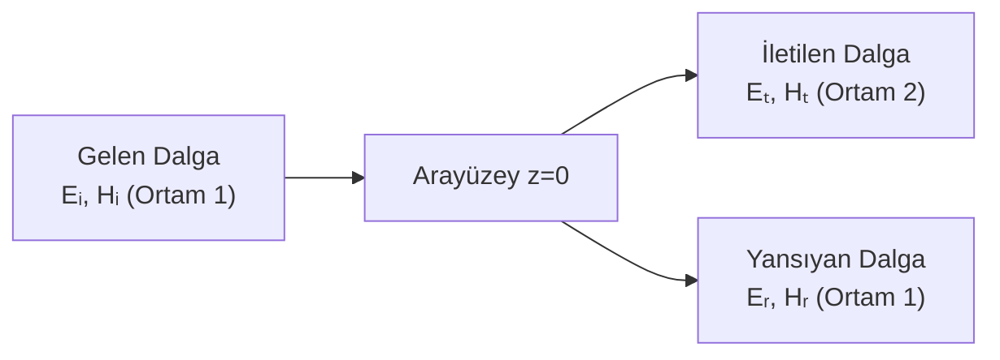

# 04 — Yansıma, Kırılma ve Sınır Koşulları

← [[EMD Ana Sayfa]]

> **Özet:** Bir ortamdan diğerine geçen EM dalga → yansıyan + iletilen dalga. Fresnel katsayıları, Snell kanunu, Brewster ve kritik açılar.

---

## Genel Senaryo

**Yansıma katsayısı (Γ):** $\Gamma = E_{r0}/E_{i0}$  
**İletim katsayısı (τ):** $\tau = E_{t0}/E_{i0}$

---

## Dik Gelme (Normal Incidence)

Dalga +z yönünde, arayüzey z=0:

**Gelen:**
$$\mathbf{E}_i = \hat{x}E_{i0}e^{-j\beta_1 z}, \quad \mathbf{H}_i = \hat{y}\frac{E_{i0}}{\eta_1}e^{-j\beta_1 z}$$

**Yansıyan:**
$$\mathbf{E}_r = \hat{x}E_{r0}e^{+j\beta_1 z}, \quad \mathbf{H}_r = -\hat{y}\frac{E_{r0}}{\eta_1}e^{+j\beta_1 z}$$

**İletilen:**
$$\mathbf{E}_t = \hat{x}E_{t0}e^{-j\beta_2 z}, \quad \mathbf{H}_t = \hat{y}\frac{E_{t0}}{\eta_2}e^{-j\beta_2 z}$$

Sınır koşulları ($E_t$ ve $H_t$ sürekli) → 

> [!formul] Dik Gelme Yansıma ve İletim Katsayıları
> $$\Gamma = \frac{\eta_2 - \eta_1}{\eta_2 + \eta_1}, \qquad \tau = \frac{2\eta_2}{\eta_2 + \eta_1}$$
> $$\tau = 1 + \Gamma$$

**İdeal iletken ($\eta_2=0$):** $\Gamma=-1$, $\tau=0$ → tam yansıma.

**Güç yoğunlukları:**
$$\frac{P_r}{P_i} = |\Gamma|^2, \qquad \frac{P_t}{P_i} = 1-|\Gamma|^2 \quad\text{(enerji korunumu)}$$

---

## Duran Dalga (Standing Wave) — Mükemmel İletken Sınırı

$\Gamma=-1$ durumunda ortam 1'deki toplam alan:

$$E_{1z}(z) = E_{i0}(e^{-j\beta_1 z} - e^{+j\beta_1 z}) = -j2E_{i0}\sin(\beta_1 z)$$
$$H_{1z}(z) = \frac{2E_{i0}}{\eta_1}\cos(\beta_1 z)$$

**Düğüm (node):** $E=0$, z = 0, $-\lambda/2$, $-\lambda$, ...  
**Karın (antinode):** $E$ max, z = $-\lambda/4$, $-3\lambda/4$, ...

> [!formul] Duran Dalga Oranı (SWR)
> $$\text{SWR} = \frac{1+|\Gamma|}{1-|\Gamma|}$$

---

## Eğik Gelme (Oblique Incidence)

Gelme açısı $\theta_i$, yansıma açısı $\theta_r$, kırılma açısı $\theta_t$.

> [!formul] Snell Kanunu
> $$n_1\sin\theta_i = n_2\sin\theta_t$$
> $$\Leftrightarrow \beta_1\sin\theta_i = \beta_2\sin\theta_t$$

**Yansıma yasası:** $\theta_r = \theta_i$

---

## Fresnel Katsayıları

### TE (s) Polarizasyon (E ⊥ geliş düzlemine)

> [!formul] TE Fresnel Katsayıları
> $$\Gamma_{TE} = \frac{\eta_2\cos\theta_i - \eta_1\cos\theta_t}{\eta_2\cos\theta_i + \eta_1\cos\theta_t}$$
> $$\tau_{TE} = \frac{2\eta_2\cos\theta_i}{\eta_2\cos\theta_i + \eta_1\cos\theta_t}$$

### TM (p) Polarizasyon (E ∥ geliş düzlemine)

> [!formul] TM Fresnel Katsayıları
> $$\Gamma_{TM} = \frac{\eta_2\cos\theta_t - \eta_1\cos\theta_i}{\eta_2\cos\theta_t + \eta_1\cos\theta_i}$$
> $$\tau_{TM} = \frac{2\eta_2\cos\theta_i}{\eta_2\cos\theta_t + \eta_1\cos\theta_i}$$

---

## Kritik Açılar

### Kritik Açı (Tam İç Yansıma)

Sadece $n_1 > n_2$ (yoğundan seyreğe) durumunda var:

> [!formul] Kritik Açı
> $$\theta_c = \arcsin\!\left(\frac{n_2}{n_1}\right) = \arcsin\!\left(\sqrt{\frac{\epsilon_2}{\epsilon_1}}\right)$$

$\theta_i > \theta_c$ → $\Gamma = e^{j\psi}$, $|\Gamma|=1$ → **tam iç yansıma**

### Brewster Açısı (Tam İletim — TM polarizasyon)

> [!formul] Brewster Açısı
> $$\tan\theta_B = \frac{n_2}{n_1} = \sqrt{\frac{\epsilon_2}{\epsilon_1}}$$

$\theta_i = \theta_B$ → $\Gamma_{TM}=0$ → yansıyan dalga tamamen TE polarize.

---

## Hızlı Karşılaştırma Tablosu

| Durum | Şart | Sonuç |
|-------|------|-------|
| Tam yansıma (iletken) | $\eta_2=0$ | $\Gamma=-1$, SWR=∞ |
| Empedans uyumu | $\eta_1=\eta_2$ | $\Gamma=0$, $\tau=1$ |
| Kritik açı | $n_1>n_2$, $\theta_i=\theta_c$ | $|\Gamma|=1$ |
| Brewster açısı | TM pol., $\theta_i=\theta_B$ | $\Gamma_{TM}=0$ |

---

## Ders Notları — Ödev/Sınav Çözümleri (Ara 2025)

### Soru 1 — Silindirik Koordinatlarda Dalga Denklemi

**Problem:** $(r,\phi,z)$ silindirik koordinatlar; kaynak içermeyen basit ortamda EM dalganın elektrik alanı $\bar{E}=\hat{a}_r E(r,\phi,z)$ olarak verilmiştir. $E$'nin $\phi$'ye bağlı olmadığını belirle. Ortamda $E$'nin sağladığı denklemi yaz.

**Çözüm:**

Kaynak içermeyen: $\nabla\cdot\bar{E}=0$, $\nabla\cdot\bar{B}=0$, $\rho_v=0$

Silindirik koordinatlarda diverjans ($E_\phi=0$, $E_z=0$ çünkü sadece $\hat{a}_r$ bileşeni var):
$$\nabla\cdot\bar{E} = \frac{1}{r}\frac{\partial(rE_r)}{\partial r} + \frac{1}{r}\frac{\partial E_\phi}{\partial\phi} + \frac{\partial E_z}{\partial z}$$

$E_\phi=0$, $E_z=0$ yerine: $\nabla\cdot\bar{E} = \frac{1}{r}\frac{\partial(rE)}{\partial r} = 0$

Kaynak yoksa: $\frac{1}{r}\frac{\partial(rE)}{\partial r}=0$ → **$E$, $\phi$'ye bağlı değildir**

Dalga denklemi ($\nabla^2\bar{E} - \mu\varepsilon\dfrac{\partial^2\bar{E}}{\partial t^2}=0$), $\partial/\partial\phi=0$ ile:

$$\boxed{\frac{\partial^2 E}{\partial r^2} + \frac{1}{r}\frac{\partial E}{\partial r} + \frac{\partial^2 E}{\partial z^2} - \mu\varepsilon\frac{\partial^2 E}{\partial t^2} = 0}$$

---

### Soru 2 — Düzlemsel Dalga Anlık Görüntü

**Problem:** Serbest uzayda $\bar{E}=\hat{a}_y 20\sin(4\pi\times10^8 t - \beta z)$ V/m. $t=0$'da $z$ boyunca $\lambda/4$ ilerlemesi için gereken $t_1$'i bul; $\beta$ ve $\lambda$ değerlerini hesapla.

**Çözüm:**

$$\omega = 4\pi\times10^8 \;\text{rad/s} \implies f = \frac{\omega}{2\pi} = 2\times10^8 \;\text{Hz} = 200 \;\text{MHz}$$

$$\lambda = \frac{c}{f} = \frac{3\times10^8}{2\times10^8} = 1.5 \;\text{m}$$

$$\beta = \frac{2\pi}{\lambda} = \frac{4\pi}{3} \approx 4.19 \;\text{rad/m}$$

$$\lambda/4 = 0.375 \;\text{m}, \quad t_1 = \frac{\lambda/4}{c} = \frac{0.375}{3\times10^8} = 1.25\times10^{-9} \;\text{s} = \boxed{1.25 \;\text{ns}}$$

---

### Soru 5 — Düzlemsel Dalga H Bileşeni (Serbest Uzay)

**Problem:** $f=50$ MHz'lik dalga: $\bar{E}(z,t)=\hat{a}_y\,12\pi\sin(\omega t-\beta z)$ V/m. H bileşenini bul ve $t=0$'daki anlık görüntüyü çiz.

**Çözüm:**

- Yayılma yönü: $+\hat{a}_z$; Elektrik alan yönü: $\hat{a}_y$
- $\hat{a}_z\times\hat{a}_y = -\hat{a}_x$ → H manyetik alan yönü: $-\hat{a}_x$

$$\omega = 2\pi\times50\times10^6 = 10^8\pi \;\text{rad/s}, \quad \beta = \frac{\omega}{c} = \frac{\pi}{3} \;\text{rad/m}$$

$$\eta_0 = 120\pi \;\Omega \implies H_0 = \frac{E_0}{\eta_0} = \frac{12\pi}{120\pi} = 0.1 \;\text{A/m}$$

$$\boxed{\bar{H}(z,t) = -\hat{a}_x\,0.1\sin\!\left(10^8\pi t - \frac{\pi}{3}z\right) \;\text{A/m}}$$

---

### Soru 6 — Kayıp Tanjantı (Bakır ve Deniz Suyu)

**Problem:** $\varepsilon_r=1$, $\sigma=5.8\times10^7$ S/m bakır ile $\varepsilon_r=81$, $\sigma=4$ S/m deniz suyu için 100 MHz ve 10 GHz'de kayıp tanjantını hesapla.

$$\tan\delta = \frac{\varepsilon''}{\varepsilon'} = \frac{\sigma}{\omega\varepsilon} = \frac{\sigma}{2\pi f\varepsilon_0\varepsilon_r}$$

**Bakır** ($\varepsilon_r=1$, $\sigma=5.8\times10^7$):
$$\tan\delta_{bakır} \approx \frac{18\times5.8\times10^7\times10^7}{f} = \frac{1.044\times10^{15}}{f}$$

| Frekans | $\tan\delta$ | Sınıf |
|---------|-------------|-------|
| 100 MHz | $1.044\times10^7 \gg 1$ | **İyi iletken** |
| 10 GHz | $1.044\times10^5 \gg 1$ | **İyi iletken** |

**Deniz suyu** ($\varepsilon_r=81$, $\sigma=4$):
$$\tan\delta_{deniz} \approx \frac{0.888\times10^8}{f}$$

| Frekans | $\tan\delta$ | Sınıf |
|---------|-------------|-------|
| 100 Hz | $\approx8.88\times10^5 \gg 1$ | **İyi iletken** |
| 1 GHz | $\approx0.888 < 1$ | **Kayıplı dielektrik** |
| 10 GHz | $\approx0.088 \ll 1$ | **Dielektrik** |

> [!sinav] Sınıflandırma Kriteri
> - $\tan\delta \gg 1$: İyi iletken ($\sigma \gg \omega\varepsilon$)
> - $\tan\delta \ll 1$: İyi dielektrik ($\sigma \ll \omega\varepsilon$)
> - $\tan\delta \approx 1$: Kayıplı dielektrik

---

### Sınır Koşulları — Dielektrik Örnekleri

**Örnek 1:** $\varepsilon_{r1}=2.5$, $\varepsilon_{r2}=4$, sınır $y=0$, $\bar{E}_1=-30\hat{a}_x+50\hat{a}_y+70\hat{a}_z$ V/m. $\bar{D}_2$, $\bar{P}_2$, $\theta_1$ bul.

- Teğetsel korunur: $E_{1t}=E_{2t}$ → $E_{2x}=-30$, $E_{2z}=70$
- Normal: $\varepsilon_1 E_{1n}=\varepsilon_2 E_{2n}$ → $2.5\times50=4\times E_{2n}$ → $E_{2n}=31.25$ V/m
- $\bar{E}_2=-30\hat{a}_x+31.25\hat{a}_y+70\hat{a}_z$ V/m

Polarizasyon: $\bar{P}=\varepsilon_0(\varepsilon_r-1)\bar{E}$

**Örnek 2:** $\varepsilon_{r1}=3$, $\varepsilon_{r2}=2$, sınır $y=0$. $\bar{E}_1$ verilince $\bar{E}_2$ bul.

- Normal bileşen: $\varepsilon_1 E_{1n}=\varepsilon_2 E_{2n}$ → $E_{2n}=(\varepsilon_{r1}/\varepsilon_{r2})\cdot E_{1n}$
- Teğetsel: $E_{1t}=E_{2t}$

**Yüzey Yükü Varken:**
$$D_{2n}-D_{1n}=\rho_s \implies \varepsilon_2 E_{2n}-\varepsilon_1 E_{1n}=\rho_s$$

**Özel durumlar:**

| Sınır | $E_t$ | $E_n$ | $D_n$ |
|-------|-------|-------|-------|
| Dielektrik–Dielektrik | Sürekli | $\varepsilon_1 E_{1n}=\varepsilon_2 E_{2n}$ | Süreksiz ($\rho_s$ varsa) |
| Dielektrik–İletken | $E_{2t}=0$ → $E_{1t}=0$ | $E_{2n}=0$, $D_{1n}=\rho_s/\varepsilon_1$ | Süreksiz |
| İletken–İletken | $E_{1t}=E_{2t}$ | $\varepsilon_1 E_{1n}-\varepsilon_2 E_{2n}=\rho_s$ | — |

---

> [!sinav] Sınav İpuçları
> - **Dik gelmede:** $\Gamma=(\eta_2-\eta_1)/(\eta_2+\eta_1)$ — pay/payda sırası önemli!
> - **$R+T=1$** kontrol et (güç): $|\Gamma|^2 + (1-|\Gamma|^2) = 1$
> - **Snell:** $n_1\sin\theta_i = n_2\sin\theta_t$ — kırıcılık indisi $n=\sqrt{\epsilon_r\mu_r}$
> - **Brewster:** sadece TM (p) polarizasyon için Γ=0
> - **Tam iç yansıma:** $n_1>n_2$ şartı + $\theta_i>\theta_c$ şartı
> - **İşaret hatası:** Γ negatif olabilir — fiziksel anlam faz terslemesi

---

**Bağlantılar:** [[03 Dalga Yayılması ve Düzlemsel Dalgalar]] | [[05 İletim Hatları]] | [[02 Maxwell Denklemleri]] | [[EMD Formül Sayfası]]
