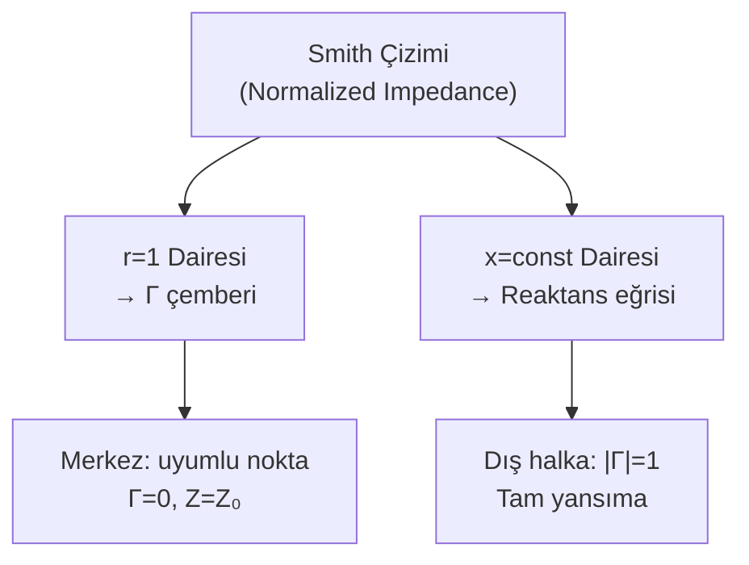

# 05 — İletim Hatları

← [[EMD Ana Sayfa]]

> **Özet:** Dağıtık parametreli sistemler. Telegraf denklemleri → dalga çözümü → empedans hesabı → Smith çizimi.

---

## İletim Hattı Modeli

Dağıtık devre parametreleri (birim uzunluk başına):

| Parametre | Sembol | Birim |
|-----------|--------|-------|
| Direnç | $R'$ | Ω/m |
| Endüktans | $L'$ | H/m |
| Kapasitans | $C'$ | F/m |
| İletkenlik | $G'$ | S/m |

---

## Telegraf Denklemleri

$$\frac{\partial V(z,t)}{\partial z} = -R'I - L'\frac{\partial I}{\partial t}$$

$$\frac{\partial I(z,t)}{\partial z} = -G'V - C'\frac{\partial V}{\partial t}$$

Harmonik durumda (fazör):

$$\frac{d^2V_s}{dz^2} = \gamma^2 V_s, \qquad \frac{d^2I_s}{dz^2} = \gamma^2 I_s$$

---

## Yayılma Sabiti

> [!formul] Yayılma Sabiti
> $$\gamma = \alpha + j\beta = \sqrt{(R'+j\omega L')(G'+j\omega C')}$$

Kayıpsız hat ($R'=G'=0$):
$$\gamma = j\beta = j\omega\sqrt{L'C'}, \quad \alpha=0$$

---

## Karakteristik Empedans

> [!formul] Karakteristik Empedans $Z_0$
> $$Z_0 = \sqrt{\frac{R'+j\omega L'}{G'+j\omega C'}}$$
> Kayıpsız: $Z_0 = \sqrt{L'/C'}$ (gerçel, Ω)

---

## Genel Hat Çözümü

$$V_s(z) = V_0^+ e^{-\gamma z} + V_0^- e^{+\gamma z}$$
$$I_s(z) = \frac{V_0^+}{Z_0}e^{-\gamma z} - \frac{V_0^-}{Z_0}e^{+\gamma z}$$

---

## Yük Empedansı ve Yansıma Katsayısı

Hat uzunluğu $\ell$, yük $Z_L$ (z=0'da):

> [!formul] Yük Yansıma Katsayısı
> $$\Gamma_L = \frac{Z_L - Z_0}{Z_L + Z_0}$$

**Özel durumlar:**

| Yük | $Z_L$ | $\Gamma_L$ | Sonuç |
|-----|-------|-----------|-------|
| Kısa devre | 0 | -1 | Tam yansıma, 180° faz |
| Açık devre | ∞ | +1 | Tam yansıma |
| Uyumlu | $Z_0$ | 0 | Yansıma yok |

---

## Giriş Empedansı

Hat girişindeki empedans ($z=-\ell$):

> [!formul] Giriş Empedansı
> $$Z_{in} = Z_0\frac{Z_L + Z_0\tanh(\gamma\ell)}{Z_0 + Z_L\tanh(\gamma\ell)}$$
> Kayıpsız ($\gamma=j\beta$):
> $$Z_{in} = Z_0\frac{Z_L + jZ_0\tan(\beta\ell)}{Z_0 + jZ_L\tan(\beta\ell)}$$

**Özel uzunluklar (kayıpsız):**

| Uzunluk | $Z_L=0$ (kısa) | $Z_L=\infty$ (açık) |
|---------|----------------|---------------------|
| $\ell=\lambda/4$ | $Z_{in}=Z_0^2/Z_L \to \infty$ | $Z_{in}=0$ |
| $\ell=\lambda/2$ | $Z_{in}=0$ | $Z_{in}=\infty$ |

**$\lambda/4$ dönüştürücü:** $Z_{in}=Z_0^2/Z_L$ → empedans dönüşümü için kullanılır.

---

## Duran Dalga Oranı (SWR / VSWR)

> [!formul] Gerilim Duran Dalga Oranı
> $$\text{SWR} = \frac{V_{max}}{V_{min}} = \frac{1+|\Gamma_L|}{1-|\Gamma_L|}$$

- Uyumlu hat: SWR = 1
- Tam yansıma: SWR = ∞

---

## Güç İletimi

$$P_{av} = \frac{|V_0^+|^2}{2Z_0}\left(1-|\Gamma_L|^2\right)$$

**İletim verimliliği:** $1-|\Gamma_L|^2$

---

## Smith Çizimi (Kavramsal)

Smith çiziminde:
- Saat yönü → Yük'e doğru (WTL)
- Saat yönünün tersi → Generatöre doğru (WTG)
- $\lambda/4$ → 180° dönüş

---

## Ders Notları — Sınır Koşulları ve Kapasitanslar

*Not: Bu notlar dersin temel elektrostatik bölümünden alınmıştır.*

### Sınır Koşulları — Ek Örnekler

**Örnek (sayfa 11):** $\varepsilon_{r1}=3$, $\varepsilon_{r2}=2$, sınır $y=0$, $\bar{E}_1$ bileşenleriyle verilmiş. Açılar:

$$\cos\alpha_1 = \frac{E_{1n}}{|E_1|}, \quad \cos\alpha_2 = \frac{E_{2n}}{|E_2|}$$

Normal bileşen dönüşümü: $E_{2n} = \dfrac{\varepsilon_{r1}}{\varepsilon_{r2}}E_{1n}$

**Örnek (sayfa 12):** $\bar{E}_2=2\hat{a}_x-3\hat{a}_y+3\hat{a}_z$, $\varepsilon_1=2\varepsilon_0$, $\varepsilon_2=8\varepsilon_0$, sınır $y=0$

- Teğetsel: $E_{1x}=E_{2x}=2$, $E_{1z}=E_{2z}=3$
- Normal ($y$ ekseni): $\varepsilon_1 E_{1n} = \varepsilon_2 E_{2n}$ → $2\varepsilon_0 E_{1y} = 8\varepsilon_0\times(-3)$ → $E_{1y}=-12$

$$\bar{E}_1 = 2\hat{a}_x - 12\hat{a}_y + 3\hat{a}_z \;\text{V/m}$$

**Yüzey yükü ($\rho_s$) varken:**
$$D_{2n}-D_{1n}=\rho_s \implies \varepsilon_2 E_{2n}-\varepsilon_1 E_{1n}=\rho_s$$

---

### Kapasitans Formülleri

> [!formul] Temel Kapasitans Hesabı
> 1. Gauss yasasıyla $\bar{E}$ bul
> 2. $V = -\int\bar{E}\cdot d\bar{l}$ ile voltaj hesapla
> 3. $C = Q/V$

**Paralel Plakalı Kapasitör:** Alan $S$, aralık $d$, dielektrik $\varepsilon$

$$\rho_s = \frac{Q}{S}, \quad \bar{E} = \frac{\rho_s}{\varepsilon}(-\hat{a}_y) = -\frac{Q}{\varepsilon S}\hat{a}_y$$

$$V_{12} = -\int_0^d\bar{E}\cdot d\bar{l} = \frac{Qd}{\varepsilon S}$$

$$\boxed{C = \frac{Q}{V_{12}} = \frac{\varepsilon S}{d}}$$

**Silindirik Kapasitör:** İç yarıçap $a$, dış yarıçap $b$, uzunluk $L$, dielektrik $\varepsilon$

Gauss (silindirik yüzey): $E_r\cdot r\cdot2\pi L = Q/\varepsilon$ → $E_r = \dfrac{Q}{2\pi r L\varepsilon}$

$$V = -\int_a^b E_r\,dr = \frac{Q}{2\pi L\varepsilon}\ln\!\left(\frac{b}{a}\right)$$

$$\boxed{C = \frac{Q}{V} = \frac{2\pi L\varepsilon}{\ln(b/a)}}$$

> [!sinav] Kapasitör Türleri
> - Paralel plaka: $C=\varepsilon S/d$ — en basit, uniform alan
> - Silindirik: $C=2\pi L\varepsilon/\ln(b/a)$ — koaksiyel kablo modeli
> - Küresel: $C=4\pi\varepsilon/(1/a-1/b)$ — benzer türetim

*Sınır koşulları detayları için: [[04 Yansıma Kırılma ve Sınır Koşulları]]*

---

> [!sinav] Sınav İpuçları
> - **$Z_0 = \sqrt{L'/C'}$** kayıpsız hat için gerçel
> - **$\Gamma_L = (Z_L-Z_0)/(Z_L+Z_0)$** — pay-payda sırası Maxwell ile aynı mantık
> - **$Z_{in}$ formülünü kayıpsız formda kullan** — sınavda büyük ihtimalle $\alpha=0$
> - **$\lambda/4$ dönüştürücü:** $Z_{in}Z_L = Z_0^2$ — empedans eşleme
> - **SWR = (1+|Γ|)/(1-|Γ|)** — uyumlu hat SWR=1
> - Smith çiziminde **sağ** = yüksek direnç, **sol** = düşük direnç

---

**Bağlantılar:** [[04 Yansıma Kırılma ve Sınır Koşulları]] | [[03 Dalga Yayılması ve Düzlemsel Dalgalar]] | [[EMD Formül Sayfası]]
