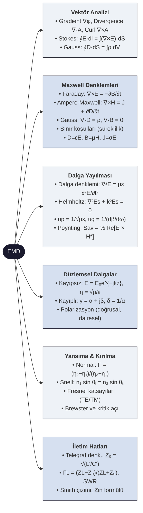

# ⚡ Elektromanyetik Dalga Teorisi — Ana Sayfa

← [[HOME]]

> **Özet:** Maxwell denklemleri → dalga denklemi → düzlemsel dalgalar → yansıma/kırılma → iletim hatları

---

## Konu Haritası

---

## Konu Anlatımları

| # | Not | İçerik |
|---|-----|--------|
| 01 | [[Konu Anlatımları/01 Vektör Analizi ve del Operatörü]] | ∇, curl, div, Stokes, koordinatlar |
| 02 | [[Konu Anlatımları/02 Maxwell Denklemleri]] | 4 denklem + sınır koşulları |
| 03 | [[Konu Anlatımları/03 Dalga Yayılması ve Düzlemsel Dalgalar]] | Dalga denklemi, Helmholtz, Poynting |
| 04 | [[Konu Anlatımları/04 Yansıma ve Sınır Koşulları]] | Fresnel, Snell, Brewster |
| 05 | [[Konu Anlatımları/05 İletim Hatları]] | Telegraf, empedans, duran dalga |
| FS | [[EMD Formül Sayfası]] | Tüm formüller özet |

## Örnek Sorular

| # | Not | İçerik |
|---|-----|--------|
| 01 | [[Örnek Sorular/01 Vektör Analizi Örnekleri]] | Hacim integrali, çizgi integrali, Stokes |
| 02 | [[Örnek Sorular/02 Maxwell Örnekleri]] | Deplasman akımı, Faraday, süreklilik |
| 03 | [[Örnek Sorular/03 Dalga Yayılması Örnekleri]] | Düzlemsel dalga, kayıp tanjantı |
| 04 | [[Örnek Sorular/04 Yansıma ve Sınır Koşulları Örnekleri]] | Dalga denklemi (silindirik), sınır koşulları |
| 05 | [[Örnek Sorular/05 İletim Hatları Örnekleri]] | Kapasitans, elektrostatik sınır örnekleri |

---

## Kritik Formüller (Özet)

### Maxwell (Diferansiyel)
$$\nabla\times\mathbf{E} = -\frac{\partial\mathbf{B}}{\partial t}, \quad \nabla\times\mathbf{H} = \mathbf{J}+\frac{\partial\mathbf{D}}{\partial t}$$
$$\nabla\cdot\mathbf{D}=\rho, \quad \nabla\cdot\mathbf{B}=0$$

### Dalga Denklemi (Kaynaksız)
$$\nabla^2\mathbf{E} - \mu\epsilon\frac{\partial^2\mathbf{E}}{\partial t^2}=0$$

### Poynting
$$\mathbf{S}=\mathbf{E}\times\mathbf{H}, \quad P_{av}=\frac{1}{2}\text{Re}[\mathbf{E}\times\mathbf{H}^*]$$

---

> [!sinav] Sınav Stratejisi
> 1. Maxwell denklemlerini diferansiyel + integral formda yaz
> 2. Sınır koşulları tablosunu ezberle
> 3. Düzlemsel dalga çözümünü türet
> 4. Fresnel katsayılarını uygula
