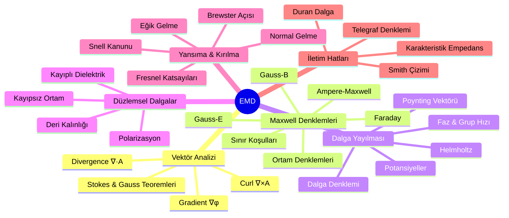

# ⚡ Elektromanyetik Dalga Teorisi — Ana Sayfa

← [[HOME]]

> **Özet:** Maxwell denklemleri → dalga denklemi → düzlemsel dalgalar → yansıma/kırılma → iletim hatları

---

## Konu Haritası

---

## Konular

| # | Not | İçerik |
|---|-----|--------|
| 01 | [[01 Vektör Analizi ve del Operatörü]] | ∇, curl, div, Stokes, koordinatlar |
| 02 | [[02 Maxwell Denklemleri]] | 4 denklem + sınır koşulları |
| 03 | [[03 Dalga Yayılması ve Düzlemsel Dalgalar]] | Dalga denklemi, Helmholtz, Poynting |
| 04 | [[04 Yansıma Kırılma ve Sınır Koşulları]] | Fresnel, Snell, Brewster |
| 05 | [[05 İletim Hatları]] | Telegraf, empedans, duran dalga |
| FS | [[EMD Formül Sayfası]] | Tüm formüller özet |

---

## Kritik Formüller (Özet)

### Maxwell (Diferansiyel)
$$\nabla\times\mathbf{E} = -\frac{\partial\mathbf{B}}{\partial t}, \quad \nabla\times\mathbf{H} = \mathbf{J}+\frac{\partial\mathbf{D}}{\partial t}$$
$$\nabla\cdot\mathbf{D}=\rho, \quad \nabla\cdot\mathbf{B}=0$$

### Dalga Denklemi (Kaynaksız)
$$\nabla^2\mathbf{E} - \mu\epsilon\frac{\partial^2\mathbf{E}}{\partial t^2}=0$$

### Poynting
$$\mathbf{S}=\mathbf{E}\times\mathbf{H}, \quad P_{av}=\frac{1}{2}\text{Re}[\mathbf{E}\times\mathbf{H}^*]$$

---

## Ders Notları — Temel Örnekler

### Maxwell Denklemleri — Hızlı Özet (16 Kas ders notu)

**Diferansiyel form (4 denklem):**

| | Elektrostatik | Dinamik (zamanla değişen) |
|-|---------------|--------------------------|
| Faraday | $\nabla\times\bar{E}=0$ | $\nabla\times\bar{E}=-\dfrac{\partial\bar{B}}{\partial t}$ |
| Ampere | $\nabla\times\bar{H}=\bar{J}$ | $\nabla\times\bar{H}=\bar{J}+\dfrac{\partial\bar{D}}{\partial t}$ |
| Gauss (E) | $\nabla\cdot\bar{D}=\rho_v$ | aynı |
| Gauss (B) | $\nabla\cdot\bar{B}=0$ | aynı |

**Ortam denklemleri:** $\bar{D}=\varepsilon\bar{E}$, $\bar{H}=\bar{B}/\mu$

**Akım türleri:** $\bar{J}_{iletim}=\sigma\bar{E}$, $\bar{J}_{konv}=\rho_v\bar{v}$

**Lorentz kuvvet:** $\bar{F}=q(\bar{E}+\bar{v}\times\bar{B})$

**İntegral form** (Stokes+Gauss teoremi ile türetilir):
$$\oint_C\bar{E}\cdot d\bar{l} = -\frac{d}{dt}\iint_S\bar{B}\cdot d\bar{S} \quad\text{(Faraday)}$$
$$\oint_C\bar{H}\cdot d\bar{l} = \iint_S\!\!\left(\bar{J}+\frac{\partial\bar{D}}{\partial t}\right)\!\cdot d\bar{S} \quad\text{(Ampere)}$$
$$\unicode{x222F}_S\bar{D}\cdot d\bar{S} = \iiint_V\rho_v\,dV \quad\text{(Gauss)}$$
$$\unicode{x222F}_S\bar{B}\cdot d\bar{S} = 0$$

---

### Deplasman Akımı — Kapasitör Örneği

**Problem:** $V_0$ genlikli ve $\omega$ açısal frekanslı $V_c(t)=V_0\sin(\omega t)$ AC kaynağa bağlı $C_1$ paralel plakalı kapasitörde:

a) Kapasitördeki deplasman akımının teldeki iletim akımına eşit olduğunu göster  
b) İletken telden $r$ uzaklıktaki $H$ alanını bul

**Çözüm a):**

① Kapasitör voltajı: $V_c = V_0\sin(\omega t)$

② Plakalardaki yük: $q(t) = C_1 V_c = C_1 V_0\sin(\omega t)$

③ İletim akımı:
$$i(t) = \frac{dq}{dt} = C_1 V_0\omega\cos(\omega t) \quad\text{[A]}$$

④ Kapasitör içi elektrik alanı: $E = V_c/d = (V_0/d)\sin(\omega t)$

$$J_D = \varepsilon\frac{\partial E}{\partial t} = \varepsilon\frac{V_0\omega}{d}\cos(\omega t)$$

Toplam deplasman akımı:
$$i_D = J_D\cdot A = \varepsilon\frac{A}{d}V_0\omega\cos(\omega t) = C_1 V_0\omega\cos(\omega t) \quad\because C_1=\varepsilon A/d$$

$$\boxed{i_D(t) = i(t)} \quad\checkmark$$

**Çözüm b):** (*Detay için: [[02 Maxwell Denklemleri]]*)
$$H(r,t) = \frac{C_1 V_0\omega\cos(\omega t)}{2\pi r} \;\text{A/m}$$

---

### Düzlemsel Dalga — Örnek (Soru 5, Ara 2025)

**Problem:** Serbest uzayda $\bar{E}(z,t) = \hat{a}_y\,12\pi\sin(\omega t-\beta z)$ V/m, $f=50$ MHz. $\bar{H}$ bileşenini bul.

**Çözüm:**

Yayılma yönü $+\hat{a}_z$; $\bar{E}$ yönü $\hat{a}_y$ → $\bar{H}$ yönü $\hat{a}_z\times\hat{a}_y=-\hat{a}_x$

$$\omega = 2\pi f = 2\pi\times50\times10^6 = 10^8\pi \;\text{rad/s}$$
$$\beta = \omega/c = \frac{10^8\pi}{3\times10^8} = \frac{\pi}{3} \;\text{rad/m}$$
$$\eta_0 = 120\pi \;\Omega \implies H_0 = \frac{E_0}{\eta_0} = \frac{12\pi}{120\pi} = 0.1 \;\text{A/m}$$

$$\boxed{\bar{H}(z,t) = -\hat{a}_x\,0.1\sin\!\left(10^8\pi t - \frac{\pi}{3}z\right) \;\text{A/m}}$$

---

### Karşılıklı İndüktans ve Faraday — Örnek (Soru 3)

**Problem:** Halka şeklinde iletken tel (a=0.1 m, b=0.2 m), $I(t)=10\cos(2\pi\times10^2 t)$ A taşıyan düz telle aynı düzlemde. Sonsuz düz telden kaynaklanan manyetik akıyı ve indüklenen EMF'yi bul.

**Çözüm:**

Düz telden $y$ uzaklıkta: $\bar{B} = \dfrac{\mu_0 I(t)}{2\pi y}\hat{a}_x$

Akı: $\Phi_m = \int_a^{a+b}\int_0^b \dfrac{\mu_0 I(t)}{2\pi y}dz\,dy = \dfrac{\mu_0 I(t)\cdot b}{2\pi}\ln\!\left(\dfrac{a+b}{a}\right)$

$$\mathcal{E} = -\frac{d\Phi_m}{dt} = -\frac{\mu_0 b}{2\pi}\ln\!\left(\frac{a+b}{a}\right)\frac{dI}{dt}$$

$\mu_0=4\pi\times10^{-7}$, $a=0.1$, $b=0.2$, $\ln(3)\approx1.0986$:

$$\frac{dI}{dt} = -10\cdot2\pi\times10^2\sin(2\pi\times10^2 t)$$

$$\mathcal{E}(t) \approx 2.76\sin(2\pi\times10^2 t) \;\text{mV}$$

$$\boxed{i(t) = \frac{\mathcal{E}}{R_{toplam}} = \frac{2.76\sin(2\pi\times10^2 t)\text{ mV}}{5\;\Omega} \approx 0.552\sin(2\pi\times10^2 t) \;\text{mA}}$$

---

### Süreklilik Denkleminin Türetimi (Soru 4)

Doğrusal, homojen, izotropik ortamda yük yoğunluğunun zamanla yok olduğu gösterilir:

$$\nabla\cdot\bar{J} = -\frac{\partial\rho_v}{\partial t} \quad\text{(Süreklilik)}$$
$$\text{Ohm: } \bar{J}=\sigma\bar{E}, \quad \text{Gauss: } \nabla\cdot\bar{E}=\rho_v/\varepsilon$$
$$\nabla\cdot(\sigma\bar{E}) = \sigma\nabla\cdot\bar{E} = \frac{\sigma}{\varepsilon}\rho_v = -\frac{\partial\rho_v}{\partial t}$$

$$\boxed{\frac{\partial\rho_v}{\partial t} + \frac{\sigma}{\varepsilon}\rho_v = 0}$$

Çözüm: $\rho_v(t) = \rho_{v0}\,e^{-(\sigma/\varepsilon)t}$ — iletkenliği olan ortamda serbest yükler $\tau=\varepsilon/\sigma$ relaksasyon süresiyle azalır.

---

> [!sinav] Sınav Stratejisi
> 1. Maxwell denklemlerini diferansiyel + integral formda yaz
> 2. Sınır koşulları tablosunu ezberle
> 3. Düzlemsel dalga çözümünü türet
> 4. Fresnel katsayılarını uygula
