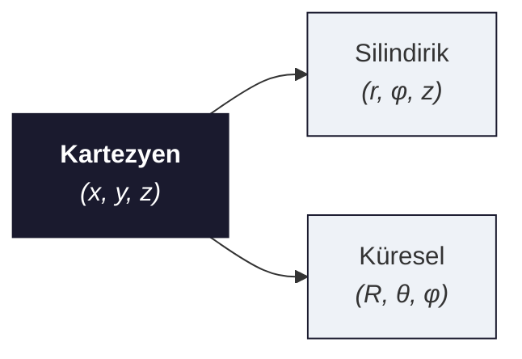
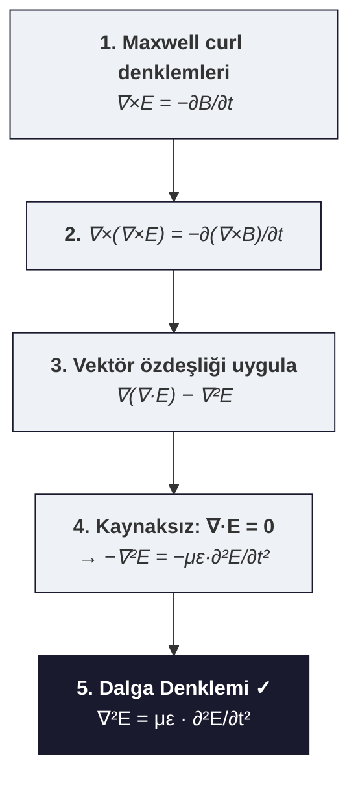

# 01 — Vektör Analizi ve ∇ Operatörü

← [[EMD Ana Sayfa]] | Örnekler: [[../Örnek Sorular/01 Vektör Analizi Örnekleri]]

> **Özet:** Elektromanyetik denklemlerin dili. ∇ operatörünün üç kullanımı ve iki integral teoremi → Maxwell denklemlerinin temeli.

---

## Koordinat Sistemleri

| Sistem | Hacim Elemanı $dv$ | Alan Elemanı |
|--------|-------------------|--------------|
| Kartezyen | $dx\,dy\,dz$ | $dy\,dz,\;dx\,dz,\;dx\,dy$ |
| Silindirik | $r\,dr\,d\phi\,dz$ | $r\,d\phi\,dz,\;dr\,dz,\;r\,dr\,d\phi$ |
| Küresel | $R^2\sin\theta\,dR\,d\theta\,d\phi$ | $R^2\sin\theta\,d\theta\,d\phi$ |

---

## ∇ Operatörünün Üç Kullanımı

> [!tanim] del (nabla) Operatörü — Kartezyen
> $$\nabla = \hat{x}\frac{\partial}{\partial x} + \hat{y}\frac{\partial}{\partial y} + \hat{z}\frac{\partial}{\partial z}$$

### 1. Gradient (Skaler → Vektör)

$$\nabla\phi = \hat{x}\frac{\partial\phi}{\partial x} + \hat{y}\frac{\partial\phi}{\partial y} + \hat{z}\frac{\partial\phi}{\partial z}$$

**Fiziksel anlam:** $\phi$'nin en hızlı arttığı yönü ve hızını verir.  
**Elektrik alan:** $\mathbf{E} = -\nabla V$

### 2. Divergence / Diverjans (Vektör → Skaler)

$$\nabla\cdot\mathbf{A} = \frac{\partial A_x}{\partial x} + \frac{\partial A_y}{\partial y} + \frac{\partial A_z}{\partial z}$$

**Fiziksel anlam:** Bir noktadan dışarıya "akan" net akı. Kaynak varsa $\neq 0$.  
**Gauss:** $\nabla\cdot\mathbf{D} = \rho$

### 3. Curl / Rotasyonel (Vektör → Vektör)

$$\nabla\times\mathbf{A} = \begin{vmatrix}\hat{x}&\hat{y}&\hat{z}\\\partial_x&\partial_y&\partial_z\\A_x&A_y&A_z\end{vmatrix}$$

**Fiziksel anlam:** Döngüsel/rotasyonel karakteri ölçer.  
**Faraday:** $\nabla\times\mathbf{E} = -\partial_t\mathbf{B}$

### 4. Laplacian (Skaler → Skaler)

$$\nabla^2\phi = \nabla\cdot(\nabla\phi) = \frac{\partial^2\phi}{\partial x^2}+\frac{\partial^2\phi}{\partial y^2}+\frac{\partial^2\phi}{\partial z^2}$$

Vektörel Laplacian: $\nabla^2\mathbf{A} = \nabla(\nabla\cdot\mathbf{A}) - \nabla\times(\nabla\times\mathbf{A})$

---

## İki Temel İntegral Teoremi

> [!formul] Stokes Teoremi
> $$\oint_C \mathbf{A}\cdot d\mathbf{l} = \iint_S (\nabla\times\mathbf{A})\cdot d\mathbf{S}$$
> Rotasyonel (curl) denklemlerini → integral forma dönüştürür (Faraday, Ampere).

> [!formul] Diverjans (Gauss) Teoremi
> $$\unicode{x222F}_S \mathbf{A}\cdot d\mathbf{S} = \iiint_V (\nabla\cdot\mathbf{A})\,dv$$
> Diverjans denklemlerini → integral forma dönüştürür (Gauss yasaları).

---

## Vektörel Özdeşlikler (Ezberle!)

> [!formul] Kritik Özdeşlikler
> 1. $\nabla\cdot(\nabla\times\mathbf{A}) \equiv 0$ — Rotasyonelin diverjansı her zaman sıfır
> 2. $\nabla\times(\nabla\phi) \equiv 0$ — Skalerin gradyentinin rotasyoneli sıfır
> 3. $\nabla\times(\nabla\times\mathbf{A}) = \nabla(\nabla\cdot\mathbf{A}) - \nabla^2\mathbf{A}$
> 4. $\nabla\cdot(\nabla\phi) = \nabla^2\phi$

| Özdeşlik | İfade |
|---------|-------|
| $\nabla\cdot(\mathbf{A}\times\mathbf{B})$ | $\mathbf{B}\cdot(\nabla\times\mathbf{A}) - \mathbf{A}\cdot(\nabla\times\mathbf{B})$ |
| $\nabla(\psi\phi)$ | $\psi\nabla\phi + \phi\nabla\psi$ |
| $\nabla\cdot(\psi\mathbf{A})$ | $\psi\nabla\cdot\mathbf{A} + \mathbf{A}\cdot\nabla\psi$ |
| $\nabla\times(\psi\mathbf{A})$ | $\psi\nabla\times\mathbf{A} + (\nabla\psi)\times\mathbf{A}$ |

---

## Silindirik ve Küresel Koordinatlarda ∇

**Silindirik $(r, \phi, z)$:**
$$\nabla\cdot\mathbf{A} = \frac{1}{r}\frac{\partial(rA_r)}{\partial r} + \frac{1}{r}\frac{\partial A_\phi}{\partial\phi} + \frac{\partial A_z}{\partial z}$$

$$\nabla^2\phi = \frac{1}{r}\frac{\partial}{\partial r}\!\left(r\frac{\partial\phi}{\partial r}\right) + \frac{1}{r^2}\frac{\partial^2\phi}{\partial\phi^2} + \frac{\partial^2\phi}{\partial z^2}$$

**Küresel $(R, \theta, \phi)$:**
$$\nabla\cdot\mathbf{A} = \frac{1}{R^2}\frac{\partial(R^2 A_R)}{\partial R} + \frac{1}{R\sin\theta}\frac{\partial(\sin\theta\, A_\theta)}{\partial\theta} + \frac{1}{R\sin\theta}\frac{\partial A_\phi}{\partial\phi}$$

---

## Özdeşliğin Kullanımı: Dalga Denklemi Türetimi

---

> [!sinav] Sınav İpuçları
> - Sınır koşullarını türetmek için Stokes ve Gauss teoremlerini çok ince ($\Delta h \to 0$) yüzeylere/hacme uygula
> - $\nabla\times(\nabla\times\mathbf{A})$ özdeşliği dalga denklemi türetiminin kalbidir — ezberle
> - Koordinat sistemi seçimi simetriyi kullan: küresel → nokta yük, silindirik → tel

---

**Bağlantılar:** [[02 Maxwell Denklemleri]] | [[03 Dalga Yayılması ve Düzlemsel Dalgalar]] | [[EMD Formül Sayfası]]
