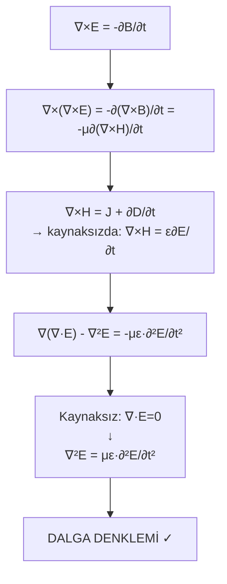

# 03 — Dalga Yayılması ve Düzlemsel Dalgalar

← [[EMD Ana Sayfa]] | Örnekler: [[../Örnek Sorular/03 Dalga Yayılması Örnekleri]]

> **Özet:** Maxwell → dalga denklemi → Helmholtz → düzlemsel dalga çözümü. Kayıplı ortamda deri derinliği. Poynting vektörü ile enerji taşınımı.

---

## Dalga Denkleminin Türetimi

> [!formul] Dalga Denklemi (Kaynaksız, Basit Ortam)
> $$\nabla^2\mathbf{E} - \mu\epsilon\frac{\partial^2\mathbf{E}}{\partial t^2} = 0$$
> $$\nabla^2\mathbf{H} - \mu\epsilon\frac{\partial^2\mathbf{H}}{\partial t^2} = 0$$

**Yayılma hızı:**
$$u_p = \frac{1}{\sqrt{\mu\epsilon}} = \frac{c}{\sqrt{\mu_r\epsilon_r}} \quad\text{(m/s)}$$

---

## Potansiyeller ve Lorenz Gauge

**Manyetik vektör potansiyeli:** $\mathbf{B} = \nabla\times\mathbf{A}$

**Elektrik alan (dinamik):**
$$\mathbf{E} = -\nabla V - \frac{\partial\mathbf{A}}{\partial t}$$

> [!formul] Lorenz Koşulu (Dinamik Uyumluluk)
> $$\nabla\cdot\mathbf{A} + \mu\epsilon\frac{\partial V}{\partial t} = 0$$

Bunu kullanarak $\mathbf{A}$ ve $V$ için ayrı dalga denklemleri:
$$\nabla^2\mathbf{A} - \mu\epsilon\frac{\partial^2\mathbf{A}}{\partial t^2} = -\mu\mathbf{J}$$
$$\nabla^2 V - \mu\epsilon\frac{\partial^2 V}{\partial t^2} = -\frac{\rho}{\epsilon}$$

---

## Helmholtz Denklemi (Fazör / Harmonik)

Zamana harmonik: $\mathbf{E}(\mathbf{r},t) = \text{Re}[\mathbf{E}_s(\mathbf{r})e^{j\omega t}]$

$$\nabla^2\mathbf{E}_s + k^2\mathbf{E}_s = 0 \quad\text{(Helmholtz)}$$

$$k = \omega\sqrt{\mu\epsilon} \quad\text{dalga sayısı (rad/m)}$$

Serbest uzayda: $k_0 = \omega\sqrt{\mu_0\epsilon_0} = \omega/c$

---

## Düzlemsel Dalga Çözümü

**+z yönünde yayılan x-polarize dalga:**
$$\mathbf{E}(z,t) = \hat{x}E_0^+\cos(\omega t - k_0 z)$$

**Fazör:** $\mathbf{E}_s(z) = \hat{x}E_0^+ e^{-jk_0 z}$

**Dalga sabitleri:**

| Büyüklük | Formül | Anlam |
|---------|--------|-------|
| Dalga sayısı $k$ | $\omega/u_p$ | rad/m |
| Dalga boyu $\lambda$ | $2\pi/k$ | m |
| Periyot $T$ | $2\pi/\omega$ | s |
| Faz hızı $u_p$ | $\omega/k = 1/\sqrt{\mu\epsilon}$ | m/s |

---

## Kayıplı Dielektrik (İletken Ortam)

Kompleks dielektrik sabit: $\epsilon_c = \epsilon' - j\epsilon'' = \epsilon - j\sigma/\omega$

**Yayılma sabiti:**
$$\gamma = \alpha + j\beta = j\omega\sqrt{\mu\epsilon_c} = j\omega\sqrt{\mu\left(\epsilon - j\frac{\sigma}{\omega}\right)}$$

| Parametre | Formül | Anlam |
|-----------|--------|-------|
| $\alpha$ (zayıflama) | $\omega\sqrt{\frac{\mu\epsilon'}{2}\left[\sqrt{1+(\sigma/\omega\epsilon')^2}-1\right]}$ | Np/m |
| $\beta$ (faz) | $\omega\sqrt{\frac{\mu\epsilon'}{2}\left[\sqrt{1+(\sigma/\omega\epsilon')^2}+1\right]}$ | rad/m |

**Alan:** $\mathbf{E} = \hat{x}E_0 e^{-\alpha z}\cos(\omega t-\beta z)$

> [!formul] Deri Kalınlığı (Skin Depth)
> $$\delta = \frac{1}{\alpha} \quad\text{(m)}$$
> İyi iletkenler için: $\delta = \sqrt{\frac{2}{\omega\mu\sigma}}$

---

## Öz Empedans (Intrinsic Impedance)

> [!formul] Öz Empedans η
> $$\eta = \sqrt{\frac{\mu}{\epsilon}} \quad\text{(kayıpsız, Ω)}$$
> $$\eta_c = \sqrt{\frac{\mu}{\epsilon_c}} = |\eta|e^{j\theta_\eta} \quad\text{(kayıplı, kompleks)}$$

Serbest uzay: $\eta_0 = \sqrt{\mu_0/\epsilon_0} \approx 120\pi \approx 377\ \Omega$

**H alanı:** $\mathbf{H} = \frac{1}{\eta}(\hat{k}\times\mathbf{E})$

**Ortogonallik:** $\mathbf{E} \perp \mathbf{H} \perp \hat{k}$ (TEM dalga)

---

## Poynting Vektörü — Enerji Taşınımı

> [!formul] Anlık Poynting Vektörü
> $$\mathbf{S}(t) = \mathbf{E}(t)\times\mathbf{H}(t) \quad\text{(W/m²)}$$

> [!formul] Zaman Ortalamalı (Kompleks Fazör)
> $$\mathbf{S}_{av} = \frac{1}{2}\text{Re}[\mathbf{E}_s\times\mathbf{H}_s^*] \quad\text{(W/m²)}$$

**Kayıpsız düzlemsel dalgada:**
$$S_{av} = \frac{|E_0|^2}{2\eta} = \frac{\eta|H_0|^2}{2}$$

---

## Faz Hızı vs Grup Hızı

| Kavram | Formül | Anlam |
|--------|--------|-------|
| Faz hızı $u_p$ | $\omega/\beta$ | Eşfaz cephesi hızı |
| Grup hızı $u_g$ | $1/(d\beta/d\omega)$ | Enerji/bilgi taşınım hızı |

Dispersif ortamda $u_p \neq u_g$.

---

> [!sinav] Sınav İpuçları
> - **Düzlemsel dalga çözümü:** z-ekseni boyunca giden $e^{-jkz}$ fazörü — gerçel zamana geçince $\cos(\omega t - kz)$
> - **E⊥H⊥k** her zaman — TEM karakteri
> - **Kayıplı dielektrikte:** $\alpha$ zayıflama, $\beta$ faz değişimi; $\delta=1/\alpha$ ezberle
> - **İyi iletken:** $\sigma/\omega\epsilon \gg 1$ → $\alpha\approx\beta\approx\sqrt{\omega\mu\sigma/2}$
> - **Poynting:** zaman ortalaması için $\frac{1}{2}\text{Re}[\mathbf{E}\times\mathbf{H}^*]$

---

**Bağlantılar:** [[02 Maxwell Denklemleri]] | [[04 Yansıma Kırılma ve Sınır Koşulları]] | [[05 İletim Hatları]] | [[EMD Formül Sayfası]]
