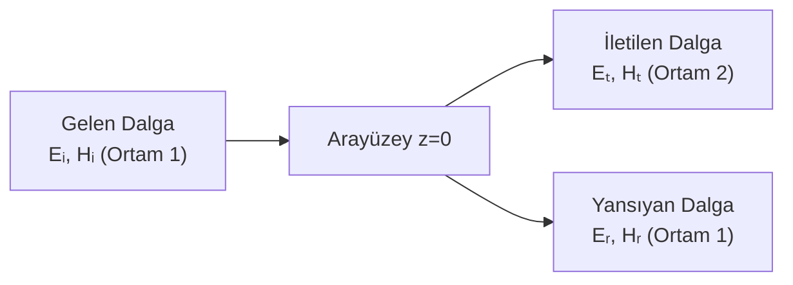

# 04 — Yansıma, Kırılma ve Sınır Koşulları

← [[EMD Ana Sayfa]] | Örnekler: [[../Örnek Sorular/04 Yansıma ve Sınır Koşulları Örnekleri]]

> **Özet:** Bir ortamdan diğerine geçen EM dalga → yansıyan + iletilen dalga. Fresnel katsayıları, Snell kanunu, Brewster ve kritik açılar.

---

## Genel Senaryo

**Yansıma katsayısı (Γ):** $\Gamma = E_{r0}/E_{i0}$  
**İletim katsayısı (τ):** $\tau = E_{t0}/E_{i0}$

---

## Dik Gelme (Normal Incidence)

Dalga +z yönünde, arayüzey z=0:

**Gelen:**
$$\mathbf{E}_i = \hat{x}E_{i0}e^{-j\beta_1 z}, \quad \mathbf{H}_i = \hat{y}\frac{E_{i0}}{\eta_1}e^{-j\beta_1 z}$$

**Yansıyan:**
$$\mathbf{E}_r = \hat{x}E_{r0}e^{+j\beta_1 z}, \quad \mathbf{H}_r = -\hat{y}\frac{E_{r0}}{\eta_1}e^{+j\beta_1 z}$$

**İletilen:**
$$\mathbf{E}_t = \hat{x}E_{t0}e^{-j\beta_2 z}, \quad \mathbf{H}_t = \hat{y}\frac{E_{t0}}{\eta_2}e^{-j\beta_2 z}$$

Sınır koşulları ($E_t$ ve $H_t$ sürekli) → 

> [!formul] Dik Gelme Yansıma ve İletim Katsayıları
> $$\Gamma = \frac{\eta_2 - \eta_1}{\eta_2 + \eta_1}, \qquad \tau = \frac{2\eta_2}{\eta_2 + \eta_1}$$
> $$\tau = 1 + \Gamma$$

**İdeal iletken ($\eta_2=0$):** $\Gamma=-1$, $\tau=0$ → tam yansıma.

**Güç yoğunlukları:**
$$\frac{P_r}{P_i} = |\Gamma|^2, \qquad \frac{P_t}{P_i} = 1-|\Gamma|^2 \quad\text{(enerji korunumu)}$$

---

## Duran Dalga (Standing Wave) — Mükemmel İletken Sınırı

$\Gamma=-1$ durumunda ortam 1'deki toplam alan:

$$E_{1z}(z) = E_{i0}(e^{-j\beta_1 z} - e^{+j\beta_1 z}) = -j2E_{i0}\sin(\beta_1 z)$$
$$H_{1z}(z) = \frac{2E_{i0}}{\eta_1}\cos(\beta_1 z)$$

**Düğüm (node):** $E=0$, z = 0, $-\lambda/2$, $-\lambda$, ...  
**Karın (antinode):** $E$ max, z = $-\lambda/4$, $-3\lambda/4$, ...

> [!formul] Duran Dalga Oranı (SWR)
> $$\text{SWR} = \frac{1+|\Gamma|}{1-|\Gamma|}$$

---

## Eğik Gelme (Oblique Incidence)

Gelme açısı $\theta_i$, yansıma açısı $\theta_r$, kırılma açısı $\theta_t$.

> [!formul] Snell Kanunu
> $$n_1\sin\theta_i = n_2\sin\theta_t$$
> $$\Leftrightarrow \beta_1\sin\theta_i = \beta_2\sin\theta_t$$

**Yansıma yasası:** $\theta_r = \theta_i$

---

## Fresnel Katsayıları

### TE (s) Polarizasyon (E ⊥ geliş düzlemine)

> [!formul] TE Fresnel Katsayıları
> $$\Gamma_{TE} = \frac{\eta_2\cos\theta_i - \eta_1\cos\theta_t}{\eta_2\cos\theta_i + \eta_1\cos\theta_t}$$
> $$\tau_{TE} = \frac{2\eta_2\cos\theta_i}{\eta_2\cos\theta_i + \eta_1\cos\theta_t}$$

### TM (p) Polarizasyon (E ∥ geliş düzlemine)

> [!formul] TM Fresnel Katsayıları
> $$\Gamma_{TM} = \frac{\eta_2\cos\theta_t - \eta_1\cos\theta_i}{\eta_2\cos\theta_t + \eta_1\cos\theta_i}$$
> $$\tau_{TM} = \frac{2\eta_2\cos\theta_i}{\eta_2\cos\theta_t + \eta_1\cos\theta_i}$$

---

## Kritik Açılar

### Kritik Açı (Tam İç Yansıma)

Sadece $n_1 > n_2$ (yoğundan seyreğe) durumunda var:

> [!formul] Kritik Açı
> $$\theta_c = \arcsin\!\left(\frac{n_2}{n_1}\right) = \arcsin\!\left(\sqrt{\frac{\epsilon_2}{\epsilon_1}}\right)$$

$\theta_i > \theta_c$ → $\Gamma = e^{j\psi}$, $|\Gamma|=1$ → **tam iç yansıma**

### Brewster Açısı (Tam İletim — TM polarizasyon)

> [!formul] Brewster Açısı
> $$\tan\theta_B = \frac{n_2}{n_1} = \sqrt{\frac{\epsilon_2}{\epsilon_1}}$$

$\theta_i = \theta_B$ → $\Gamma_{TM}=0$ → yansıyan dalga tamamen TE polarize.

---

## Hızlı Karşılaştırma Tablosu

| Durum | Şart | Sonuç |
|-------|------|-------|
| Tam yansıma (iletken) | $\eta_2=0$ | $\Gamma=-1$, SWR=∞ |
| Empedans uyumu | $\eta_1=\eta_2$ | $\Gamma=0$, $\tau=1$ |
| Kritik açı | $n_1>n_2$, $\theta_i=\theta_c$ | $|\Gamma|=1$ |
| Brewster açısı | TM pol., $\theta_i=\theta_B$ | $\Gamma_{TM}=0$ |

---

> [!sinav] Sınav İpuçları
> - **Dik gelmede:** $\Gamma=(\eta_2-\eta_1)/(\eta_2+\eta_1)$ — pay/payda sırası önemli!
> - **$R+T=1$** kontrol et (güç): $|\Gamma|^2 + (1-|\Gamma|^2) = 1$
> - **Snell:** $n_1\sin\theta_i = n_2\sin\theta_t$ — kırıcılık indisi $n=\sqrt{\epsilon_r\mu_r}$
> - **Brewster:** sadece TM (p) polarizasyon için Γ=0
> - **Tam iç yansıma:** $n_1>n_2$ şartı + $\theta_i>\theta_c$ şartı
> - **İşaret hatası:** Γ negatif olabilir — fiziksel anlam faz terslemesi

---

**Bağlantılar:** [[03 Dalga Yayılması ve Düzlemsel Dalgalar]] | [[05 İletim Hatları]] | [[02 Maxwell Denklemleri]] | [[EMD Formül Sayfası]]
