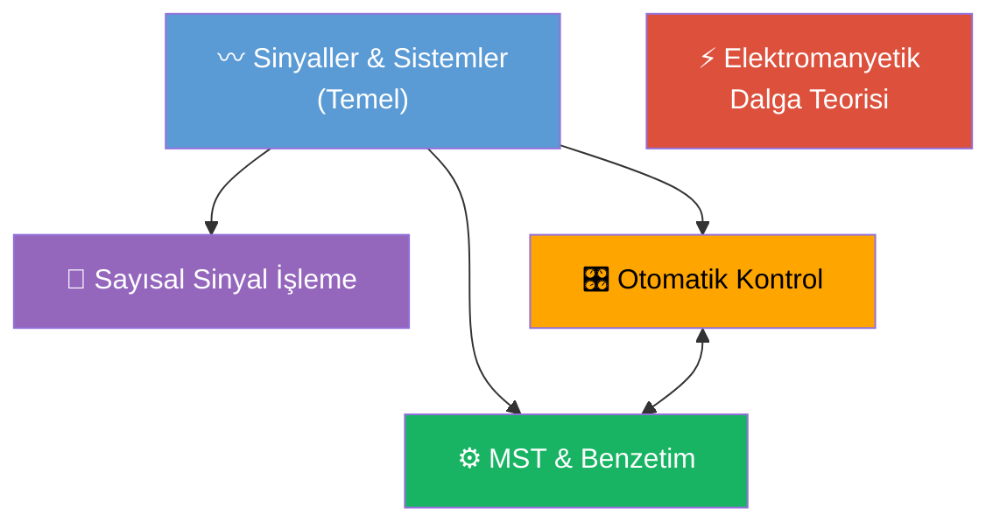
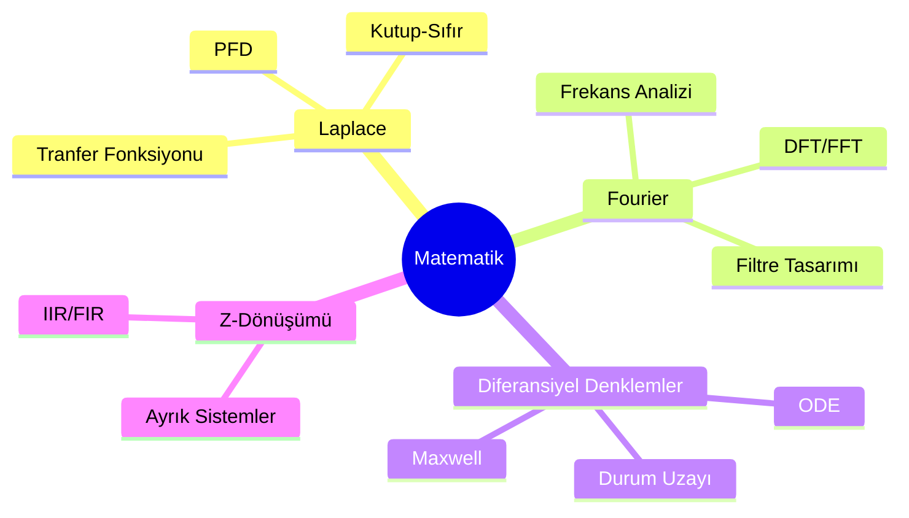

# Bütünleme Dönemi — Second Brain

> **Sınav haftası:** Haziran 2026 · **Hedef:** 5 dersten geçmek 💪

---

## Dersler

| Ders                                                                             | Hub                                                        | Formül Sayfası                                                  | Durum |
| -------------------------------------------------------------------------------- | ---------------------------------------------------------- | --------------------------------------------------------------- | ----- |
| [[Elektromanyetik Dalga Teorisi/EMD Ana Sayfa\|⚡ Elektromanyetik Dalga Teorisi]] | [[Elektromanyetik Dalga Teorisi/EMD Ana Sayfa]]            | [[Elektromanyetik Dalga Teorisi/EMD Formül Sayfası]]            | 🔴    |
| [[Mühendislik Sİstem Tasarımı ve Benzetimi/MST Ana Sayfa\|⚙️ MST & Benzetim]]    | [[Mühendislik Sİstem Tasarımı ve Benzetimi/MST Ana Sayfa]] | [[Mühendislik Sİstem Tasarımı ve Benzetimi/MST Formül Sayfası]] | 🔴    |
| [[Otomatik Kontrol/OK Ana Sayfa\|🎛️ Otomatik Kontrol]]                          | [[Otomatik Kontrol/OK Ana Sayfa]]                          | [[Otomatik Kontrol/OK Formül Sayfası]]                          | 🔴    |
| [[Sayısal Sinyal İşleme/SSI Ana Sayfa\|📡 Sayısal Sinyal İşleme]]                | [[Sayısal Sinyal İşleme/SSI Ana Sayfa]]                    | [[Sayısal Sinyal İşleme/SSI Formül Sayfası]]                    | 🔴    |
| [[Sİnyaller ve Sistemler/SS Ana Sayfa\|〰️ Sinyaller ve Sistemler]]               | [[Sİnyaller ve Sistemler/SS Ana Sayfa]]                    | [[Sİnyaller ve Sistemler/SS Formül Sayfası]]                    | 🔴    |

---

## Konular Arası Bağlantılar

---

## Ortak Matematik Araçları

---

## Hızlı Bağlantılar

- [[00 Sınav Takvimi ve Strateji]] — Sınav planı ve strateji
- [[00 Dış Kaynaklar ve MSÜ Rehberi]] — MSÜ UZEM, JAST dergi, açık erişim PDF'ler
- [[_templates/Ders Notu Template]] — Yeni not şablonu

---

> **Grafik Görünümü:** `Ctrl+G` ile açıp her dersin renk grubunu görebilirsin.
> **Arama:** `Ctrl+Shift+F` ile tüm vault'ta arama yapabilirsin.
