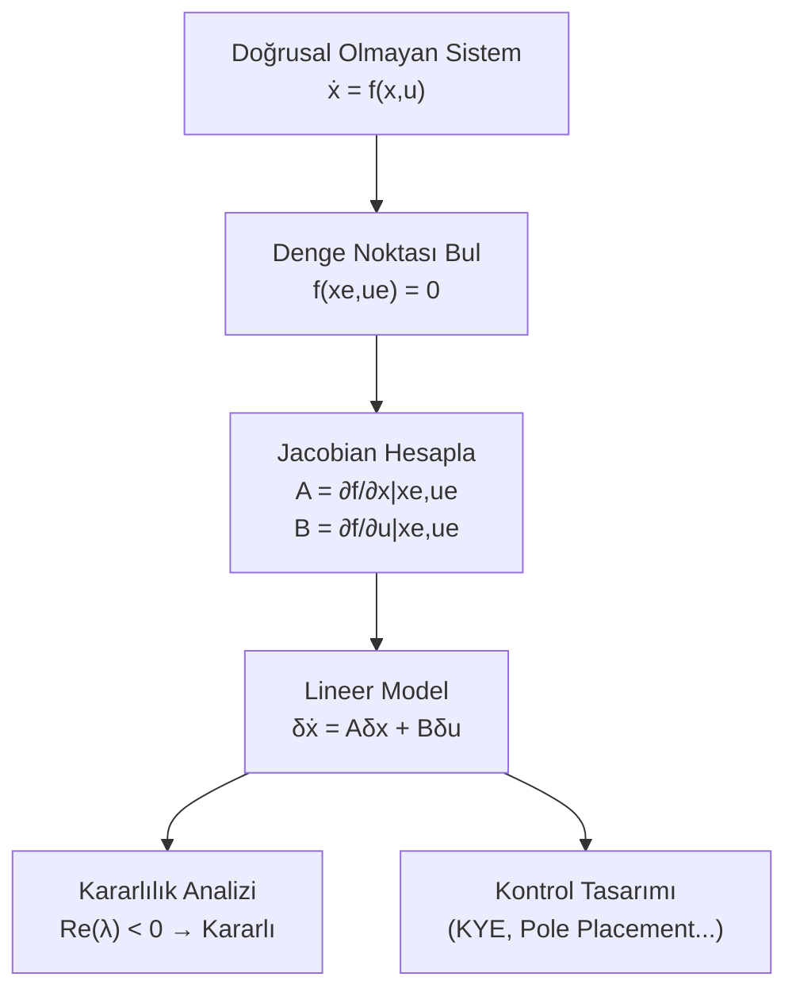

# 04 — Doğrusallaştırma

← [[MST Ana Sayfa]]

## Neden Doğrusallaştırma?

Gerçek sistemler genellikle **doğrusal olmayan** diferansiyel denklemlerle tanımlanır:

$$\dot{x} = f(x, u)$$

Kontrol teorisi araçları (KYE, Bode, Routh) sadece **lineer** sistemler için çalışır.

**Çözüm:** Bir çalışma noktası (denge noktası) çevresinde Taylor serisi açılımı → lineer yaklaşım.

---

## Denge Noktası (Equilibrium Point)

> [!tanim] Denge Noktası
> $x_e$, $u_e$ değerlerinde sistem değişmiyorsa:
> $$f(x_e, u_e) = 0$$

**Bulma adımları:**
1. $\dot{x} = f(x, u)$ yaz
2. $\dot{x} = 0$ koy (denge şartı)
3. $x_e$, $u_e$ bul (birden fazla denge noktası olabilir)

---

## Taylor Serisi Doğrusallaştırma

Küçük sapmalar tanımla:
$$\delta x = x - x_e, \quad \delta u = u - u_e, \quad \delta\dot{x} = \dot{x} - \dot{x}_e = \dot{x}$$

Tek değişkenli Taylor serisi:
$$f(x) \approx f(x_e) + \left.\frac{df}{dx}\right|_{x_e} (x - x_e) + \ldots$$

Çok değişkenli sistem için:

$$\delta\dot{x} \approx \underbrace{\left.\frac{\partial f}{\partial x}\right|_{x_e, u_e}}_{A} \delta x + \underbrace{\left.\frac{\partial f}{\partial u}\right|_{x_e, u_e}}_{B} \delta u$$

$$\boxed{\delta\dot{x} = A\,\delta x + B\,\delta u}$$

---

## Jacobian Matrisleri

**Sistem matrisi** $A$ (Jacobian $f$'e göre $x$):

$$A = \left.\frac{\partial f}{\partial x}\right|_{x_e, u_e} = \begin{bmatrix} \frac{\partial f_1}{\partial x_1} & \frac{\partial f_1}{\partial x_2} & \cdots \\ \frac{\partial f_2}{\partial x_1} & \frac{\partial f_2}{\partial x_2} & \cdots \\ \vdots & & \ddots \end{bmatrix}_{x_e, u_e}$$

**Giriş matrisi** $B$ (Jacobian $f$'e göre $u$):

$$B = \left.\frac{\partial f}{\partial u}\right|_{x_e, u_e}$$

---

## Çözümlü Örnek 1: Basit Sarkaç

**Doğrusal olmayan sistem:**
$$\ddot{\theta} + \frac{g}{L}\sin\theta = 0$$

**Durum değişkenleri:** $x_1 = \theta$, $x_2 = \dot{\theta}$

$$f_1 = x_2, \quad f_2 = -\frac{g}{L}\sin x_1$$

**Denge noktaları:** $f_1 = 0 \implies x_2 = 0$, $f_2 = 0 \implies \sin x_1 = 0$
$$x_e = (0, 0) \quad \text{veya} \quad x_e = (\pi, 0)$$

**$x_e = (0, 0)$ çevresinde Jacobian:**

$$A = \begin{bmatrix} \frac{\partial f_1}{\partial x_1} & \frac{\partial f_1}{\partial x_2} \\ \frac{\partial f_2}{\partial x_1} & \frac{\partial f_2}{\partial x_2} \end{bmatrix}_{(0,0)} = \begin{bmatrix} 0 & 1 \\ -\frac{g}{L}\cos(0) & 0 \end{bmatrix} = \begin{bmatrix} 0 & 1 \\ -g/L & 0 \end{bmatrix}$$

Özdeğerler: $\lambda^2 + g/L = 0 \implies \lambda = \pm j\sqrt{g/L}$ → **sınır kararlı** (salınım)

**$x_e = (\pi, 0)$ çevresinde:**

$$A = \begin{bmatrix} 0 & 1 \\ -\frac{g}{L}\cos(\pi) & 0 \end{bmatrix} = \begin{bmatrix} 0 & 1 \\ g/L & 0 \end{bmatrix}$$

Özdeğerler: $\lambda = \pm\sqrt{g/L}$ → **kararsız** (ters sarkaç)

---

## Çözümlü Örnek 2: Doğrusal Olmayan Mekanik

**Sistem:** $m\ddot{x} + b\dot{x}^3 + kx^2 = f$

Durum değişkenleri: $x_1 = x$, $x_2 = \dot{x}$

$$f_1 = x_2$$
$$f_2 = \frac{1}{m}(f - b x_2^3 - k x_1^2)$$

**Denge noktası ($f_e = 0$ girişi için):** $x_2 = 0$, $k x_{1e}^2 = 0 \implies x_{1e} = 0$

**Jacobian:**

$$A = \begin{bmatrix} 0 & 1 \\ -2kx_1/m & -3bx_2^2/m \end{bmatrix}_{(0,0,0)} = \begin{bmatrix} 0 & 1 \\ 0 & 0 \end{bmatrix}$$

$$B = \begin{bmatrix} 0 \\ 1/m \end{bmatrix}_{(0,0)} = \begin{bmatrix} 0 \\ 1/m \end{bmatrix}$$

**Lineerleştirilmiş sistem:**
$$\delta\dot{x} = \begin{bmatrix} 0 & 1 \\ 0 & 0 \end{bmatrix}\delta x + \begin{bmatrix} 0 \\ 1/m \end{bmatrix}\delta f$$

---

## Çözümlü Örnek 3: Elektrik (Diyot)

**Diyot denklemi:** $i = I_s(e^{v/(nV_T)} - 1) \approx I_s e^{v/(nV_T)}$

**Çalışma noktası:** $(V_Q, I_Q)$

**Küçük sinyal modeli (lineerleştirilmiş):**

$$g_m = \left.\frac{di}{dv}\right|_{V_Q} = \frac{I_Q}{nV_T}$$

$$\delta i = g_m \delta v$$

---

## Lyapunov ile Kararlılık (Giriş)

Lineerleştirilmiş sistemin özdeğerleri:

| Özdeğer | Kararlılık |
|---------|-----------|
| $\text{Re}(\lambda_i) < 0$ tümü | Lokal asimptotik kararlı |
| $\text{Re}(\lambda_i) > 0$ herhangi biri | Lokal kararsız |
| $\text{Re}(\lambda_i) = 0$ birkaçı | Belirsiz (doğrusal analiz yetersiz) |

> [!warning] Önemli
> Lineerleştirilmiş analizin geçerliliği yalnızca denge noktasının **yakınında** geçerlidir!
> Büyük sapmalar için orijinal doğrusal olmayan sistem incelenmelidir.

---

## Özet Akış Diyagramı

---

> [!sinav] Sınav İpucu
> - Taylor 1. derece: $f(x) \approx f(x_e) + f'(x_e)(x-x_e)$
> - Jacobian = her $f_i$'yi her $x_j$'ye göre türev al, $x_e$'de değerlendir
> - $\sin x \approx x$, $\cos x \approx 1$ (küçük açı: $x_e = 0$ için)
> - $e^x \approx 1 + x$ (küçük sapmalar için)
> - Sıfır girişte denge: $f(x_e, 0) = 0$'ı çöz

---

← [[03 Durum Uzayı]] | [[MST Ana Sayfa]] | → [[05 Kök Yer Eğrisi ve Kompansasyon]]
