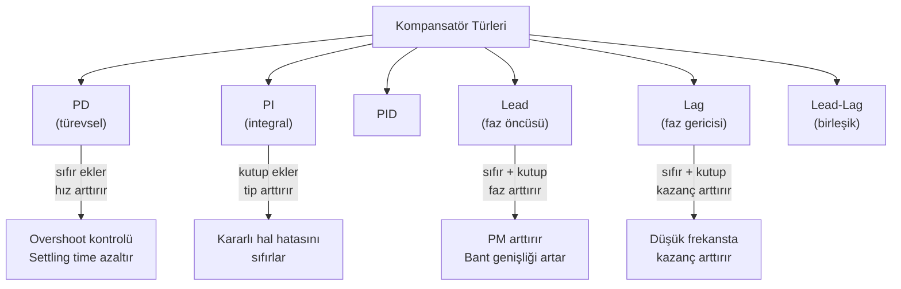
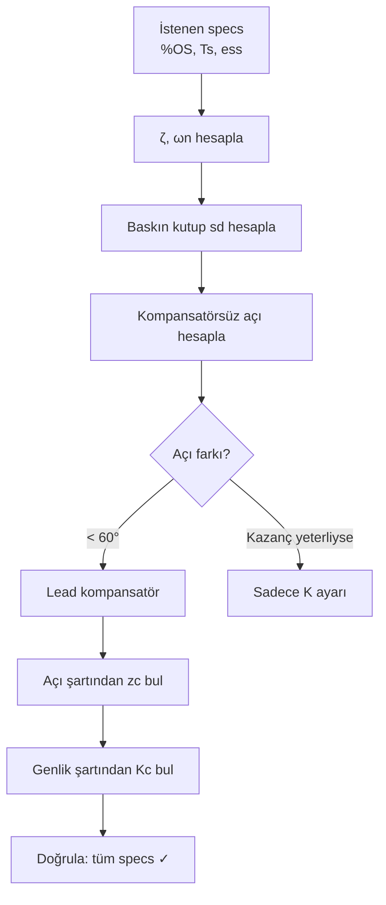

# 05 — Kök Yer Eğrisi ve Kompansasyon

← [[MST Ana Sayfa]]

> [!link] Temel KYE Teorisi
> KYE çizim kuralları ve çözümlü örnekler için: **[[../Otomatik Kontrol/04 Kök Yer Eğrisi|OK — KYE]]**
> Bu notta MST perspektifinden **kompansatör tasarımı** ağırlıklıdır.

---

## Tasarım Hedefleri

Kapalı çevrim sistem tasarımında tipik hedefler:

| Hedef | Parametre |
|-------|----------|
| Belirli aşım oranı | $\%OS \to \zeta$ |
| Belirli yerleşme süresi | $T_s \to \sigma = \zeta\omega_n$ |
| Belirli yükselme süresi | $T_r \to \omega_d$ |
| Sıfır kararlı hal hatası | Sistem tipi arttır |
| Belirli kazanç payı | Bode PM/GM |

---

## Kompansatör Türleri

---

## PD Kompansatörü

$$G_c(s) = K_c(s + z_c)$$

- Kapalı çevrim karakteristik denklemine **sıfır ekler**
- KYE'yi **sola çeker** (daha hızlı yanıt)
- Gürültüye duyarlı (frekans artışı)

**Tasarım yöntemi:**
1. $\%OS$'tan $\zeta$ hesapla: $\zeta = \dfrac{-\ln(\%OS/100)}{\sqrt{\pi^2+\ln^2(\%OS/100)}}$
2. $T_s$'ten $\sigma = \zeta\omega_n$ hesapla: $\sigma = 4/T_s$ (%2 kriter)
3. İstenen baskın kutup: $s_d = -\sigma \pm j\omega_d$ ($\omega_d = \omega_n\sqrt{1-\zeta^2}$)
4. Açı şartını sağlayan $z_c$ bul
5. Genlik şartından $K_c$ bul

**Açı şartı:**
$$\angle G_c(s_d) G_p(s_d) = \pm 180°$$

---

## Çözümlü Örnek 1: PD Tasarımı

**Bitki:** $G_p(s) = \dfrac{1}{s(s+4)(s+6)}$

**Hedef:** $\%OS = 16\%$, $T_s \leq 2$ s

**Adım 1:** $\%OS = 16\% \implies \zeta \approx 0.5$

**Adım 2:** $T_s = 4/(\zeta\omega_n) \leq 2 \implies \omega_n \geq 4$

$\sigma = \zeta\omega_n = 0.5 \times 4 = 2$, $\omega_d = \omega_n\sqrt{1-\zeta^2} = 4\cdot\sqrt{3}/2 \approx 3.46$

**Baskın kutup:** $s_d = -2 + j3.46$

**Adım 3:** Kompansatörsüz açı hesabı

$\angle G_p(s_d) = \angle\frac{1}{s_d(s_d+4)(s_d+6)}$

- $\angle s_d = \angle(-2+j3.46) = 180° - \arctan(3.46/2) = 180° - 60° = 120°$
- $\angle(s_d+4) = \angle(2+j3.46) = \arctan(3.46/2) = 60°$
- $\angle(s_d+6) = \angle(4+j3.46) = \arctan(3.46/4) = 40.9°$

$\angle G_p = -(120° + 60° + 40.9°) = -220.9°$

Gereken ek açı: $-220.9° + \theta_c = -180° \implies \theta_c = 40.9°$

**Adım 4:** $z_c$ bul

Sıfır katkısı: $\angle(s_d + z_c) = 40.9°$

$\arctan\left(\dfrac{3.46}{-2+z_c}\right) = 40.9° \implies -2+z_c = 3.46/\tan(40.9°) \approx 4 \implies z_c = 6$

$$G_c(s) = K_c(s + 6)$$

**Not:** Bu durumda $z_c = 6$ bitki kutpunu iptal eder → **kutup-sıfır iptali**

**Adım 5:** Genlik şartından $K_c$:

$$|K_c G_p(s_d)| = 1 \implies K_c = \frac{|s_d||s_d+4||s_d+6|}{|s_d+6|} \approx \frac{|s_d||s_d+4|}{1}$$

---

## Lead Kompansatörü

$$G_{lead}(s) = K_c \frac{s + z_c}{s + p_c}, \quad z_c < p_c$$

- **Faz öncüsü** ekler (faz artar)
- PM'i iyileştirir
- Bant genişliğini artırır

**Kural:** $\dfrac{p_c}{z_c} \approx 10$ genellikle yeterli

**Maksimum faz katkısı:**

$$\phi_{max} = \arcsin\left(\frac{1-\alpha}{1+\alpha}\right), \quad \alpha = \frac{z_c}{p_c} < 1$$

**Frekans:** $\omega_{max} = \dfrac{\sqrt{p_c z_c}}{1}$ (geometrik ortalama)

---

## Lag Kompansatörü

$$G_{lag}(s) = K_c \frac{s + z_c}{s + p_c}, \quad z_c > p_c$$

- **Kazanç artırır** (düşük frekansta)
- Hız hatasını azaltır, kararlı hal hassasiyetini artırır
- Geçici yanıtı bozmaz (kutup-sıfır orijine yakın yerleştirilir)

**Kural:** $p_c \approx z_c/10$, orijine yakın tut

---

## PI Kompansatörü

$$G_{PI}(s) = K_p + \frac{K_i}{s} = \frac{K_p s + K_i}{s}$$

- Sistem tipini arttırır (1 kutup orijinde ekler)
- Basamak hatası → sıfır
- KYE'ye orijine çok yakın sıfır ekler

> [!warning]
> PI eklenmesi geçici yanıtı yavaşlatabilir. Dikkatli tasarım gerekir.

---

## PID Kompansatörü

$$G_{PID}(s) = K_p + \frac{K_i}{s} + K_d s = \frac{K_d s^2 + K_p s + K_i}{s}$$

PD + PI kombinasyonu:
- PD → hız ve aşım kontrolü
- PI → kararlı hal hatası sıfırlama

**Ziegler-Nichols (ön bilgi):**

Limit kararlılık: $K = K_u$, $T = T_u$ ($\omega = 2\pi/T_u$)

| Kontrolör | $K_p$ | $T_i$ | $T_d$ |
|-----------|-------|-------|-------|
| P | $0.5K_u$ | — | — |
| PI | $0.45K_u$ | $T_u/1.2$ | — |
| PID | $0.6K_u$ | $T_u/2$ | $T_u/8$ |

---

## Lead-Lag Kompansatörü

$$G_{LL}(s) = K_c \frac{(s+z_1)(s+z_2)}{(s+p_1)(s+p_2)}$$

$p_1 < z_1 < z_2 < p_2$ (lag + lead birleşimi):
- Lag kısmı: kazanç ve kararlı hal hassasiyetini artırır
- Lead kısmı: geçici yanıtı iyileştirir

---

## KYE ile Tasarım Özeti

---

> [!sinav] Sınav İpucu
> - PD sıfır ekler → KYE sol tarafa kayar → daha hızlı sistem
> - Lead: PM artırır, bant genişliği artar
> - Lag: kararlı hal kazancı artar, geçici yanıt minimal değişir
> - PI = lag'ın özel hali (sıfır orijine yakın, kutup tam orijinde)
> - PD = lead'in özel hali (sadece sıfır, kutup yok)
> - Tasarımda her zaman: açı şartı → konumu bul, genlik şartı → K bul

---

← [[04 Doğrusallaştırma]] | [[MST Ana Sayfa]]

**İlgili:** [[../Otomatik Kontrol/04 Kök Yer Eğrisi|OK — Kök Yer Eğrisi]]
