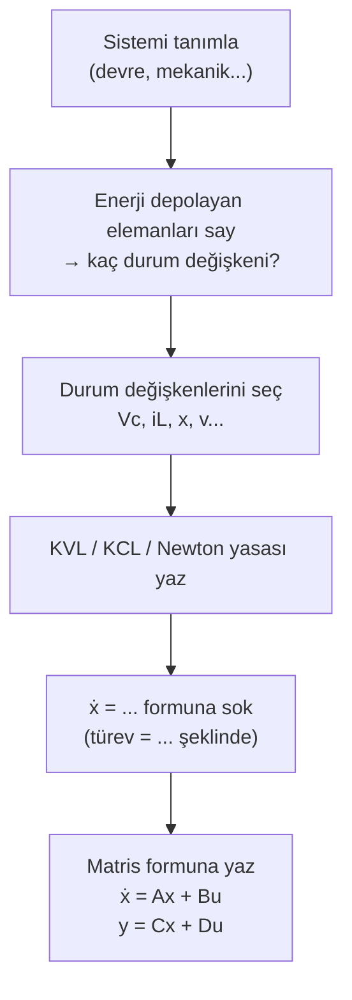

# 03 — Durum Uzayı (State Space)

← [[MST Ana Sayfa]] | Örnekler: [[../Örnek Sorular/03 Durum Uzayı Örnekleri|03 Durum Uzayı Örnekleri]]

---

## Neden Durum Uzayı?

Transfer fonksiyonu yöntemiyle sistemleri modelleyebiliyoruz:

$$Y(s) = G(s) \cdot U(s)$$

Ama bu yöntem **tek giriş — tek çıkış** sistemlerde işe yarar ve sistemin **iç durumu** hakkında hiçbir şey söylemez.

**Durum uzayı** bize şunları sağlar:
- Birden fazla giriş/çıkış (MIMO sistemler)
- Sistemin içindeki her değişkeni takip etme
- Doğrusal olmayan sistemleri de yazabilme
- Bilgisayar simülasyonu için hazır form

---

## Durum Değişkeni Nedir?

> [!tanim] Durum Değişkeni
> Bir sistemin o anki **iç durumunu tamamen** tarif eden minimum sayıdaki değişken kümesidir. Genellikle **x** ile gösterilir.
>
> Yani: giriş `u(t)` ve başlangıç durumu `x(0)` biliniyorsa, sistemin geleceği tamamen belirlenir.

**Fiziksel kural:** Sistemde kaç tane enerji depolayan eleman varsa, o kadar durum değişkeni gerekir.

| Eleman | Durum değişkeni |
|--------|----------------|
| Kondansatör | $V_C$ (gerilim) |
| Bobin (endüktans) | $i_L$ (akım) |
| Yay (mekanik) | $x$ (konum) |
| Kütle | $v$ (hız) |

---

## Genel Form

Her sistem bu iki denklemle yazılır:

$$\boxed{\dot{x}(t) = Ax(t) + Bu(t)}$$
$$\boxed{y(t) = Cx(t) + Du(t)}$$

| Sembol | Boyut | Ne anlama gelir |
|--------|-------|----------------|
| $x$ | $n \times 1$ | Durum vektörü (iç durum) |
| $u$ | $r \times 1$ | Giriş vektörü |
| $y$ | $m \times 1$ | Çıkış vektörü |
| $A$ | $n \times n$ | Sistem matrisi — sistemin kendi dinamiği |
| $B$ | $n \times r$ | Giriş matrisi — girişin duruma etkisi |
| $C$ | $m \times n$ | Çıkış matrisi — durumdan çıkışa geçiş |
| $D$ | $m \times r$ | İletim matrisi — çoğu fiziksel sistemde **0** |

> [!tip] Sezgi
> $A$ matrisi: "Sistem kendi başına nasıl davranır?"
> $B$ matrisi: "Giriş uyguladığımda sistemi nasıl iter?"
> $C$ matrisi: "Durumun hangi kombinasyonu ölçülebilir?"

---

## RC Devresi — Adım Adım Türetme

```
u(t) → [C][R(t)] → y(t)
        ↑kondansatör
```

**Adım 1 — Durum değişkenini seç:**
$x = V_C$ (kondansatör gerilimi, devrenin "hafızası")

**Adım 2 — KVL yaz:**
$$u(t) = V_C(t) + R(t) \cdot i(t)$$

**Adım 3 — $i = C\dot{V}_C$ koyarak $\dot{x}$'i bul:**
$$u(t) = x + R(t) \cdot C \cdot \dot{x}$$

$$\boxed{\dot{x}(t) = \frac{u(t)}{R(t) \cdot C} - \frac{x(t)}{R(t) \cdot C}}$$

**Adım 4 — Çıkış denklemi:**
$$y(t) = u(t) - V_C(t) = -x(t) + u(t)$$

Matris formunda:

$$A = \left[\frac{-1}{RC}\right], \quad B = \left[\frac{1}{RC}\right], \quad C = [-1], \quad D = [1]$$

---

## RLC Devresi — 2 Durum Değişkeni

İki enerji depolayan eleman var → 2 durum değişkeni gerekir:

$$x_1 = V_C \quad \text{(kondansatör gerilimi)}$$
$$x_2 = i_L \quad \text{(bobin akımı)}$$

Türetilen state denklemleri:

$$\dot{x}_1 = \frac{x_2}{C}  \tag{1}$$

$$\dot{x}_2 = \frac{u(t)}{L} - \frac{x_1}{L} - \frac{R}{L} x_2  \tag{2}$$

Matris formunda yazarsak:

$$\begin{bmatrix} \dot{x}_1 \\ \dot{x}_2 \end{bmatrix} = \begin{bmatrix} 0 & \frac{1}{C} \\ -\frac{1}{L} & -\frac{R}{L} \end{bmatrix} \begin{bmatrix} x_1 \\ x_2 \end{bmatrix} + \begin{bmatrix} 0 \\ \frac{1}{L} \end{bmatrix} u$$

Bu tam olarak $\dot{x} = Ax + Bu$ formudur.

---

## Doğrusal Olmayan Sistemlerde State Space

Doğrusal olmayan sistemlerde $A$, $B$, $C$, $D$ sabit matrisler olmaz. Bunun yerine:

$$\dot{x}(t) = f(x, u, t)$$
$$y(t) = h(x, u, t)$$

Birden fazla durum değişkeni varsa vektör olarak yazılır:

$$\begin{bmatrix} \dot{x}_1 \\ \dot{x}_2 \\ \vdots \\ \dot{x}_n \end{bmatrix} = \begin{bmatrix} f_1(x, u, t) \\ f_2(x, u, t) \\ \vdots \\ f_n(x, u, t) \end{bmatrix}$$

> [!warning] Önemli
> $f$ ve $h$ zamana bağımlı değilse (**zamanla değişmeyen sistem** — time-invariant) $t$ argümanı düşer:
> $$\dot{x} = f(x, u), \quad y = h(x, u)$$

Analiz için: önce **denge noktası** bul → orada **doğrusallaştır** → bkz. [[04 Doğrusallaştırma]]

---

## State-Space → Transfer Fonksiyonu

Laplace dönüşümü ($x(0) = 0$):

$$sX(s) = AX(s) + BU(s) \implies X(s) = (sI - A)^{-1}BU(s)$$

$$\boxed{G(s) = C(sI - A)^{-1}B + D}$$

> [!sinav] Sınav İpucu
> $sI - A$ matrisinin tersini alıp $C$ ile soldan, $B$ ile sağdan çarp, $D$ ekle — bu formül sınavda çok çıkar.

---

## Transfer Fonksiyonu → State-Space (Kontrolör Kanonik Form)

$$G(s) = \frac{b_{n-1}s^{n-1} + \ldots + b_1 s + b_0}{s^n + a_{n-1}s^{n-1} + \ldots + a_1 s + a_0}$$

**Durum değişkenleri:** $x_1 = y$, $x_2 = \dot{y}$, ..., $x_n = y^{(n-1)}$

$$A = \begin{bmatrix} 0 & 1 & 0 & \cdots & 0 \\ 0 & 0 & 1 & \cdots & 0 \\ \vdots & & & \ddots & \vdots \\ -a_0 & -a_1 & -a_2 & \cdots & -a_{n-1} \end{bmatrix}, \quad B = \begin{bmatrix} 0 \\ 0 \\ \vdots \\ 1 \end{bmatrix}$$

$$C = \begin{bmatrix} b_0 & b_1 & \cdots & b_{n-1} \end{bmatrix}, \quad D = 0$$

> [!tip] Ezber Kolaylığı
> $A$ matrisinin **son satırı** = paydanın katsayıları eksi işaretle: $[-a_0, -a_1, \ldots, -a_{n-1}]$
> Geri kalan satırlar: birim matrisin bir sağa kaymış hali.

---

## Özdeğer Analizi (Kararlılık)

Sistemin özdeğerleri = $A$ matrisinin özdeğerleri = transfer fonksiyonunun **kutupları**

$$\det(\lambda I - A) = 0 \quad \text{(karakteristik denklem)}$$

| Özdeğer konumu | Sistem davranışı |
|----------------|-----------------|
| Tüm $\text{Re}(\lambda) < 0$ | **Kararlı** — sönümlenir |
| Herhangi $\text{Re}(\lambda) > 0$ | **Kararsız** — büyür |
| $\text{Re}(\lambda) = 0$ | Sınır — salınır |

---

## Kontrol Edilebilirlik ve Gözlenebilirlik

**Kontrol edilebilirlik:** Her duruma giriş aracılığıyla ulaşılabilir mi?

$$\mathcal{C} = \begin{bmatrix} B & AB & A^2B & \cdots & A^{n-1}B \end{bmatrix}$$

Kontrol edilebilir $\iff \text{rank}(\mathcal{C}) = n$

**Gözlenebilirlik:** Her iç durum, çıkışı ölçerek anlaşılabilir mi?

$$\mathcal{O} = \begin{bmatrix} C \\ CA \\ CA^2 \\ \vdots \\ CA^{n-1} \end{bmatrix}$$

Gözlenebilir $\iff \text{rank}(\mathcal{O}) = n$

---

## Özet: Türetme Adımları



---

> [!sinav] Sınav İpucu
> - $G(s) = C(sI-A)^{-1}B + D$ → sınavda mutlaka çıkar
> - Özdeğerler → $\det(\lambda I-A) = 0$ → kararlılık
> - Faz değişkenleri: son satır $= [-a_0, -a_1, \ldots, -a_{n-1}]$
> - Elektrik sistemlerde durum değişkenleri = **kondansatör gerilimleri** + **bobin akımları**
> - Mekanik sistemlerde = **konum** + **hız**
> - SS ve TF aynı sistemi tarif eder — özdeğerler = kutuplar
