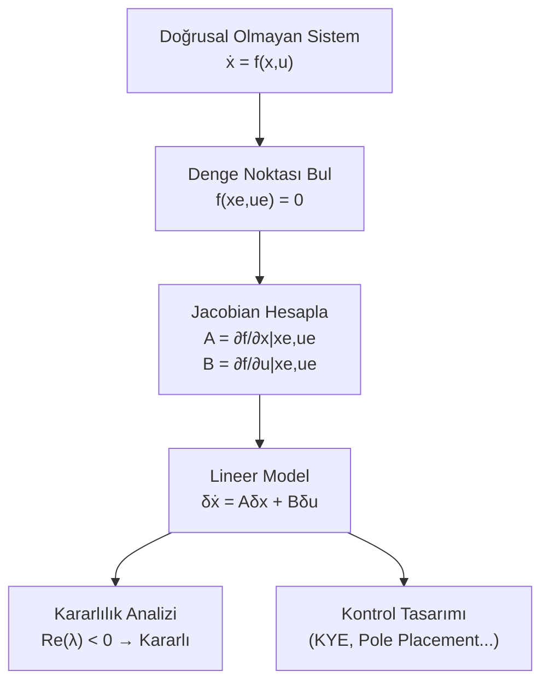

# 04 — Doğrusallaştırma

← [[MST Ana Sayfa]] | Örnekler: [[../Örnek Sorular/04 Doğrusallaştırma Örnekleri|04 Doğrusallaştırma Örnekleri]]

## Neden Doğrusallaştırma?

Gerçek sistemler genellikle **doğrusal olmayan** diferansiyel denklemlerle tanımlanır:

$$\dot{x} = f(x, u)$$

Kontrol teorisi araçları (KYE, Bode, Routh) sadece **lineer** sistemler için çalışır.

**Çözüm:** Bir çalışma noktası (denge noktası) çevresinde Taylor serisi açılımı → lineer yaklaşım.

---

## Denge Noktası (Equilibrium Point)

> [!tanim] Denge Noktası
> $x_e$, $u_e$ değerlerinde sistem değişmiyorsa:
> $$f(x_e, u_e) = 0$$

**Bulma adımları:**
1. $\dot{x} = f(x, u)$ yaz
2. $\dot{x} = 0$ koy (denge şartı)
3. $x_e$, $u_e$ bul (birden fazla denge noktası olabilir)

---

## Taylor Serisi Doğrusallaştırma

Küçük sapmalar tanımla:
$$\delta x = x - x_e, \quad \delta u = u - u_e, \quad \delta\dot{x} = \dot{x} - \dot{x}_e = \dot{x}$$

Tek değişkenli Taylor serisi:
$$f(x) \approx f(x_e) + \left.\frac{df}{dx}\right|_{x_e} (x - x_e) + \ldots$$

Çok değişkenli sistem için:

$$\delta\dot{x} \approx \underbrace{\left.\frac{\partial f}{\partial x}\right|_{x_e, u_e}}_{A} \delta x + \underbrace{\left.\frac{\partial f}{\partial u}\right|_{x_e, u_e}}_{B} \delta u$$

$$\boxed{\delta\dot{x} = A\,\delta x + B\,\delta u}$$

---

## Jacobian Matrisleri

**Sistem matrisi** $A$ (Jacobian $f$'e göre $x$):

$$A = \left.\frac{\partial f}{\partial x}\right|_{x_e, u_e} = \begin{bmatrix} \frac{\partial f_1}{\partial x_1} & \frac{\partial f_1}{\partial x_2} & \cdots \\ \frac{\partial f_2}{\partial x_1} & \frac{\partial f_2}{\partial x_2} & \cdots \\ \vdots & & \ddots \end{bmatrix}_{x_e, u_e}$$

**Giriş matrisi** $B$ (Jacobian $f$'e göre $u$):

$$B = \left.\frac{\partial f}{\partial u}\right|_{x_e, u_e}$$

---

## Jacobian Özdeğer → Denge Nokta Tipi

| Özdeğer | Nokta Tipi | Davranış |
|---------|-----------|---------|
| $\lambda = \pm j\omega$ (saf sanal) | **Center Point** (Merkez) | $x(t) = A\sin t + B\cos t$ — kapalı yörüngeler |
| $\lambda_{1,2}$ gerçel, zıt işaret | **Saddle Point** | Kararsız — bir yönde çekici, diğerinde itici |
| $\text{Re}(\lambda) < 0$ karmaşık | **Stable Spiral** | İçe sarılan spiral |
| $\text{Re}(\lambda) > 0$ karmaşık | **Unstable Spiral** | Dışa sarılan spiral |
| $\lambda_{1,2}$ gerçel, negatif | **Stable Node** | Doğrudan denge noktasına yaklaşma |
| $\lambda_{1,2}$ gerçel, pozitif | **Unstable Node** | Doğrudan uzaklaşma |

> [!sinav] Sınav İpucu
> Saf sanal özdeğer → center point (salınım, NE kararlı NE kararsız — sınır kararlı)  
> Zıt işaretli gerçel → saddle point (her zaman kararsız!)

---

## Lyapunov ile Kararlılık (Giriş)

Lineerleştirilmiş sistemin özdeğerleri:

| Özdeğer | Kararlılık |
|---------|-----------|
| $\text{Re}(\lambda_i) < 0$ tümü | Lokal asimptotik kararlı |
| $\text{Re}(\lambda_i) > 0$ herhangi biri | Lokal kararsız |
| $\text{Re}(\lambda_i) = 0$ birkaçı | Belirsiz (doğrusal analiz yetersiz) |

> [!warning] Önemli
> Lineerleştirilmiş analizin geçerliliği yalnızca denge noktasının **yakınında** geçerlidir!
> Büyük sapmalar için orijinal doğrusal olmayan sistem incelenmelidir.

---

## Özet Akış Diyagramı

---

> [!sinav] Sınav İpucu
> - Taylor 1. derece: $f(x) \approx f(x_e) + f'(x_e)(x-x_e)$
> - Jacobian = her $f_i$'yi her $x_j$'ye göre türev al, $x_e$'de değerlendir
> - $\sin x \approx x$, $\cos x \approx 1$ (küçük açı: $x_e = 0$ için)
> - $e^x \approx 1 + x$ (küçük sapmalar için)
> - Sıfır girişte denge: $f(x_e, 0) = 0$'ı çöz
