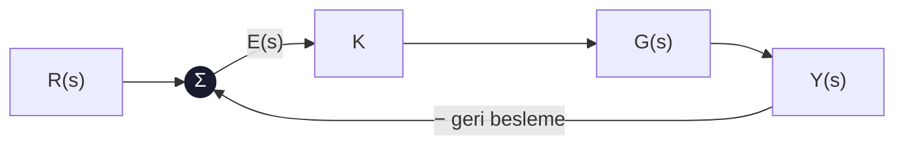
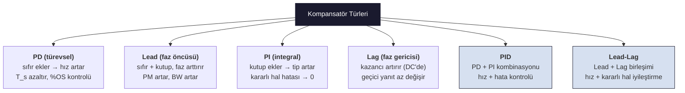
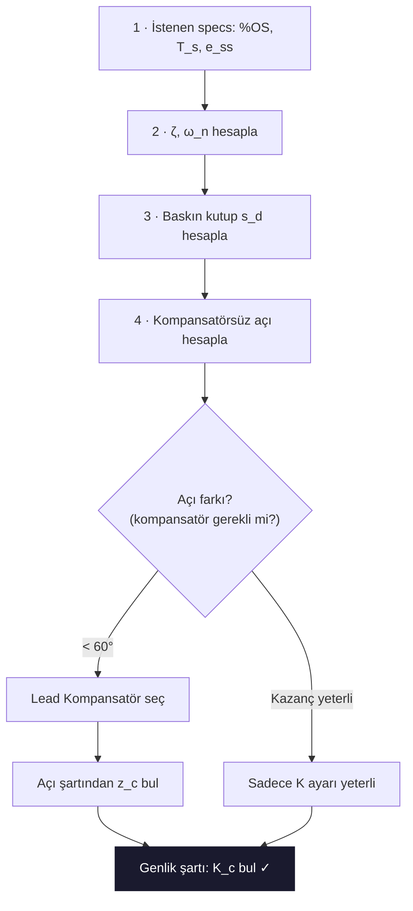

# 05 — Kök Yer Eğrisi ve Kompansasyon

← [[MST Ana Sayfa]] | Örnekler: [[../Örnek Sorular/05 Kök Yer Eğrisi Örnekleri|05 Kök Yer Eğrisi Örnekleri]]

> [!link] Temel KYE Teorisi
> KYE çizim kuralları ve çözümlü örnekler için: **[[../Otomatik Kontrol/04 Kök Yer Eğrisi|OK — KYE]]**
> Bu notta MST perspektifinden **kompansatör tasarımı** ağırlıklıdır.

---

# BÖLÜM A — Kök Yer Eğrisini Anlamak (Sıfırdan)

## A.0 — Tek Cümlelik Tanım

> [!tip] Kök yer eğrisi nedir?
> Bir kapalı çevrim sistemin **kazancı $K$'yı $0$'dan $\infty$'a değiştirdikçe**, kapalı çevrim **kutuplarının (köklerinin) $s$-düzleminde çizdiği yol**dur.
> Kutupların yeri = sistemin davranışı (hız, aşım, kararlılık). Yani KYE bize "$K$'yı büyütürsem sistemim nasıl davranır?" sorusunun **resmini** verir.

### Neden umursuyoruz?

Tipik geri besleme döngüsü:



Kapalı çevrim transfer fonksiyonu:

$$T(s) = \frac{KG(s)}{1 + KG(s)}$$

Sistemin **kutupları** paydanın kökleridir → **karakteristik denklem**:

$$\boxed{1 + KG(s) = 0 \quad\Longleftrightarrow\quad G(s) = -\frac{1}{K}}$$

$K$ değiştikçe bu denklemin kökleri **gezer**. İşte o gezinti = kök yer eğrisi.

> [!info]- Kutup yeri neden bu kadar önemli? (sezgi)
> 2. derece bir sistemde kutup $s = -\sigma \pm j\omega_d$ ise:
> - **Reel kısım $-\sigma$** → ne kadar sola, o kadar hızlı sönüm (yerleşme süresi $T_s = 4/\sigma$).
> - **Sanal kısım $\omega_d$** → ne kadar yukarı, o kadar çok salınım.
> - **Sağ yarı düzleme ($\sigma<0$ bozulursa)** geçerse → **kararsız** sistem.
>
> Yani kutbu nereye taşıdığını bilmek = sistemin nasıl davranacağını bilmek. KYE tam da bunu gösteriyor.

---

## A.1 — Ortam Hazırlığı (önce BU bloğu çalıştır)

Aşağıdaki yardımcı fonksiyonu bir kez çalıştır; sonraki tüm grafikler bunu kullanır. (Mantık: her $K$ değeri için $1+KG(s)=0$ denkleminin köklerini `numpy.roots` ile buluruz ve hepsini üst üste çizeriz.)

```python
import numpy as np
import matplotlib.pyplot as plt

def kye(poles, zeros=(), Kmax=300, xlim=None, ylim=None, baslik=""):
    """Açık çevrim kutup/sıfırlardan kök yer eğrisi çizer.
    1 + K·G = 0  ->  payda(s) + K·pay(s) = 0  denkleminin köklerini K süpürür."""
    p = np.array(poles, dtype=float)
    z = np.array(zeros, dtype=float)
    den = np.poly(p)                                   # G'nin paydası (kutuplar)
    num = np.poly(z) if len(z) else np.array([1.0])    # G'nin payı (sıfırlar)
    num = np.concatenate([np.zeros(len(den) - len(num)), num])  # dereceleri eşitle

    # K'yı 0 yakınında sık, sonra seyrek tara (eğri pürüzsüz çıksın)
    Ks = np.concatenate([np.linspace(0, 5, 1500), np.linspace(5, Kmax, 4000)])
    R = np.array([np.roots(den + K * num) for K in Ks])  # her K için kapalı çevrim kutupları

    fig, ax = plt.subplots(figsize=(6.2, 5.2))
    ax.scatter(R.real, R.imag, s=1.2, color="#1a1a2e", label="kapalı çevrim kökleri (K: 0→∞)")
    ax.plot(p, np.zeros_like(p), "x", color="#c0392b", ms=13, mew=2.5, label="açık çevrim kutupları (K=0)")
    if len(z):
        ax.plot(z, np.zeros_like(z), "o", mfc="none", color="#2980b9", ms=12, mew=2, label="açık çevrim sıfırları (K=∞)")
    ax.axhline(0, color="0.6", lw=0.8)
    ax.axvline(0, color="0.6", lw=0.8)
    if xlim: ax.set_xlim(*xlim)
    if ylim: ax.set_ylim(*ylim)
    ax.set_xlabel("Re(s) = σ  (sönüm)")
    ax.set_ylabel("Im(s) = jω  (salınım)")
    ax.set_title(baslik)
    ax.legend(loc="upper left", fontsize=8, framealpha=0.9)
    ax.grid(alpha=0.2)
    plt.show()
    return R

print("kye() hazır ✓  — artık alttaki blokları çalıştırabilirsin")
```

---

## A.2 — En Basit Örnekle Sezgi: $G(s)=\dfrac{1}{s(s+2)}$

Açık çevrim kutupları $s=0$ ve $s=-2$. Karakteristik denklem:

$$1 + \frac{K}{s(s+2)} = 0 \;\Longrightarrow\; s^2 + 2s + K = 0 \;\Longrightarrow\; s = -1 \pm \sqrt{1-K}$$

Elle ne beklediğimizi okuyalım, sonra numpy ile çizelim:

- $K=0$: kökler $0$ ve $-2$ (açık çevrim kutupları). **KYE her zaman kutuplardan başlar.**
- $0<K<1$: iki **reel** kök, birbirine doğru kayar.
- $K=1$: ikisi de $-1$'de **buluşur** (ayrılma noktası).
- $K>1$: kökler **kompleks** olur, $\text{Re}=-1$ çizgisi boyunca **yukarı/aşağı** gider.

```python
# G(s) = 1 / (s(s+2)) -> kutuplar 0 ve -2, sıfır yok
kye(poles=[0, -2], Kmax=30, xlim=(-3, 1), ylim=(-4, 4),
    baslik="G(s)=1/(s(s+2))  —  K büyüdükçe kökler -1'de buluşup dikleşir")
```

> [!success]- Grafiği nasıl okuyacağız? (çok önemli)
> - Kırmızı **×**'ler $K=0$ başlangıç noktaları (açık çevrim kutupları).
> - Lacivert noktalar $K$ büyüdükçe köklerin gittiği yer.
> - İki kol reel eksende $-1$'de buluşup **dikey** kalkıyor. Bu, $K$ arttıkça:
>   - reel kısım $-1$'de sabit → **yerleşme süresi değişmez** ($T_s=4/1=4$ s),
>   - sanal kısım büyüyor → **aşım (salınım) artar**, $\zeta$ düşer.
> - Yani bu sistemde $K$'yı büyütmek seni daha salınımlı ama aynı hızda bir cevaba götürür. KYE bunu tek bakışta söylüyor.

---

# BÖLÜM B — Çizim Kuralları, Adım Adım (numpy doğrulamalı)

Bundan sonra tüm kurallar **tek bir örnek** üzerinde işlenir — bu, sınav örneğinizle aynı bitki:

$$G(s) = \frac{1}{s(s+4)(s+6)} \quad\Rightarrow\quad \text{kutuplar: } 0,\,-4,\,-6,\quad \text{sıfır yok}$$

Önce sonucu görelim, sonra her özelliğini kuralla + numpy ile ayrı ayrı doğrulayalım:

```python
# Tam kök yer eğrisi — referans resim
R = kye(poles=[0, -4, -6], Kmax=500, xlim=(-8, 3), ylim=(-6, 6),
        baslik="G(s)=1/(s(s+4)(s+6))  —  3 dallı tam KYE")
```

---

## B.1 — Kural 1: Başlangıç ve Bitiş

> **Dallar açık çevrim KUTUPLARINDAN başlar ($K=0$), açık çevrim SIFIRLARINDA biter ($K=\infty$). Sıfıra gidemeyen dallar sonsuza kaçar.**

Burada 3 kutup, 0 sıfır var → **3 dal**, hepsi sonsuza gider.

$$\text{dal sayısı} = \max(\#\text{kutup},\,\#\text{sıfır}) = 3$$

> [!info]- Neden böyle? ($K\to 0$ ve $K\to\infty$ limiti)
> $1+KG=0 \Rightarrow \frac{1}{K} = -G(s) = -\frac{N(s)}{D(s)}$.
> - $K\to 0$ ise $\frac{1}{K}\to\infty$, bu yüzden $D(s)\to 0$ olmalı → kökler **kutuplara** yakınsar.
> - $K\to\infty$ ise $\frac{1}{K}\to 0$, bu yüzden $N(s)\to 0$ olmalı → kökler **sıfırlara** yakınsar. Sıfır yetmezse kalan dallar sonsuza gider.

---

## B.2 — Kural 2: Reel Eksen Üzerindeki Parçalar

> **Reel eksende bir nokta KYE üzerindedir ⇔ SAĞINDAKİ reel kutup + sıfır sayısı TEK ise.**

Kutuplar $0,-4,-6$ için:

| Aralık | Sağdaki kutup/sıfır sayısı | KYE'de mi? |
|--------|:--:|:--:|
| $0 < s$ | 0 (çift) | ✗ |
| $-4 < s < 0$ | 1 ($s=0$) | ✓ |
| $-6 < s < -4$ | 2 ($0,-4$) | ✗ |
| $s < -6$ | 3 ($0,-4,-6$) | ✓ |

```python
# Reel eksen testini numpy ile doğrula
poles = np.array([0, -4, -6])
test = np.linspace(-8, 1, 19)
for s in test:
    sagdaki = np.sum(poles > s)          # bu noktanın sağındaki kutup sayısı
    uzerinde = "KYE'de ✓" if sagdaki % 2 == 1 else "değil ✗"
    print(f"s={s:5.1f} | sağda {sagdaki} kutup -> {uzerinde}")
```

> [!info]- Neden "sağdaki sayı tek"? (açı koşulu)
> KYE'nin temel koşulu $\angle G(s) = \pm 180°(2k+1)$. Reel eksendeki bir test noktasından bakınca:
> - **Sağındaki** her reel kutup/sıfır $180°$ açı katar.
> - **Solundaki** her reel kutup/sıfır $0°$ katar (açı katkısı yok).
> - Kompleks kutuplar eşlenik çiftler olduğundan katkıları birbirini götürür.
> Toplam $180°$'nin **tek** katı olması için sağdaki sayının **tek** olması gerekir.

---

## B.3 — Kural 3: Asimptotlar (sonsuza giden dallar)

Sonsuza giden dal sayısı $= \#\text{kutup} - \#\text{sıfır} = 3 - 0 = 3$.

**Asimptot açıları:**
$$\theta = \frac{180°(2k+1)}{n-m} = \frac{180°(2k+1)}{3} = 60°,\,180°,\,300°$$

**Asimptotların reel ekseni kestiği merkez (ağırlık merkezi):**
$$\sigma_a = \frac{\sum\text{kutuplar} - \sum\text{sıfırlar}}{n-m} = \frac{(0-4-6)-0}{3} = \frac{-10}{3} \approx -3.33$$

```python
# Asimptotları KYE'nin üstüne çizerek doğrula
poles = [0, -4, -6]
n_m = 3
sigma_a = (np.sum(poles)) / n_m
print(f"Asimptot merkezi σ_a = {sigma_a:.3f}")

den = np.poly(poles)                      # [1, 10, 24, 0]
Ks = np.concatenate([np.linspace(0, 5, 1500), np.linspace(5, 600, 4000)])
# karakteristik denklem: s^3+10s^2+24s+K  ->  sabit terime K eklenir
R = np.array([np.roots(np.r_[den[:-1], den[-1] + K]) for K in Ks])

fig, ax = plt.subplots(figsize=(6.2, 5.2))
ax.scatter(R.real, R.imag, s=1.2, color="#1a1a2e")
ax.plot(poles, [0,0,0], "x", color="#c0392b", ms=13, mew=2.5)
# 3 asimptot çizgisi
t = np.linspace(0, 8, 2)
for ang in (60, 180, 300):
    a = np.deg2rad(ang)
    ax.plot(sigma_a + t*np.cos(a), t*np.sin(a), "--", color="#27ae60", lw=1.3)
ax.plot(sigma_a, 0, "s", color="#27ae60", ms=7, label=f"σ_a={sigma_a:.2f}")
ax.axhline(0, color="0.6", lw=0.8); ax.axvline(0, color="0.6", lw=0.8)
ax.set_xlim(-8, 3); ax.set_ylim(-6, 6)
ax.set_title("Yeşil kesikli = asimptotlar (60°/180°/300°), kare = σ_a")
ax.legend(loc="upper left", fontsize=8); ax.grid(alpha=0.2)
plt.show()
```

> [!info]- Açı formülü nereden? $n-m$ paydası neden?
> $s\to\infty$ iken $G(s)\approx \frac{1}{s^{\,n-m}}$. Açı koşulu $\angle G = 180°(2k+1)$ olunca $-(n-m)\angle s = 180°(2k+1)$ → asimptot yönleri $\frac{180°(2k+1)}{n-m}$. Payda $n-m$ olduğu için 3 dal $360°/3 = 120°$ aralıklarla dizilir.

---

## B.4 — Kural 4: Ayrılma (Breakaway) Noktası

İki dal reel eksende buluşup düzlemden ayrıldığı nokta. Koşul:

$$\frac{dK}{ds} = 0, \quad\text{burada } K = -\frac{1}{G(s)} = -s(s+4)(s+6)$$

```python
# Ayrılma noktası: K = -s(s+4)(s+6),  dK/ds = 0
payda = np.poly([0, -4, -6])        # s^3 + 10 s^2 + 24 s
turev = np.polyder(payda)           # 3 s^2 + 20 s + 24
adaylar = np.roots(turev)
print("dK/ds=0 kökleri:", np.round(adaylar, 3))

# Sadece KYE üzerindeki aralıkta (-4<s<0) olan aday geçerli
gecerli = [r.real for r in adaylar if -4 < r.real < 0]
print("Geçerli ayrılma noktası:", np.round(gecerli, 3))
```

Sonuç $\approx -1.57$ (diğer kök $-5.74$, ama orası reel eksende KYE'de **değil** → reddedilir, bkz. B.2 tablosu).

> [!info]- Neden $dK/ds=0$? (sezgi)
> Reel eksende ilerlerken $K$ artıyor; iki dal buluştuğu anda $K$ o noktada **maksimuma** ulaşır, sonra kökler kompleks olup ayrılır. Bir fonksiyon maksimumdayken türevi sıfırdır → $dK/ds=0$.

---

## B.5 — Kural 5: $j\omega$ Eksenini Kesme (Kararlılık Sınırı)

Dallar sanal ekseni kestiği $K$ değeri **kritik kazanç**tır; bu noktanın ötesinde sistem **kararsız**. Karakteristik denklem:

$$s^3 + 10s^2 + 24s + K = 0$$

```python
# En sağdaki kökün reel kısmı NEGATİFTEN POZİTİFE geçtiği K = kararlılık sınırı
# (K=0'da orijindeki kutup yüzünden reel kısım zaten 0; o başlangıcı atlamak için
#  K'yı küçük bir değerden başlatıp işaret değişimini ararız)
Ks = np.linspace(0.1, 400, 8000)
en_sag = np.array([np.roots([1, 10, 24, K]).real.max() for K in Ks])
gecis = np.where(np.diff(np.sign(en_sag)) > 0)[0]   # − → + geçişi
i = gecis[-1]
Kkrit = Ks[i]
kokler = np.roots([1, 10, 24, Kkrit])
print(f"Kararlılık sınırı  K_krit ≈ {Kkrit:.0f}")
print("Bu K'da kökler:", np.round(kokler, 3))        # bir çift kök ±j sanal eksende
print("Kesişim frekansı ω ≈", round(abs(kokler.imag).max(), 2), "rad/s")
```

Beklenen: $K_{krit}\approx 240$, kesişim $s\approx \pm j4.9$. $K>240$ için bir çift kök sağ yarı düzleme geçer → **kararsız**.

> [!info]- Elle nasıl bulunur? (Routh-Hurwitz)
> $s^3+10s^2+24s+K$ için Routh tablosu $s^1$ satırı: $\frac{10\cdot24 - K}{10} = \frac{240-K}{10}$. Bu satır sıfırlanınca ($K=240$) sistem salınım sınırında. $s^2$ satırından $10s^2+K=0 \Rightarrow s=\pm j\sqrt{24}\approx \pm j4.9$. numpy ile elle hesabın **birebir aynı** çıktığını yukarıda gördük.

---

## B.6 — Hepsini Bir Arada: Açıklamalı Tam KYE

```python
# Tüm bulguları tek grafikte işaretle
poles = [0, -4, -6]
den = np.poly(poles)
Ks = np.concatenate([np.linspace(0, 5, 1500), np.linspace(5, 600, 5000)])
R = np.array([np.roots(np.r_[den[:-1], den[-1]+K]) for K in Ks])

fig, ax = plt.subplots(figsize=(6.6, 5.6))
ax.scatter(R.real, R.imag, s=1.0, color="#1a1a2e")
ax.plot(poles, [0,0,0], "x", color="#c0392b", ms=13, mew=2.5, label="kutuplar (K=0)")
ax.plot(-1.57, 0, "D", color="#e67e22", ms=8, label="ayrılma ≈ -1.57")
ax.plot([0,0], [4.9,-4.9], "*", color="#8e4444", ms=14, label="jω kesişimi ±j4.9 (K=240)")
sa = sum(poles)/3
t = np.linspace(0, 8, 2)
for ang in (60,180,300):
    a = np.deg2rad(ang); ax.plot(sa+t*np.cos(a), t*np.sin(a), "--", color="#27ae60", lw=1)
ax.axhline(0, color="0.6", lw=0.8); ax.axvline(0, color="0.6", lw=0.8)
ax.set_xlim(-8, 3); ax.set_ylim(-6, 6)
ax.set_xlabel("Re(s)"); ax.set_ylabel("Im(s)")
ax.set_title("Tam KYE: kutuplar + ayrılma + jω kesişimi + asimptotlar")
ax.legend(loc="upper left", fontsize=8); ax.grid(alpha=0.2)
plt.show()
```

> [!sinav] Çizim kuralları — 60 saniyelik özet
> 1. **Dal sayısı** = max(kutup, sıfır). Kutuptan başlar, sıfırda/sonsuzda biter.
> 2. **Reel eksen**: sağındaki kutup+sıfır sayısı **tek** ise üzerinde.
> 3. **Asimptot**: sayı $n-m$, açı $\frac{180°(2k+1)}{n-m}$, merkez $\sigma_a=\frac{\sum p-\sum z}{n-m}$.
> 4. **Ayrılma**: $dK/ds=0$, yalnız KYE üzerindeki kök geçerli.
> 5. **$j\omega$ kesişimi**: Routh ile kritik $K$ → kararlılık sınırı.

---

# BÖLÜM C — Tasarımla Köprü

Artık KYE'yi okuyabildiğine göre asıl amaç: **istediğimiz baskın kutbu** ($s_d$) KYE üzerine getirmek. Eğer mevcut KYE o noktadan geçmiyorsa, bir **kompansatör** ekleyip eğriyi oraya çekeriz. Aşağıdaki bölümler tam olarak bunu yapıyor.

```python
# Hedef baskın kutup: %OS=16 -> ζ=0.5, T_s=2 -> σ=2 -> s_d = -2 + j3.46
# (kendi içinde tam çizim; hedefi ve ζ=0.5 doğrusunu KYE üstüne işaretliyoruz)
zeta = 0.5
sd = complex(-2, 4*np.sqrt(1 - zeta**2))           # = -2 + j3.46

poles = [0, -4, -6]
den = np.poly(poles)
Ks = np.concatenate([np.linspace(0, 5, 1500), np.linspace(5, 600, 5000)])
R = np.array([np.roots(np.r_[den[:-1], den[-1] + K]) for K in Ks])

fig, ax = plt.subplots(figsize=(6.2, 5.2))
ax.scatter(R.real, R.imag, s=1.0, color="#1a1a2e")
ax.plot(poles, [0,0,0], "x", color="#c0392b", ms=13, mew=2.5, label="kutuplar")
ax.plot(sd.real, sd.imag, "P", color="#16a085", ms=15, label=f"hedef s_d={sd:.2f}")
# ζ=0.5 doğrusu: orijinden θ=arccos(ζ) açıyla çıkan ışın
th = np.arccos(zeta)
r = np.linspace(0, 7, 2)
ax.plot(-r*np.cos(th), r*np.sin(th), ":", color="#16a085", lw=1.5, label="ζ=0.5 doğrusu")
ax.axhline(0, color="0.6", lw=0.8); ax.axvline(0, color="0.6", lw=0.8)
ax.set_xlim(-8, 3); ax.set_ylim(-6, 6)
ax.set_title("Hedef baskın kutup KYE üstünde mi?")
ax.legend(loc="upper left", fontsize=8); ax.grid(alpha=0.2)
plt.show()

print("Hedef baskın kutup s_d =", sd)
print("ζ=0.5 doğrusu KYE'yi kesiyorsa o noktada uygun K vardır; kesmiyorsa")
print("PD/Lead kompansatör ile eğriyi sola çekeriz (aşağıdaki bölümler).")
```

> [!note] Geçiş
> Bundan sonrası **kompansatör tasarımı**: KYE'yi hedef kutuptan geçirmek için sıfır/kutup ekleme sanatı.

---

## Tasarım Hedefleri

Kapalı çevrim sistem tasarımında tipik hedefler:

| Hedef | Parametre |
|-------|----------|
| Belirli aşım oranı | $\%OS \to \zeta$ |
| Belirli yerleşme süresi | $T_s \to \sigma = \zeta\omega_n$ |
| Belirli yükselme süresi | $T_r \to \omega_d$ |
| Sıfır kararlı hal hatası | Sistem tipi arttır |
| Belirli kazanç payı | Bode PM/GM |

---

## Kompansatör Türleri



---

## PD Kompansatörü

$$G_c(s) = K_c(s + z_c)$$

- Kapalı çevrim karakteristik denklemine **sıfır ekler**
- KYE'yi **sola çeker** (daha hızlı yanıt)
- Gürültüye duyarlı (frekans artışı)

**Tasarım yöntemi:**
1. $\%OS$'tan $\zeta$ hesapla: $\zeta = \dfrac{-\ln(\%OS/100)}{\sqrt{\pi^2+\ln^2(\%OS/100)}}$
2. $T_s$'ten $\sigma = \zeta\omega_n$ hesapla: $\sigma = 4/T_s$ (%2 kriter)
3. İstenen baskın kutup: $s_d = -\sigma \pm j\omega_d$ ($\omega_d = \omega_n\sqrt{1-\zeta^2}$)
4. Açı şartını sağlayan $z_c$ bul
5. Genlik şartından $K_c$ bul

**Açı şartı:**
$$\angle G_c(s_d) G_p(s_d) = \pm 180°$$

**Geometrik yöntem ($z_c$ bulma):**

$s_d = -\sigma + j\omega_d$ için, $z_c$ henüz bilinmiyor:

$$\sum\angle\text{sıfırlar} - \sum\angle\text{kutuplar} = 180°(2k+1)$$

Sıfır $z_c$ açısı: $\theta_{z_c} = \angle(s_d + z_c) = \arctan\!\dfrac{\omega_d}{z_c - \sigma}$

Gerekli açıyı diğer kutup/sıfır açılarından hesapla, sonra:

$$\tan(\theta_{z_c}) = \frac{\omega_d}{z_c - \sigma} \implies z_c = \sigma + \frac{\omega_d}{\tan(\theta_{z_c})}$$

*"tan(β Pisagor)" yöntemi: baskın kutuptan yatay eksen açısı $\beta = \arccos(\zeta)$, sıfır konumunu Pisagor geometrisiyle bul.*

---

## Lead Kompansatörü

$$G_{lead}(s) = K_c \frac{s + z_c}{s + p_c}, \quad z_c < p_c$$

- **Faz öncüsü** ekler (faz artar)
- PM'i iyileştirir
- Bant genişliğini artırır

**Kural:** $\dfrac{p_c}{z_c} \approx 10$ genellikle yeterli

**Maksimum faz katkısı:**

$$\phi_{max} = \arcsin\left(\frac{1-\alpha}{1+\alpha}\right), \quad \alpha = \frac{z_c}{p_c} < 1$$

**Frekans:** $\omega_{max} = \dfrac{\sqrt{p_c z_c}}{1}$ (geometrik ortalama)

---

## Lag Kompansatörü

$$G_{lag}(s) = K_c \frac{s + z_c}{s + p_c}, \quad z_c > p_c$$

- **Kazanç artırır** (düşük frekansta)
- Hız hatasını azaltır, kararlı hal hassasiyetini artırır
- Geçici yanıtı bozmaz (kutup-sıfır orijine yakın yerleştirilir)

**Kural:** $p_c \approx z_c/10$, orijine yakın tut

---

## PI Kompansatörü

$$G_{PI}(s) = K_p + \frac{K_i}{s} = \frac{K_p s + K_i}{s}$$

- Sistem tipini arttırır (1 kutup orijinde ekler)
- Basamak hatası → sıfır
- KYE'ye orijine çok yakın sıfır ekler

> [!warning]
> PI eklenmesi geçici yanıtı yavaşlatabilir. Dikkatli tasarım gerekir.

---

## PID Kompansatörü

$$G_{PID}(s) = K_p + \frac{K_i}{s} + K_d s = \frac{K_d s^2 + K_p s + K_i}{s}$$

PD + PI kombinasyonu:
- PD → hız ve aşım kontrolü
- PI → kararlı hal hatası sıfırlama

**Ziegler-Nichols (ön bilgi):**

Limit kararlılık: $K = K_u$, $T = T_u$ ($\omega = 2\pi/T_u$)

| Kontrolör | $K_p$ | $T_i$ | $T_d$ |
|-----------|-------|-------|-------|
| P | $0.5K_u$ | — | — |
| PI | $0.45K_u$ | $T_u/1.2$ | — |
| PID | $0.6K_u$ | $T_u/2$ | $T_u/8$ |

---

## Lead-Lag Kompansatörü

$$G_{LL}(s) = K_c \frac{(s+z_1)(s+z_2)}{(s+p_1)(s+p_2)}$$

$p_1 < z_1 < z_2 < p_2$ (lag + lead birleşimi):
- Lag kısmı: kazanç ve kararlı hal hassasiyetini artırır
- Lead kısmı: geçici yanıtı iyileştirir

---

## KYE ile Tasarım Özeti



---

> [!sinav] Sınav İpucu
> - PD sıfır ekler → KYE sol tarafa kayar → daha hızlı sistem
> - Lead: PM artırır, bant genişliği artar
> - Lag: kararlı hal kazancı artar, geçici yanıt minimal değişir
> - PI = lag'ın özel hali (sıfır orijine yakın, kutup tam orijinde)
> - PD = lead'in özel hali (sadece sıfır, kutup yok)
> - Tasarımda her zaman: açı şartı → konumu bul, genlik şartı → K bul

---

## Op-Amp ile Kompansatör Gerçekleme (Hocanın Notu)

Kompansatörler op-amp devreleri ile fiziksel olarak gerçeklenir. Genel yapı:

$$G(s) = -\frac{Z_2(s)}{Z_1(s)}$$

| Fonksiyon | $Z_1$ | $Z_2$ | Transfer Fonksiyonu |
|-----------|-------|-------|-------------------|
| **Kazanç** | $R_1$ | $R_2$ | $-R_2/R_1$ |
| **İntegral** | $R$ | $C$ | $-\dfrac{1}{RCs}$ |
| **Türev** | $C$ | $R$ | $-RCs$ |
| **PI kontrolör** | $R_1$ | $R_2 \parallel C$ | $-\dfrac{R_2}{R_1}\!\left(s+\dfrac{1}{R_2C}\right)\dfrac{1}{s}$ |
| **PD kontrolör** | $R_1 \parallel C_1$ | $R_2$ | $-R_2C_1\!\left(s+\dfrac{1}{R_1C_1}\right)$ |
| **PID kontrolör** | $R_1 \parallel C_1$ | $R_2 \parallel C_2$ (seri) | $-\dfrac{R_2C_1\!\left(s+\frac{1}{R_1C_1}\right)\!\left(s+\frac{1}{R_2C_2}\right)}{s}$ |

> [!sinav] PD Tasarımından Devreye Geçiş
> PD sıfırunu $z_c$ bulduktan sonra:
> - $G_{PD}(s) = -R_2C_1(s + z_c)$ formunda eşitleyin
> - $z_c = 1/(R_1C_1)$ → $R_1C_1$ sabitini belirler
> - $R_2C_1 = 1$ seçilirse kazanç $K_c$ ile $R_2$ belirlenir

**İlgili:** [[../Otomatik Kontrol/04 Kök Yer Eğrisi|OK — Kök Yer Eğrisi]]
