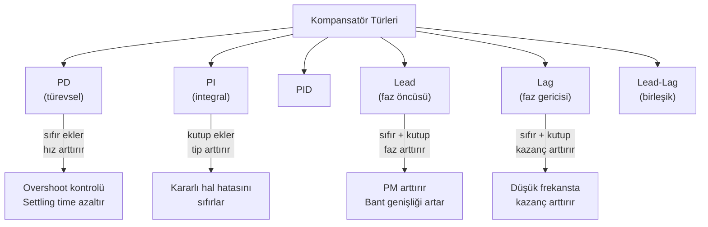
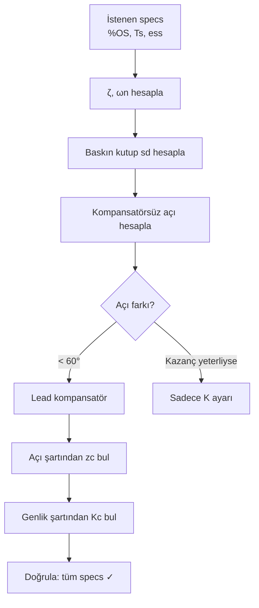

# 05 — Kök Yer Eğrisi ve Kompansasyon

← [[MST Ana Sayfa]] | Örnekler: [[../Örnek Sorular/05 Kök Yer Eğrisi Örnekleri|05 Kök Yer Eğrisi Örnekleri]]

> [!link] Temel KYE Teorisi
> KYE çizim kuralları ve çözümlü örnekler için: **[[../Otomatik Kontrol/04 Kök Yer Eğrisi|OK — KYE]]**
> Bu notta MST perspektifinden **kompansatör tasarımı** ağırlıklıdır.

---

## Tasarım Hedefleri

Kapalı çevrim sistem tasarımında tipik hedefler:

| Hedef | Parametre |
|-------|----------|
| Belirli aşım oranı | $\%OS \to \zeta$ |
| Belirli yerleşme süresi | $T_s \to \sigma = \zeta\omega_n$ |
| Belirli yükselme süresi | $T_r \to \omega_d$ |
| Sıfır kararlı hal hatası | Sistem tipi arttır |
| Belirli kazanç payı | Bode PM/GM |

---

## Kompansatör Türleri

---

## PD Kompansatörü

$$G_c(s) = K_c(s + z_c)$$

- Kapalı çevrim karakteristik denklemine **sıfır ekler**
- KYE'yi **sola çeker** (daha hızlı yanıt)
- Gürültüye duyarlı (frekans artışı)

**Tasarım yöntemi:**
1. $\%OS$'tan $\zeta$ hesapla: $\zeta = \dfrac{-\ln(\%OS/100)}{\sqrt{\pi^2+\ln^2(\%OS/100)}}$
2. $T_s$'ten $\sigma = \zeta\omega_n$ hesapla: $\sigma = 4/T_s$ (%2 kriter)
3. İstenen baskın kutup: $s_d = -\sigma \pm j\omega_d$ ($\omega_d = \omega_n\sqrt{1-\zeta^2}$)
4. Açı şartını sağlayan $z_c$ bul
5. Genlik şartından $K_c$ bul

**Açı şartı:**
$$\angle G_c(s_d) G_p(s_d) = \pm 180°$$

**Geometrik yöntem ($z_c$ bulma):**

$s_d = -\sigma + j\omega_d$ için, $z_c$ henüz bilinmiyor:

$$\sum\angle\text{sıfırlar} - \sum\angle\text{kutuplar} = 180°(2k+1)$$

Sıfır $z_c$ açısı: $\theta_{z_c} = \angle(s_d + z_c) = \arctan\!\dfrac{\omega_d}{z_c - \sigma}$

Gerekli açıyı diğer kutup/sıfır açılarından hesapla, sonra:

$$\tan(\theta_{z_c}) = \frac{\omega_d}{z_c - \sigma} \implies z_c = \sigma + \frac{\omega_d}{\tan(\theta_{z_c})}$$

*"tan(β Pisagor)" yöntemi: baskın kutuptan yatay eksen açısı $\beta = \arccos(\zeta)$, sıfır konumunu Pisagor geometrisiyle bul.*

---

## Lead Kompansatörü

$$G_{lead}(s) = K_c \frac{s + z_c}{s + p_c}, \quad z_c < p_c$$

- **Faz öncüsü** ekler (faz artar)
- PM'i iyileştirir
- Bant genişliğini artırır

**Kural:** $\dfrac{p_c}{z_c} \approx 10$ genellikle yeterli

**Maksimum faz katkısı:**

$$\phi_{max} = \arcsin\left(\frac{1-\alpha}{1+\alpha}\right), \quad \alpha = \frac{z_c}{p_c} < 1$$

**Frekans:** $\omega_{max} = \dfrac{\sqrt{p_c z_c}}{1}$ (geometrik ortalama)

---

## Lag Kompansatörü

$$G_{lag}(s) = K_c \frac{s + z_c}{s + p_c}, \quad z_c > p_c$$

- **Kazanç artırır** (düşük frekansta)
- Hız hatasını azaltır, kararlı hal hassasiyetini artırır
- Geçici yanıtı bozmaz (kutup-sıfır orijine yakın yerleştirilir)

**Kural:** $p_c \approx z_c/10$, orijine yakın tut

---

## PI Kompansatörü

$$G_{PI}(s) = K_p + \frac{K_i}{s} = \frac{K_p s + K_i}{s}$$

- Sistem tipini arttırır (1 kutup orijinde ekler)
- Basamak hatası → sıfır
- KYE'ye orijine çok yakın sıfır ekler

> [!warning]
> PI eklenmesi geçici yanıtı yavaşlatabilir. Dikkatli tasarım gerekir.

---

## PID Kompansatörü

$$G_{PID}(s) = K_p + \frac{K_i}{s} + K_d s = \frac{K_d s^2 + K_p s + K_i}{s}$$

PD + PI kombinasyonu:
- PD → hız ve aşım kontrolü
- PI → kararlı hal hatası sıfırlama

**Ziegler-Nichols (ön bilgi):**

Limit kararlılık: $K = K_u$, $T = T_u$ ($\omega = 2\pi/T_u$)

| Kontrolör | $K_p$ | $T_i$ | $T_d$ |
|-----------|-------|-------|-------|
| P | $0.5K_u$ | — | — |
| PI | $0.45K_u$ | $T_u/1.2$ | — |
| PID | $0.6K_u$ | $T_u/2$ | $T_u/8$ |

---

## Lead-Lag Kompansatörü

$$G_{LL}(s) = K_c \frac{(s+z_1)(s+z_2)}{(s+p_1)(s+p_2)}$$

$p_1 < z_1 < z_2 < p_2$ (lag + lead birleşimi):
- Lag kısmı: kazanç ve kararlı hal hassasiyetini artırır
- Lead kısmı: geçici yanıtı iyileştirir

---

## KYE ile Tasarım Özeti

---

> [!sinav] Sınav İpucu
> - PD sıfır ekler → KYE sol tarafa kayar → daha hızlı sistem
> - Lead: PM artırır, bant genişliği artar
> - Lag: kararlı hal kazancı artar, geçici yanıt minimal değişir
> - PI = lag'ın özel hali (sıfır orijine yakın, kutup tam orijinde)
> - PD = lead'in özel hali (sadece sıfır, kutup yok)
> - Tasarımda her zaman: açı şartı → konumu bul, genlik şartı → K bul

---

## Op-Amp ile Kompansatör Gerçekleme (Hocanın Notu)

Kompansatörler op-amp devreleri ile fiziksel olarak gerçeklenir. Genel yapı:

$$G(s) = -\frac{Z_2(s)}{Z_1(s)}$$

| Fonksiyon | $Z_1$ | $Z_2$ | Transfer Fonksiyonu |
|-----------|-------|-------|-------------------|
| **Kazanç** | $R_1$ | $R_2$ | $-R_2/R_1$ |
| **İntegral** | $R$ | $C$ | $-\dfrac{1}{RCs}$ |
| **Türev** | $C$ | $R$ | $-RCs$ |
| **PI kontrolör** | $R_1$ | $R_2 \parallel C$ | $-\dfrac{R_2}{R_1}\!\left(s+\dfrac{1}{R_2C}\right)\dfrac{1}{s}$ |
| **PD kontrolör** | $R_1 \parallel C_1$ | $R_2$ | $-R_2C_1\!\left(s+\dfrac{1}{R_1C_1}\right)$ |
| **PID kontrolör** | $R_1 \parallel C_1$ | $R_2 \parallel C_2$ (seri) | $-\dfrac{R_2C_1\!\left(s+\frac{1}{R_1C_1}\right)\!\left(s+\frac{1}{R_2C_2}\right)}{s}$ |

> [!sinav] PD Tasarımından Devreye Geçiş
> PD sıfırunu $z_c$ bulduktan sonra:
> - $G_{PD}(s) = -R_2C_1(s + z_c)$ formunda eşitleyin
> - $z_c = 1/(R_1C_1)$ → $R_1C_1$ sabitini belirler
> - $R_2C_1 = 1$ seçilirse kazanç $K_c$ ile $R_2$ belirlenir

**İlgili:** [[../Otomatik Kontrol/04 Kök Yer Eğrisi|OK — Kök Yer Eğrisi]]
