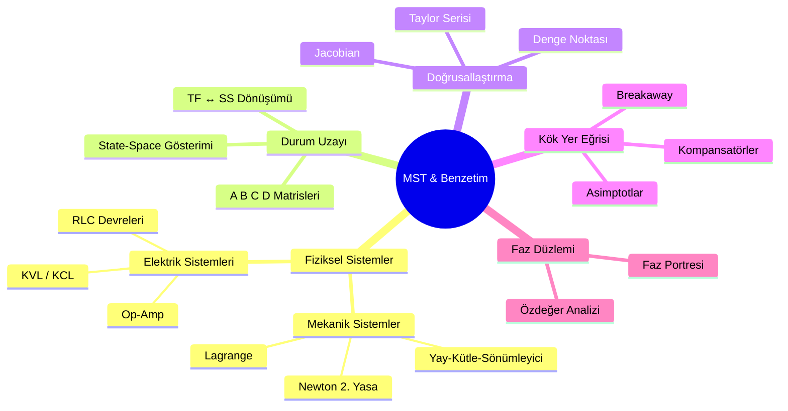
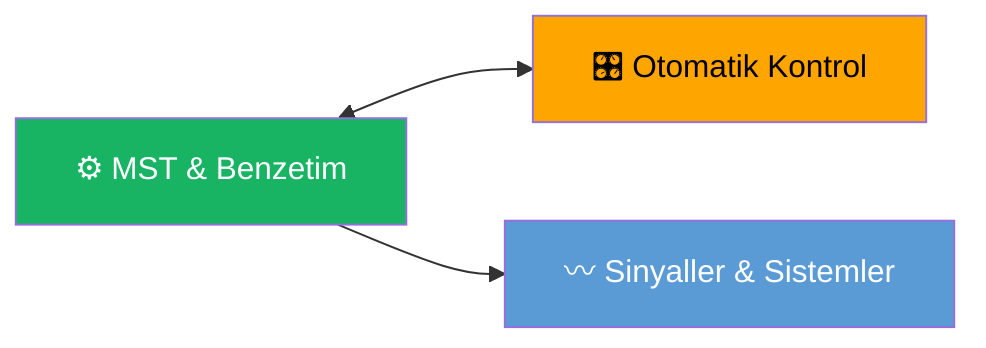

****
# Mühendislik Sistem Tasarımı ve Benzetimi — Ana Sayfa

← [[HOME]]

## Konu Haritası

## Konu Anlatımları

| # | Konu | Bağlantı |
|---|------|----------|
| 1 | Mekanik Sistemler | [[Konu Anlatımları/01 Mekanik Sistemler]] |
| 2 | Elektrik Sistemleri | [[Konu Anlatımları/02 Elektrik Sistemleri]] |
| 3 | Durum Uzayı | [[Konu Anlatımları/03 Durum Uzayı]] |
| 4 | Doğrusallaştırma | [[Konu Anlatımları/04 Doğrusallaştırma]] |
| 5 | KYE ve Kompansasyon | [[Konu Anlatımları/05 Kök Yer Eğrisi ve Kompansasyon]] |
| 📄 | Formül Özeti | [[MST Formül Sayfası]] |

## Örnek Sorular

| # | Konu | Bağlantı |
|---|------|----------|
| 1 | Mekanik Sistemler Örnekleri | [[Örnek Sorular/01 Mekanik Sistemler Örnekleri]] |
| 2 | Elektrik Sistemleri Örnekleri | [[Örnek Sorular/02 Elektrik Sistemleri Örnekleri]] |
| 3 | Durum Uzayı Örnekleri | [[Örnek Sorular/03 Durum Uzayı Örnekleri]] |
| 4 | Doğrusallaştırma Örnekleri | [[Örnek Sorular/04 Doğrusallaştırma Örnekleri]] |
| 5 | Kök Yer Eğrisi Örnekleri | [[Örnek Sorular/05 Kök Yer Eğrisi Örnekleri]] |

## Diğer Derslerle Bağlantı

- **[[../Otomatik Kontrol/OK Ana Sayfa|Otomatik Kontrol]]** — KYE, kararlılık, kompansasyon ortak
- **[[../Sİnyaller ve Sistemler/SS Ana Sayfa|SS]]** — Laplace, transfer fonksiyonu temeli

## Temel Formüller (Hızlı Erişim)

**Mekanik:** $m\ddot{x} + b\dot{x} + kx = f(t) \implies G(s) = \dfrac{1}{ms^2+bs+k}$

**Elektrik (RLC seri):** $L\ddot{q} + R\dot{q} + \dfrac{q}{C} = v(t)$

**State-Space:** $\dot{x} = Ax + Bu$, $y = Cx + Du$

**SS → TF:** $G(s) = C[sI-A]^{-1}B + D$

**Doğrusallaştırma:** $\delta\dot{x} = \left.\dfrac{\partial f}{\partial x}\right|_{x_e} \delta x$
