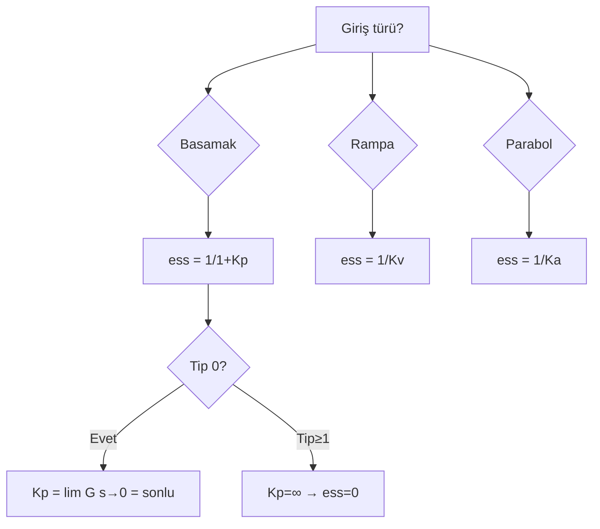
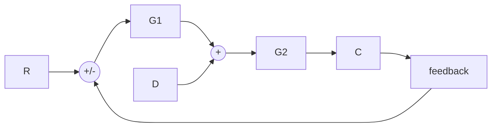

# 03 — Kararlı Hal Hataları

← [[OK Ana Sayfa]]

## Son Değer Teoremi ile Hata

Unity feedback kapalı çevrim:

$$E(s) = \frac{R(s)}{1 + G(s)}$$

Kararlı hal hatası:
$$e(\infty) = \lim_{s \to 0} s E(s) = \lim_{s \to 0} \frac{s\,R(s)}{1 + G(s)}$$

> [!warning] Koşul
> Son değer teoremi ancak sistem **kararlı** ise uygulanabilir!

---

## Hata Sabitleri

| Sabit | Formül | Kullanım |
|-------|--------|---------|
| $K_p$ (konum) | $\displaystyle K_p = \lim_{s\to 0} G(s)$ | Basamak girişi |
| $K_v$ (hız) | $\displaystyle K_v = \lim_{s\to 0} s\,G(s)$ | Rampa girişi |
| $K_a$ (ivme) | $\displaystyle K_a = \lim_{s\to 0} s^2 G(s)$ | Parabol girişi |

---

## Sistem Tipi ve Hata Tablosu

**Sistem Tipi:** Açık çevrim $G(s)$'deki orijin ($s=0$) kutup sayısı

$$G(s) = \frac{K\prod(s+z_i)}{s^N \prod(s+p_j)}$$

$N = $ sistem tipi

| Giriş | Tip 0 | Tip 1 | Tip 2 |
|-------|-------|-------|-------|
| Birim Basamak ($1/s$) | $\dfrac{1}{1+K_p}$ | **0** | **0** |
| Birim Rampa ($1/s^2$) | $\infty$ | $\dfrac{1}{K_v}$ | **0** |
| Birim Parabol ($1/s^3$) | $\infty$ | $\infty$ | $\dfrac{1}{K_a}$ |

---

## Çözümlü Örnekler

### Örnek 1 — Tip 0 Sistem

$$G(s) = \frac{120 \cdot 2}{(s)(s+3)(s+4)} \quad \text{[Tip 1!]}$$

**Not:** Payda'da $s$ var → Tip 1

$K_p = \lim_{s\to 0} G(s) = \infty$ → Basamak hatası = 0

$K_v = \lim_{s\to 0} s\cdot G(s) = \frac{120\cdot 2}{3\cdot 4} = 20$

- Basamak $5u(t)$: $e(\infty) = 0$
- Rampa $5tu(t)$: $e(\infty) = 5/K_v = 5/20 = \mathbf{0.25}$
- Parabol $5t^2 u(t)$: $e(\infty) = \infty$

---

### Örnek 2 — Hata Şartı ile K Tasarımı

$$G(s) = \frac{K(5)}{s(s+6)(s+7)(s+8)} \quad \text{[Tip 1]}$$

$K_v = \lim_{s\to 0}s\cdot G(s) = \frac{5K}{6\cdot 7\cdot 8} = \frac{5K}{336}$

Şart: $e(\infty) = \dfrac{1}{K_v} = \dfrac{336}{5K} \leq 0.1$

$$K \geq \frac{336}{5 \cdot 0.1} = \frac{336}{0.5} = 672$$

$$\boxed{K = 672}$$

---

### Örnek 3 — 1 Soru.txt'ten

**Soru 1:** $G(s) = \dfrac{K}{s^3+10s^2+25s+10}$ (Tip 0)

$K_p = \lim_{s\to 0}G(s) = \dfrac{K}{10}$

$e_{ss,\text{step}} = \dfrac{1}{1+K_p} = \dfrac{10}{10+K}$

Hata < 0.01 için: $K > 990$, ama kararlılık için $K < 240$. **Çelişki — mümkün değil!**

---

**Soru 2:** $G(s) = \dfrac{K}{s^4+7s^3+11s^2+7s}$ (Tip 1, payda'da $s$ var)

$K_p = \infty \implies e_{ss,\text{step}} = 0$

$K_v = \lim_{s\to 0}s\cdot G(s) = \dfrac{K}{7}$

$e_{ss,\text{ramp}} = \dfrac{7}{K}$

Hata < 0.1 için: $K > 70$, ama kararlılık için $K < 10$. **Çelişki — mümkün değil!**

---

## Bozucu Etkinin Yol Açtığı Hata

$$e(\infty) = e_R(\infty) + e_D(\infty)$$

Birim basamak bozucu $D(s) = 1/s$ için:

$$e_D(\infty) = -\frac{1}{\lim_{s\to 0}\frac{1}{G_2(s)} + \lim_{s\to 0}G_1(s)}$$

Eğer $G_1(s)$ yüksek kazançlı (entegratör) ise $e_D(\infty) \to 0$.

> [!sinav] Sınav İpucu
> - Sistem Tipi = paydada orijindeki kutup sayısı
> - Tip ≥ 1 → basamak hatası = 0
> - Tip ≥ 2 → rampa hatası = 0
> - Hata sıfır olmak için gerekli tip ile K aralığı çelişirse → "mümkün değil" de!
> - Son değer teoremi: sadece kararlı sistem için çalışır!

---

← [[02 Kararlılık ve Routh-Hurwitz]] | [[OK Ana Sayfa]] | → [[04 Kök Yer Eğrisi]]
