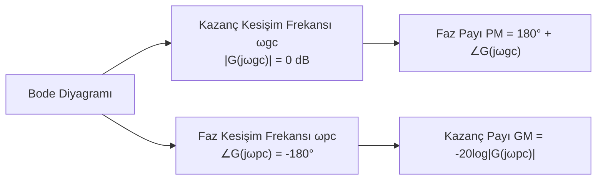

# 05 — Frekans Analizi ve Bode Diyagramı

← [[OK Ana Sayfa]]

## Frekans Yanıtı

$s = j\omega$ ile transfer fonksiyonu değerlendirilir:

$$G(j\omega) = |G(j\omega)| \angle G(j\omega)$$

**Bode diyagramı:**
- **Kazanç (dB):** $20\log_{10}|G(j\omega)|$ vs $\log_{10}(\omega)$
- **Faz (derece):** $\angle G(j\omega)$ vs $\log_{10}(\omega)$

---

## Bode Grafiği Temel Elemanlar

### 1. Sabit Kazanç $K$

| | Kazanç | Faz |
|-|--------|-----|
| Eğri | $20\log K$ dB (düz çizgi) | 0° (ya da 180°, $K<0$) |

### 2. İntegratör / Türevleyici $s^{\pm N}$

| | Kazanç Eğimi | Faz |
|-|-------------|-----|
| $1/s^N$ | $-20N$ dB/dekad | $-90N°$ |
| $s^N$ | $+20N$ dB/dekad | $+90N°$ |

### 3. Birinci Derece Faktör $(1 + s/\omega_1)$

| Frekans | Kazanç | Faz |
|---------|--------|-----|
| $\omega \ll \omega_1$ | 0 dB | 0° |
| $\omega = \omega_1$ | 3 dB | 45° |
| $\omega \gg \omega_1$ | $+20$ dB/dekad eğimi | 90° |

**Pay'da:** +20 dB/dekad, +90° faz artışı (sıfır)
**Payda'da:** -20 dB/dekad, -90° faz azalışı (kutup)

### 4. İkinci Derece Faktör (Kompleks Kutup)

$$\frac{\omega_n^2}{s^2 + 2\zeta\omega_n s + \omega_n^2}$$

| Frekans | Kazanç | Faz |
|---------|--------|-----|
| $\omega \ll \omega_n$ | 0 dB | 0° |
| $\omega = \omega_n$ | $-20\log(2\zeta)$ dB (rezonans) | -90° |
| $\omega \gg \omega_n$ | -40 dB/dekad | -180° |

---

## Faz Payı (PM) ve Kazanç Payı (GM)

$$\text{PM} = 180° + \angle G(j\omega_{gc}) \quad \text{(kazanç kesişiminde)}$$

$$\text{GM} = -20\log_{10}|G(j\omega_{pc})| \text{ dB} \quad \text{(faz kesişiminde)}$$

**Kararlı sistem:** PM > 0 **ve** GM > 0

Tipik tasarım hedefleri: **PM ≈ 45°–60°**, **GM ≈ 6–20 dB**

---

## Tipik Bode Çizim Prosedürü

**Adım 1:** $G(s)$'i standart biçime getir

$$G(s) = \frac{K\prod(1 + s/z_i)}{s^N \prod(1 + s/p_j)}$$

**Adım 2:** Kazanç diyagramı
1. Düşük frekansta: $20\log K$'dan başla, $-20N$ dB/dekad eğimi
2. Her sıfırda ($\omega = z_i$): eğim +20 dB/dekad artır
3. Her kutupda ($\omega = p_j$): eğim -20 dB/dekad azalt

**Adım 3:** Faz diyagramı
- Frekans on katı değiştiğinde faz değişimi tamamlanır
- $\omega_c/10$ ile $10\omega_c$ arasında lineer geçiş varsay

---

## Frekans-Alan ve Zaman-Alan İlişkileri

| Zaman Alan | Frekans Alan |
|-----------|-------------|
| $T_s \approx 4/(\zeta\omega_n)$ | $\omega_{gc} \approx \omega_n\sqrt{1-2\zeta^2}$ |
| $\%OS \leftrightarrow \zeta$ | $PM \approx 100\zeta$ (küçük $\zeta$ için) |
| Hız yanıtı | Bant genişliği $\omega_{BW}$ |

---

## Bode Diyagramı Çizimi — Adım Adım Örnek

### Örnek: $G(s) = \dfrac{10}{s(s+1)(s+5)}$

**Adım 1:** Standart biçime getir:

$$G(s) = \frac{10}{5}\cdot\frac{1}{s}\cdot\frac{1}{(1+s)}\cdot\frac{1}{(1+s/5)} = \frac{2}{s(1+s)(1+s/5)}$$

**Adım 2 — Kazanç diyagramı (kırık-çizgi yaklaşımı):**

| Frekans Aralığı | Eğim | Başlangıç |
|----------------|------|-----------|
| $\omega < 1$ | $-20$ dB/dekad | $\omega=1$'de $20\log 2 = 6$ dB |
| $1 < \omega < 5$ | $-20 + (-20) = -40$ dB/dekad | ($\omega=1$ köşe noktası) |
| $\omega > 5$ | $-40 + (-20) = -60$ dB/dekad | ($\omega=5$ köşe noktası) |

**Adım 3 — Faz diyagramı:**

| Blok | Faz Katkısı |
|------|------------|
| $1/s$ | $-90°$ (sabit) |
| $1/(1+s)$ | $0° \to -90°$ ($\omega=0.1 \to 10$) |
| $1/(1+s/5)$ | $0° \to -90°$ ($\omega=0.5 \to 50$) |
| **Toplam** | $-90° \to -270°$ |

**Faz payı hesabı:** $|G(j\omega_{gc})| = 0$ dB noktasını bul, o frekansda faz ölç:
$$PM = 180° + \angle G(j\omega_{gc})$$

---

### Örnek 2 — PM ve GM Sayısal Hesabı

$$G(s) = \frac{10}{s(s+1)(s+5)}, \quad G(j\omega) = \frac{10}{j\omega(j\omega+1)(j\omega+5)}$$

**Kazanç kesişim frekansı** ($|G(j\omega_{gc})| = 1$):

$|G(j\omega)| = \dfrac{10}{\omega\sqrt{\omega^2+1}\sqrt{\omega^2+25}}$

$\omega_{gc} \approx 1.12$ rad/s ($|G| = 1$ yaklaşık çözüm)

**Faz kesişim frekansı** ($\angle G = -180°$):

$$\angle G(j\omega) = -90° - \arctan(\omega) - \arctan(\omega/5)$$

$-90° - \arctan(\omega_{pc}) - \arctan(\omega_{pc}/5) = -180°$

$\arctan(\omega) + \arctan(\omega/5) = 90°$ → $\omega_{pc} = \sqrt{5} \approx 2.236$ rad/s

*(Kontrol: $\arctan(\sqrt{5}) + \arctan(\sqrt{5}/5) = 65.9° + 24.1° = 90°$ ✓)*

**Kazanç payı:**
$$GM = -20\log|G(j\omega_{pc})| = -20\log\frac{10}{\sqrt{5}\sqrt{6}\sqrt{30}} = -20\log\frac{10}{20} = +6 \text{ dB} ✓$$

**Faz payı ($\omega = \omega_{gc} \approx 1.12$):**
$$\angle G(j1.12) = -90° - \arctan(1.12) - \arctan(0.224) \approx -90° - 48.3° - 12.6° = -150.9°$$
$$\boxed{PM = 180° - 150.9° \approx 29.1°} \quad (<45° \to \text{tasarım revizyonu gerekir})$$

---

### Örnek 3 — $G(s) = K/(s+1)^3$ için Kararlılık Sınırı

$$|G(j\omega)|_{\omega_{pc}} = 1 \implies \frac{K}{(\sqrt{\omega^2+1})^3} = 1$$

Faz $= -180°$: $-3\arctan(\omega) = -180° \implies \omega_{pc} = \sqrt{3}$ rad/s

$$K_\text{maks} = (\sqrt{3+1})^3 = 8 \implies GM = 20\log(8/K) \text{ dB}$$

$K=1$: $GM = 18$ dB ✓; $K=8$: $GM = 0$ dB (sınırda kararlı)

---

## Kapalı Çevrim ↔ Bode İlişkileri

| Zaman Alan | Frekans Alan Karşılığı |
|-----------|----------------------|
| $\%OS$ azalt | $PM$ artır → $\zeta$ artır |
| $T_s$ azalt | $\omega_{gc}$ artır |
| Kararlılık | $PM > 0$, $GM > 0$ |
| Faz payı ≈ | $PM \approx 100\zeta$ (kaba tahmin) |

---

> [!sinav] Sınav İpucu
> - Kazanç payı = kutup > sıfır frekansında kazanç
> - Faz payı = kazanç = 0 dB noktasındaki faz marjı
> - PM > 0 → kararlı; PM < 0 → kararsız
> - Birinci derece kutup: kesim frekansında -45°, on kat sonra -90°
> - İntegratör: Bode başlangıcını -20 dB/dekad yapar, başlangıç fazı -90°

---

← [[04 Kök Yer Eğrisi]] | [[OK Ana Sayfa]]
