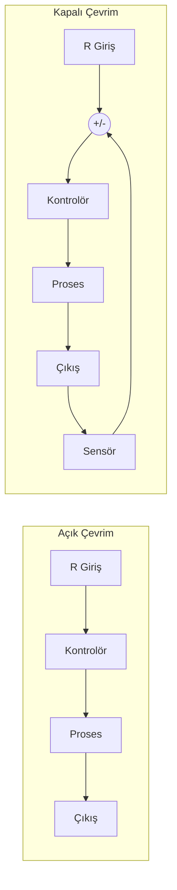
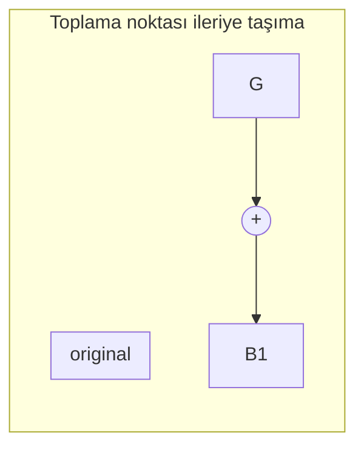
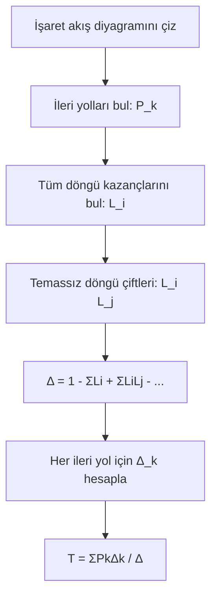

# 01 — Giriş, Kapalı Çevrim ve Blok Diyagramlar

← [[OK Ana Sayfa]] | Örnekler: [[../Örnek Sorular/01 Blok Diyagram Örnekleri]]

## Temel Tanımlar

> [!tanim] Otomatik Kontrol
> Kontrol için gerekli tüm işlemlerin bir algoritma ile insana gerek duyulmadan gerçekleştirilmesi.

| Özellik | Açık Çevrim | Kapalı Çevrim |
|---------|------------|--------------|
| Geri besleme | Yok | Var |
| Bozucu etki | Düzeltemez | Düzeltebilir |
| Karmaşıklık | Basit | Karmaşık |
| Kararlılık | Her zaman kararlı | Tasarıma bağlı |

---

## Transfer Fonksiyonu

Doğrusal, zamanla değişmeyen (LTI) n. dereceden sistem:

$$a_n y^{(n)} + a_{n-1}y^{(n-1)} + \cdots + a_0 y = b_m u^{(m)} + \cdots + b_0 u$$

Başlangıç şartları sıfır → Laplace dönüşümü:

$$G(s) = \frac{Y(s)}{U(s)} = \frac{b_m s^m + \cdots + b_0}{a_n s^n + \cdots + a_0}$$

> [!warning] Koşul
> Fiziksel sistemlerde $m \leq n$ (düzgün sistem)

---

## Blok Diyagram Kuralları

### Temel Bağlantılar

| Bağlantı | Kural | Transfer Fonksiyonu |
|---------|-------|-------------------|
| Seri (Kaskad) | $G_1 \to G_2$ | $G_1(s) \cdot G_2(s)$ |
| Paralel | $G_1 \parallel G_2$ | $G_1(s) \pm G_2(s)$ |
| **Kapalı Çevrim (negatif)** | $G$ + H geri besleme | $\dfrac{G(s)}{1 + G(s)H(s)}$ |
| Kapalı Çevrim (pozitif) | $G$ + H geri besleme | $\dfrac{G(s)}{1 - G(s)H(s)}$ |

### Öteleme Kuralları

| Hareket | Kural |
|---------|-------|
| Toplama noktasını G'nin önüne al | G'nin tersini ekle: $1/G$ |
| Toplama noktasını G'nin arkasına al | G'yi ekle |
| Dağılma noktasını G'nin önüne al | G'yi çıkar |
| Dağılma noktasını G'nin arkasına al | $1/G$'yi çıkar |

---

## Mason Kazanç Formülü

$$\frac{Y(s)}{R(s)} = \frac{\sum_k P_k \Delta_k}{\Delta}$$

**Terimler:**
- $P_k$: $k$. ileri yolun kazancı
- $\Delta = 1 - \sum L_i + \sum L_i L_j - \sum L_i L_j L_k + \cdots$ (determinant)
- $\Delta_k$: $k$. ileri yolun determinantı (o yol ile temas etmeyen döngüler)

### Mason Adımları

---

## Geçici Yanıt Parametreleri (2. Derece Sistem)

$$G(s) = \frac{\omega_n^2}{s^2 + 2\zeta\omega_n s + \omega_n^2}$$

| Parametre | Formül | Açıklama |
|-----------|--------|---------|
| $T_r$ (yükselme süresi) | $\approx \dfrac{1.8}{\omega_n}$ | %0 → %100 |
| $T_p$ (tepe süresi) | $\dfrac{\pi}{\omega_d}$, $\omega_d=\omega_n\sqrt{1-\zeta^2}$ | İlk tepe |
| $T_s$ (yerleşme süresi) | $\dfrac{4}{\zeta\omega_n}$ (%2 kriteri) | |
| $\%OS$ (aşım) | $100 e^{-\pi\zeta/\sqrt{1-\zeta^2}}$ | |
| $\zeta$ (sönüm oranı) | $\zeta = \cos\theta$ | $\theta$: kutup açısı |

> [!sinav] Sınav Tüyosu
> - $\%OS \leftrightarrow \zeta$: Aşım verilince $\zeta = \dfrac{-\ln(\%OS/100)}{\sqrt{\pi^2 + \ln^2(\%OS/100)}}$
> - $\zeta\omega_n$ sabit ise $T_s$ sabit kalır!
> - Baskın kutuplar: Gerçek kısmı diğerlerinin en az 5 katı olan kutuplar ihmal edilir.

---

← [[OK Ana Sayfa]] | Örnekler: [[../Örnek Sorular/01 Blok Diyagram Örnekleri]]
