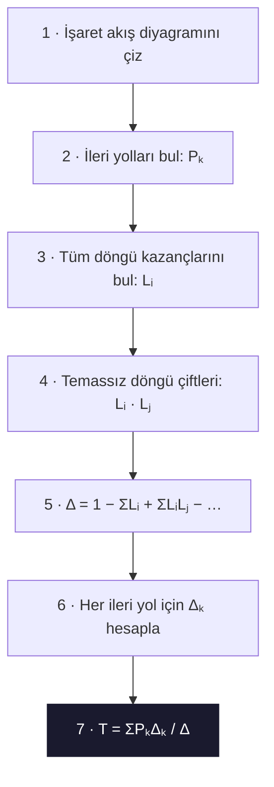

# 01 — Giriş, Kapalı Çevrim ve Blok Diyagramlar

← [[OK Ana Sayfa]] | Örnekler: [[../Örnek Sorular/01 Blok Diyagram Örnekleri]]

## Temel Tanımlar

> [!tanim] Otomatik Kontrol
> Kontrol için gerekli tüm işlemlerin bir algoritma ile insana gerek duyulmadan gerçekleştirilmesi.

```tikz
\usepackage{tikz}
\usetikzlibrary{arrows.meta,positioning,calc}
\begin{document}
\begin{tikzpicture}[
  font=\footnotesize, >={Stealth[length=2mm]},
  block/.style={draw, thick, fill=blue!5, minimum width=13mm, minimum height=8mm, align=center},
  fbk/.style={draw, thick, fill=blue!12, minimum width=13mm, minimum height=7mm},
  sum/.style={draw, thick, circle, minimum size=5.5mm, inner sep=0pt},
  link/.style={->, thick}
]
% ===================== AÇIK ÇEVRİM =====================
\node[font=\bfseries] at (3.0,1.4) {AÇIK ÇEVRİM};
\node (r1) at (0,0) {$R(s)$};
\node[block, right=8mm of r1] (k1) {Kontrolör};
\node[block, right=7mm of k1] (g1) {$G(s)$};
\coordinate[right=12mm of g1] (c1);
\draw[link] (r1) -- (k1);
\draw[link] (k1) -- (g1);
\draw[link] (g1) -- (c1) node[right] {$C(s)$};
% ===================== KAPALI ÇEVRİM =====================
\node[font=\bfseries] at (3.0,-1.6) {KAPALI ÇEVRİM};
\node (r2) at (0,-3) {$R(s)$};
\node[sum, right=8mm of r2] (s2) {};
\node[font=\tiny] at ([xshift=-1mm,yshift=1.5mm]s2.center) {$+$};
\node[font=\tiny] at ([xshift=-1mm,yshift=-1.5mm]s2.center) {$-$};
\node[block, right=8mm of s2] (k2) {Kontrolör};
\node[block, right=7mm of k2] (g2) {$G(s)$};
\coordinate[right=14mm of g2] (c2);
\draw[link] (r2) -- (s2);
\draw[link] (s2) -- (k2);
\draw[link] (k2) -- (g2);
\draw[link] (g2) -- (c2) node[right] {$C(s)$};
\coordinate (tap) at ($(g2.east)!0.55!(c2)$);
\fill (tap) circle (1.3pt);
\node[fbk, below=10mm of k2] (h2) {$H(s)$};
\draw[link] (tap) |- (h2.east);
\draw[link] (h2.west) -| (s2);
\end{tikzpicture}
\end{document}
```

| Özellik | Açık Çevrim | Kapalı Çevrim |
|---------|------------|--------------|
| Geri besleme | Yok | Var |
| Bozucu etki | Düzeltemez | Düzeltebilir |
| Karmaşıklık | Basit | Karmaşık |
| Kararlılık | Her zaman kararlı | Tasarıma bağlı |

---

## Transfer Fonksiyonu

Doğrusal, zamanla değişmeyen (LTI) n. dereceden sistem:

$$a_n y^{(n)} + a_{n-1}y^{(n-1)} + \cdots + a_0 y = b_m u^{(m)} + \cdots + b_0 u$$

Başlangıç şartları sıfır → Laplace dönüşümü:

$$G(s) = \frac{Y(s)}{U(s)} = \frac{b_m s^m + \cdots + b_0}{a_n s^n + \cdots + a_0}$$

> [!warning] Koşul
> Fiziksel sistemlerde $m \leq n$ (düzgün sistem)

---

## Blok Diyagram Kuralları

### Temel Bağlantılar

| Bağlantı | Kural | Transfer Fonksiyonu |
|---------|-------|-------------------|
| Seri (Kaskad) | $G_1 \to G_2$ | $G_1(s) \cdot G_2(s)$ |
| Paralel | $G_1 \parallel G_2$ | $G_1(s) \pm G_2(s)$ |
| **Kapalı Çevrim (negatif)** | $G$ + H geri besleme | $\dfrac{G(s)}{1 + G(s)H(s)}$ |
| Kapalı Çevrim (pozitif) | $G$ + H geri besleme | $\dfrac{G(s)}{1 - G(s)H(s)}$ |

### Öteleme Kuralları

```tikz
\usepackage{tikz}
\usetikzlibrary{arrows.meta,positioning,calc}
\begin{document}
\begin{tikzpicture}[
  font=\footnotesize, >={Stealth[length=2mm]},
  block/.style={draw, thick, fill=blue!5, minimum width=13mm, minimum height=8mm},
  fbk/.style={draw, thick, fill=blue!12, minimum width=13mm, minimum height=7mm},
  sum/.style={draw, thick, circle, minimum size=5.5mm, inner sep=0pt},
  link/.style={->, thick}
]
\node (r) at (0,0) {$R(s)$};
\node[sum, right=8mm of r] (s) {};
\node[font=\tiny] at ([xshift=-1mm,yshift=1.5mm]s.center) {$+$};
\node[font=\tiny] at ([xshift=-1mm,yshift=-1.5mm]s.center) {$-$};
\node[block, right=11mm of s] (g) {$G(s)$};
\coordinate[right=15mm of g] (c);
\draw[link] (r) -- (s);
\draw[link] (s) -- (g) node[midway, above] {$E(s)$};
\draw[link] (g) -- (c) node[right] {$C(s)$};
\coordinate (tap) at ($(g.east)!0.5!(c)$);
\fill (tap) circle (1.3pt);
\node[fbk, below=10mm of g] (h) {$H(s)$};
\draw[link] (tap) |- (h.east);
\draw[link] (h.west) -| (s);
\end{tikzpicture}
\end{document}
```

$$G_{CL}(s) = \frac{G(s)}{1 + G(s)H(s)} \qquad \xrightarrow{\;H(s)=1\;} \qquad \frac{G(s)}{1 + G(s)}$$

| Hareket | Kural |
|---------|-------|
| Toplama noktasını G'nin önüne al | G'nin tersini ekle: $1/G$ |
| Toplama noktasını G'nin arkasına al | G'yi ekle |
| Dağılma noktasını G'nin önüne al | G'yi çıkar |
| Dağılma noktasını G'nin arkasına al | $1/G$'yi çıkar |

---

## Mason Kazanç Formülü

$$\frac{Y(s)}{R(s)} = \frac{\sum_k P_k \Delta_k}{\Delta}$$

**Terimler:**
- $P_k$: $k$. ileri yolun kazancı
- $\Delta = 1 - \sum L_i + \sum L_i L_j - \sum L_i L_j L_k + \cdots$ (determinant)
- $\Delta_k$: $k$. ileri yolun determinantı (o yol ile temas etmeyen döngüler)

### Mason Adımları



---

## Geçici Yanıt Parametreleri (2. Derece Sistem)

$$G(s) = \frac{\omega_n^2}{s^2 + 2\zeta\omega_n s + \omega_n^2}$$

| Parametre | Formül | Açıklama |
|-----------|--------|---------|
| $T_r$ (yükselme süresi) | $\approx \dfrac{1.8}{\omega_n}$ | %0 → %100 |
| $T_p$ (tepe süresi) | $\dfrac{\pi}{\omega_d}$, $\omega_d=\omega_n\sqrt{1-\zeta^2}$ | İlk tepe |
| $T_s$ (yerleşme süresi) | $\dfrac{4}{\zeta\omega_n}$ (%2 kriteri) | |
| $\%OS$ (aşım) | $100 e^{-\pi\zeta/\sqrt{1-\zeta^2}}$ | |
| $\zeta$ (sönüm oranı) | $\zeta = \cos\theta$ | $\theta$: kutup açısı |

> [!sinav] Sınav Tüyosu
> - $\%OS \leftrightarrow \zeta$: Aşım verilince $\zeta = \dfrac{-\ln(\%OS/100)}{\sqrt{\pi^2 + \ln^2(\%OS/100)}}$
> - $\zeta\omega_n$ sabit ise $T_s$ sabit kalır!
> - Baskın kutuplar: Gerçek kısmı diğerlerinin en az 5 katı olan kutuplar ihmal edilir.

### Birim Adım Yanıtı — Sönüm Oranı Karşılaştırması

![[ok01-birim-adim-yaniti.png]]

> [!note]- Python kaynağı — `_assets/scripts/ok01-birim-adim-yaniti.py`
> ```python
> import numpy as np
> import matplotlib.pyplot as plt
>
> wn = 5.0                       # doğal frekans [rad/s]
> t = np.linspace(0, 4, 600)
> egriler = [
>     (0.2, "#c0392b", r"$\zeta=0.2$  (%OS$\approx$52%)"),
>     (0.5, "#e67e22", r"$\zeta=0.5$  (%OS$\approx$16%)"),
>     (0.7, "#2980b9", r"$\zeta=0.7$  (%OS$\approx$5%)"),
>     (1.0, "#27ae60", r"$\zeta=1.0$  (kritik sönüm)"),
> ]
>
> fig, ax = plt.subplots(figsize=(7, 4))
> for z, renk, etiket in egriler:
>     if z < 1:                  # az sönümlü
>         wd = wn*np.sqrt(1-z**2); phi = np.arccos(z)
>         y = 1 - np.exp(-z*wn*t)/np.sqrt(1-z**2)*np.sin(wd*t + phi)
>     else:                      # kritik sönüm
>         y = 1 - np.exp(-wn*t)*(1 + wn*t)
>     ax.plot(t, y, color=renk, lw=2, label=etiket)
>
> ax.axhline(1.0, color="0.5", lw=0.8)
> ax.set_title(r"Birim Adım Yanıtı — $\omega_n = 5$ rad/s")
> ax.set_xlabel("t (s)"); ax.set_ylabel("y(t)")
> ax.set_ylim(0, 1.6); ax.grid(True, ls="--", alpha=0.4)
> ax.legend(loc="upper right", fontsize=8)
> fig.tight_layout(); plt.show()
> ```

---

← [[OK Ana Sayfa]] | Örnekler: [[../Örnek Sorular/01 Blok Diyagram Örnekleri]]
