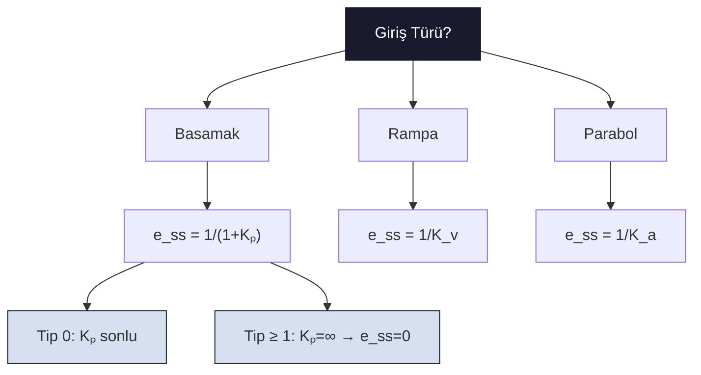

# 03 — Kararlı Hal Hataları

← [[OK Ana Sayfa]] | Örnekler: [[../Örnek Sorular/03 Kararlı Hal Hata Örnekleri]]

## Son Değer Teoremi ile Hata

Unity feedback kapalı çevrim:

$$E(s) = \frac{R(s)}{1 + G(s)}$$

Kararlı hal hatası:
$$e(\infty) = \lim_{s \to 0} s E(s) = \lim_{s \to 0} \frac{s\,R(s)}{1 + G(s)}$$

> [!warning] Koşul
> Son değer teoremi ancak sistem **kararlı** ise uygulanabilir!

---

## Hata Sabitleri

| Sabit | Formül | Kullanım |
|-------|--------|---------|
| $K_p$ (konum) | $\displaystyle K_p = \lim_{s\to 0} G(s)$ | Basamak girişi |
| $K_v$ (hız) | $\displaystyle K_v = \lim_{s\to 0} s\,G(s)$ | Rampa girişi |
| $K_a$ (ivme) | $\displaystyle K_a = \lim_{s\to 0} s^2 G(s)$ | Parabol girişi |

---

## Sistem Tipi ve Hata Tablosu

**Sistem Tipi:** Açık çevrim $G(s)$'deki orijin ($s=0$) kutup sayısı

$$G(s) = \frac{K\prod(s+z_i)}{s^N \prod(s+p_j)}$$

$N = $ sistem tipi

| Giriş | Tip 0 | Tip 1 | Tip 2 |
|-------|-------|-------|-------|
| Birim Basamak ($1/s$) | $\dfrac{1}{1+K_p}$ | **0** | **0** |
| Birim Rampa ($1/s^2$) | $\infty$ | $\dfrac{1}{K_v}$ | **0** |
| Birim Parabol ($1/s^3$) | $\infty$ | $\infty$ | $\dfrac{1}{K_a}$ |



> $K_p = \lim_{s\to 0} G(s)$, $\quad K_v = \lim_{s\to 0} s\,G(s)$, $\quad K_a = \lim_{s\to 0} s^2 G(s)$

---

## Bozucu Etkinin Yol Açtığı Hata

```tikz
\usepackage{tikz}
\usetikzlibrary{arrows.meta,positioning,calc}
\begin{document}
\begin{tikzpicture}[
  font=\footnotesize, >={Stealth[length=2mm]},
  block/.style={draw, thick, fill=blue!5, minimum width=12mm, minimum height=8mm},
  sum/.style={draw, thick, circle, minimum size=5.5mm, inner sep=0pt},
  link/.style={->, thick}
]
\node (r) at (0,0) {$R(s)$};
\node[sum, right=7mm of r] (s1) {};
\node[font=\tiny] at ([xshift=-1mm,yshift=1.5mm]s1.center) {$+$};
\node[font=\tiny] at ([xshift=-1mm,yshift=-1.5mm]s1.center) {$-$};
\node[block, right=8mm of s1] (g1) {$G_1(s)$};
\node[sum, right=9mm of g1] (s2) {};
\node[font=\tiny] at ([xshift=-1.5mm,yshift=1.3mm]s2.center) {$+$};
\node[font=\tiny] at ([xshift=1.6mm,yshift=1.3mm]s2.center) {$+$};
\node[block, right=9mm of s2] (g2) {$G_2(s)$};
\coordinate[right=12mm of g2] (c);
\node[red!70!black, above=11mm of s2] (d) {$D(s)$};
\draw[link] (r) -- (s1);
\draw[link] (s1) -- (g1);
\draw[link] (g1) -- (s2);
\draw[link, red!70!black] (d) -- (s2);
\draw[link] (s2) -- (g2);
\draw[link] (g2) -- (c) node[right] {$C(s)$};
\coordinate (tap) at ($(g2.east)!0.6!(c)$);
\fill (tap) circle (1.3pt);
\coordinate (fb) at ($(tap)+(0,-11mm)$);
\draw[thick] (tap) -- (fb);
\draw[link] (fb) -| (s1);
\end{tikzpicture}
\end{document}
```

$$e(\infty) = e_R(\infty) + e_D(\infty)$$

Birim basamak bozucu $D(s) = 1/s$ için:

$$e_D(\infty) = -\frac{1}{\lim_{s\to 0}\frac{1}{G_2(s)} + \lim_{s\to 0}G_1(s)}$$

Eğer $G_1(s)$ yüksek kazançlı (entegratör) ise $e_D(\infty) \to 0$.

> [!sinav] Sınav İpucu
> - Sistem Tipi = paydada orijindeki kutup sayısı
> - Tip ≥ 1 → basamak hatası = 0
> - Tip ≥ 2 → rampa hatası = 0
> - Hata sıfır olmak için gerekli tip ile K aralığı çelişirse → "mümkün değil" de!
> - Son değer teoremi: sadece kararlı sistem için çalışır!

---

← [[OK Ana Sayfa]] | Örnekler: [[../Örnek Sorular/03 Kararlı Hal Hata Örnekleri]]
