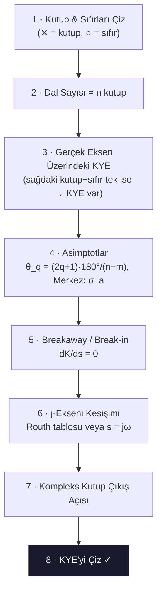

# 04 — Kök Yer Eğrisi (Root Locus / KYE)

← [[OK Ana Sayfa]] | Örnekler: [[../Örnek Sorular/04 Kök Yer Eğrisi Örnekleri]]

## KYE Nedir?

> [!tanim] Kök Yer Eğrisi
> Kapalı çevrim karakteristik denklemin köklerinin $K$ parametresi $0 \to \infty$ değişirken s-düzleminde çizdiği yol.

**Unity feedback kapalı çevrim:**
$$1 + G(s) = 0 \implies G(s) = -1$$

$$\angle G(s) = \pm 180°(2k+1) \quad \text{(açı şartı)}$$
$$|G(s)| = 1 \quad \text{(genlik şartı)}$$

---

## KYE Çizim Adımları

---

## Formüller

### Asimptotlar

$$\text{Asimptot sayısı} = n - m \quad (n=\text{kutup}, m=\text{sıfır})$$

$$\theta_q = \frac{(2q+1)\cdot 180°}{n - m}, \quad q = 0, 1, 2, \ldots, (n-m-1)$$

$$\sigma_a = \frac{\sum \text{kutuplar} - \sum \text{sıfırlar}}{n - m}$$

### Breakaway Noktası

$$\frac{dK}{ds} = 0 \quad \Leftrightarrow \quad K = -\frac{D(s)}{N(s)} \text{ türevi sıfır}$$

Veya: $\sum_{\text{kutuplar}} \frac{1}{s - p_i} = \sum_{\text{sıfırlar}} \frac{1}{s - z_j}$

### j-Ekseni Kesişimi

**Yöntem 1 (Routh):** $s^1$ satırını sıfır yap, $K_\text{kritik}$ bul. Yardımcı polinomdan $\omega$ bul.

**Yöntem 2:** $s = j\omega$ koy, reel ve imajiner kısımları ayır, denklem sistemini çöz.

### Kompleks Kutuptan Çıkış Açısı

$$\phi_d = 180° + \sum \angle(s+z_i) - \sum_{\text{diğer kutuplardan}} \angle(s+p_j)$$

---

## Sönüm Oranı — %OS İlişkisi

$$\%OS = 100 e^{-\pi\zeta/\sqrt{1-\zeta^2}}$$

| $\zeta$ | $\%OS$ |
|---------|--------|
| 0.3 | 37.2% |
| 0.5 | 16.3% |
| 0.6 | 9.5% |
| 0.7 | 4.6% |
| 1.0 | 0% (aşımsız) |

---

> [!sinav] Sınav İpucu
> - **Gerçek eksende:** Sağdaki kutup+sıfır sayısı **tek** → KYE var
> - Asimptot formülünü ezberle: $\sigma_a = (\sum p_i - \sum z_j)/(n-m)$
> - Breakaway: $K = -D(s)/N(s)$ türevini sıfırla
> - j-ekseni = sınırda kararlılık = $K_\text{kritik}$ (Routh ile bulunur)
> - KYE **kutuplardan başlar** ($K=0$), **sıfırlara veya sonsuza gider** ($K\to\infty$)

---

← [[OK Ana Sayfa]] | Örnekler: [[../Örnek Sorular/04 Kök Yer Eğrisi Örnekleri]]

**İlgili:** [[05 Kök Yer Eğrisi ve Kompansasyon|MST&B - KYE & Kompansasyon]]
