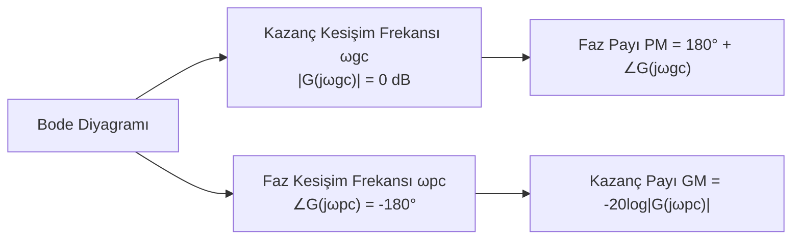

# 05 — Frekans Analizi ve Bode Diyagramı

← [[OK Ana Sayfa]] | Örnekler: [[../Örnek Sorular/05 Bode Diyagramı Örnekleri]]

## Frekans Yanıtı

$s = j\omega$ ile transfer fonksiyonu değerlendirilir:

$$G(j\omega) = |G(j\omega)| \angle G(j\omega)$$

**Bode diyagramı:**
- **Kazanç (dB):** $20\log_{10}|G(j\omega)|$ vs $\log_{10}(\omega)$
- **Faz (derece):** $\angle G(j\omega)$ vs $\log_{10}(\omega)$

---

## Bode Grafiği Temel Elemanlar

### 1. Sabit Kazanç $K$

| | Kazanç | Faz |
|-|--------|-----|
| Eğri | $20\log K$ dB (düz çizgi) | 0° (ya da 180°, $K<0$) |

### 2. İntegratör / Türevleyici $s^{\pm N}$

| | Kazanç Eğimi | Faz |
|-|-------------|-----|
| $1/s^N$ | $-20N$ dB/dekad | $-90N°$ |
| $s^N$ | $+20N$ dB/dekad | $+90N°$ |

### 3. Birinci Derece Faktör $(1 + s/\omega_1)$

| Frekans | Kazanç | Faz |
|---------|--------|-----|
| $\omega \ll \omega_1$ | 0 dB | 0° |
| $\omega = \omega_1$ | 3 dB | 45° |
| $\omega \gg \omega_1$ | $+20$ dB/dekad eğimi | 90° |

**Pay'da:** +20 dB/dekad, +90° faz artışı (sıfır)
**Payda'da:** -20 dB/dekad, -90° faz azalışı (kutup)

### 4. İkinci Derece Faktör (Kompleks Kutup)

$$\frac{\omega_n^2}{s^2 + 2\zeta\omega_n s + \omega_n^2}$$

| Frekans | Kazanç | Faz |
|---------|--------|-----|
| $\omega \ll \omega_n$ | 0 dB | 0° |
| $\omega = \omega_n$ | $-20\log(2\zeta)$ dB (rezonans) | -90° |
| $\omega \gg \omega_n$ | -40 dB/dekad | -180° |

---

## Faz Payı (PM) ve Kazanç Payı (GM)

$$\text{PM} = 180° + \angle G(j\omega_{gc}) \quad \text{(kazanç kesişiminde)}$$

$$\text{GM} = -20\log_{10}|G(j\omega_{pc})| \text{ dB} \quad \text{(faz kesişiminde)}$$

**Kararlı sistem:** PM > 0 **ve** GM > 0

Tipik tasarım hedefleri: **PM ≈ 45°–60°**, **GM ≈ 6–20 dB**

---

## Tipik Bode Çizim Prosedürü

**Adım 1:** $G(s)$'i standart biçime getir

$$G(s) = \frac{K\prod(1 + s/z_i)}{s^N \prod(1 + s/p_j)}$$

**Adım 2:** Kazanç diyagramı
1. Düşük frekansta: $20\log K$'dan başla, $-20N$ dB/dekad eğimi
2. Her sıfırda ($\omega = z_i$): eğim +20 dB/dekad artır
3. Her kutupda ($\omega = p_j$): eğim -20 dB/dekad azalt

**Adım 3:** Faz diyagramı
- Frekans on katı değiştiğinde faz değişimi tamamlanır
- $\omega_c/10$ ile $10\omega_c$ arasında lineer geçiş varsay

---

## Frekans-Alan ve Zaman-Alan İlişkileri

| Zaman Alan | Frekans Alan |
|-----------|-------------|
| $T_s \approx 4/(\zeta\omega_n)$ | $\omega_{gc} \approx \omega_n\sqrt{1-2\zeta^2}$ |
| $\%OS \leftrightarrow \zeta$ | $PM \approx 100\zeta$ (küçük $\zeta$ için) |
| Hız yanıtı | Bant genişliği $\omega_{BW}$ |

## Kapalı Çevrim ↔ Bode İlişkileri

| Zaman Alan | Frekans Alan Karşılığı |
|-----------|----------------------|
| $\%OS$ azalt | $PM$ artır → $\zeta$ artır |
| $T_s$ azalt | $\omega_{gc}$ artır |
| Kararlılık | $PM > 0$, $GM > 0$ |
| Faz payı ≈ | $PM \approx 100\zeta$ (kaba tahmin) |

---

> [!sinav] Sınav İpucu
> - Kazanç payı = kutup > sıfır frekansında kazanç
> - Faz payı = kazanç = 0 dB noktasındaki faz marjı
> - PM > 0 → kararlı; PM < 0 → kararsız
> - Birinci derece kutup: kesim frekansında -45°, on kat sonra -90°
> - İntegratör: Bode başlangıcını -20 dB/dekad yapar, başlangıç fazı -90°

---

← [[OK Ana Sayfa]] | Örnekler: [[../Örnek Sorular/05 Bode Diyagramı Örnekleri]]
