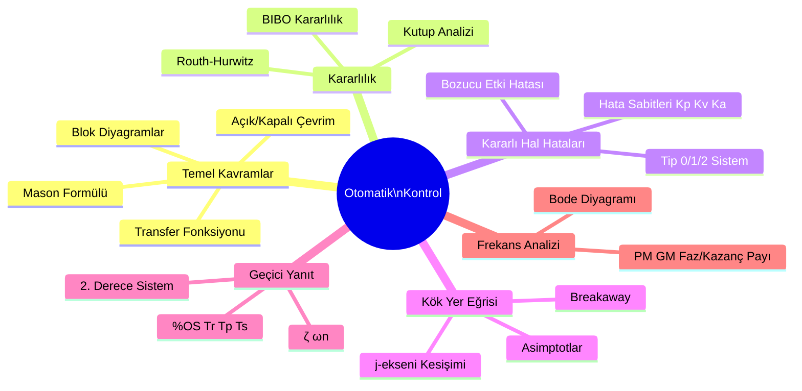
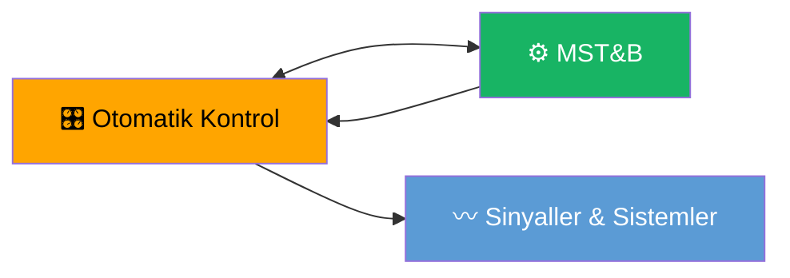

# Otomatik Kontrol — Ana Sayfa

← [[HOME]]

## Konu Haritası

## Konu Anlatımları

| # | Konu | Bağlantı |
|---|------|----------|
| 1 | Giriş, Kapalı Çevrim, Blok Diyagramlar, Mason | [[Konu Anlatımları/01 Giriş Kapalı Çevrim ve Blok Diyagramları]] |
| 2 | Kararlılık ve Routh-Hurwitz | [[Konu Anlatımları/02 Kararlılık ve Routh-Hurwitz]] |
| 3 | Kararlı Hal Hataları | [[Konu Anlatımları/03 Kararlı Hal Hataları]] |
| 4 | Kök Yer Eğrisi | [[Konu Anlatımları/04 Kök Yer Eğrisi]] |
| 5 | Frekans Analizi ve Bode | [[Konu Anlatımları/05 Frekans Analizi ve Bode Diyagramı]] |
| 📄 | Formül Özeti | [[OK Formül Sayfası]] |

## Örnek Sorular

| # | Konu | Bağlantı |
|---|------|----------|
| 1 | Blok Diyagram Örnekleri | [[Örnek Sorular/01 Blok Diyagram Örnekleri]] |
| 2 | Routh-Hurwitz Örnekleri | [[Örnek Sorular/02 Routh-Hurwitz Örnekleri]] |
| 3 | Kararlı Hal Hata Örnekleri | [[Örnek Sorular/03 Kararlı Hal Hata Örnekleri]] |
| 4 | Kök Yer Eğrisi Örnekleri | [[Örnek Sorular/04 Kök Yer Eğrisi Örnekleri]] |
| 5 | Bode Diyagramı Örnekleri | [[Örnek Sorular/05 Bode Diyagramı Örnekleri]] |

## İlgili Derslerle Bağlantı

- **[[MST Ana Sayfa|MST&B]]** — Transfer fonksiyonu, Laplace, KYE ortak
- **[[../Sİnyaller ve Sistemler/SS Ana Sayfa|SS]]** — Laplace dönüşümü temeli

## Temel Formüller (Hızlı Erişim)

**Kapalı Çevrim TF:** $T(s) = \dfrac{G(s)}{1 + G(s)H(s)}$

**Routh 3. Derece:** $s^3 + as^2 + bs + c = 0$ → Şart: $ab > c$

**Hata Sabitleri:** $K_p = \lim_{s\to 0}G(s)$, $K_v = \lim_{s\to 0}sG(s)$, $K_a = \lim_{s\to 0}s^2G(s)$

**KYE Asimptot Açısı:** $\theta_q = \dfrac{\pm 180°(2q+1)}{n-m}$

**2. Derece:** $s^2 + 2\zeta\omega_n s + \omega_n^2 = 0$ → $T_s \approx \dfrac{4}{\zeta\omega_n}$, $\%OS = 100e^{-\pi\zeta/\sqrt{1-\zeta^2}}$
