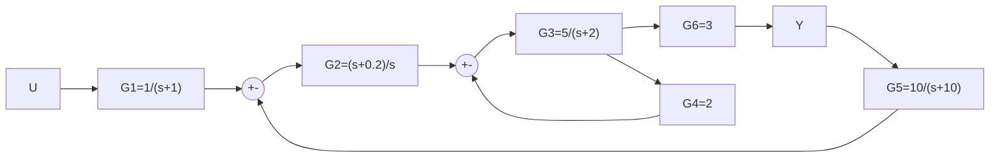
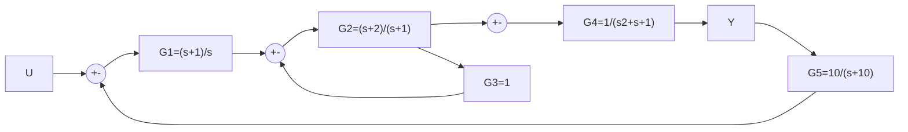

# 01 — Blok Diyagram Örnekleri

← [[OK Ana Sayfa]] | Teori: [[../Konu Anlatımları/01 Giriş Kapalı Çevrim ve Blok Diyagramları]]

---

## Ödev-1 — Çok Çevrimli Blok Diyagram (Y/U = ?)

**Verilen:**
$$G_1=\frac{1}{s+1},\quad G_2=\frac{s+0.2}{s},\quad G_3=\frac{5}{s+2},\quad G_4=2,\quad G_5=\frac{10}{s+10},\quad G_6=3$$

**Topoloji:** $U \to G_1 \to \Sigma_1 \to G_2 \to \Sigma_2 \to G_3 \to G_6 \to Y$
- İç geri besleme: $G_3$ çıkışı $\to G_4 \to \Sigma_2$ (negatif)
- Dış geri besleme: $Y \to G_5 \to \Sigma_1$ (negatif)

**Çözüm (iç çevrimden dışa):**

**Adım 1 — İç çevrim** ($\Sigma_2, G_3, G_4$):

$$A(s) = \frac{G_3}{1+G_3 G_4} = \frac{\frac{5}{s+2}}{1+\frac{10}{s+2}} = \frac{5}{s+12}$$

**Adım 2 — Dış çevrim** ($\Sigma_1, G_2, A, G_6, G_5$):

$$\frac{Y}{U} = \frac{G_1 \cdot G_2 \cdot A(s) \cdot G_6}{1 + G_2 \cdot A(s) \cdot G_6 \cdot G_5}$$

Numeratör: $G_1 G_2 A G_6 = \dfrac{1}{s+1}\cdot\dfrac{s+0.2}{s}\cdot\dfrac{5}{s+12}\cdot 3 = \dfrac{15(s+0.2)}{s(s+1)(s+12)}$

Paydada $G_2 A G_6 G_5$: $\dfrac{s+0.2}{s}\cdot\dfrac{5}{s+12}\cdot 3\cdot\dfrac{10}{s+10} = \dfrac{150(s+0.2)}{s(s+12)(s+10)}$

$$\boxed{\frac{Y}{U} = \frac{15(s+0.2)}{s(s+1)(s+12) + 150(s+0.2)\frac{s+1}{s+10}}\cdot\frac{1}{1}}$$

> [!sinav] Hızlı Yaklaşım
> İç çevrim sadeleştir → dış çevrim uygula. Negatif geri besleme her zaman: $\frac{G}{1+GH}$

---

## Ödev-2 — İkili Negatif Geri Besleme (Y/U = ?)

**Verilen:**
$$G_1=\frac{s+1}{s},\quad G_2=\frac{s+2}{s+1},\quad G_3=1,\quad G_4=\frac{1}{s^2+s+1},\quad G_5=\frac{10}{s+10}$$

**Topoloji:** $U \to \Sigma_1 \to G_1 \to \Sigma_2 \to G_2 \to \Sigma_3 \to G_4 \to Y$
- 1. iç geri besleme: $G_2$ çıkışı $\to G_3=1 \to \Sigma_2$ (negatif)
- Dış geri besleme: $Y \to G_5 \to \Sigma_1$ (negatif)

**Adım 1 — İç çevrim** ($\Sigma_2, G_2, G_3=1$):

$$B(s) = \frac{G_2}{1+G_2 G_3} = \frac{G_2}{1+G_2} = \frac{\frac{s+2}{s+1}}{1+\frac{s+2}{s+1}} = \frac{s+2}{s+1+s+2} = \frac{s+2}{2s+3}$$

**Adım 2 — Dış çevrim:**

$$\frac{Y}{U} = \frac{G_1 \cdot B(s) \cdot G_4}{1 + G_1 \cdot B(s) \cdot G_4 \cdot G_5}$$

$$G_1 B G_4 = \frac{s+1}{s}\cdot\frac{s+2}{2s+3}\cdot\frac{1}{s^2+s+1}$$

$$\boxed{\frac{Y}{U} = \frac{(s+1)(s+2)}{s(2s+3)(s^2+s+1) + (s+1)(s+2)\cdot\frac{10}{s+10}\cdot s(2s+3)/(s(2s+3))}}$$

---

### Mason Formülü Örneği

Sistem: $G_1 \to G_2 \to G_3$, geri besleme $H_1$ (iç), $H_2$ (dış)

**İleri yollar:** $P_1 = G_1 G_2 G_3$

**Döngüler:** $L_1 = -G_2 H_1$, $L_2 = -G_1 G_2 G_3 H_2$

**Determinant:** $\Delta = 1 - (L_1 + L_2) = 1 + G_2 H_1 + G_1 G_2 G_3 H_2$

**$\Delta_1$:** $P_1$ ile temas eden döngü yok → $\Delta_1 = 1$

$$\boxed{T = \frac{G_1 G_2 G_3}{1 + G_2 H_1 + G_1 G_2 G_3 H_2}}$$

---

← [[OK Ana Sayfa]] | Teori: [[../Konu Anlatımları/01 Giriş Kapalı Çevrim ve Blok Diyagramları]]
