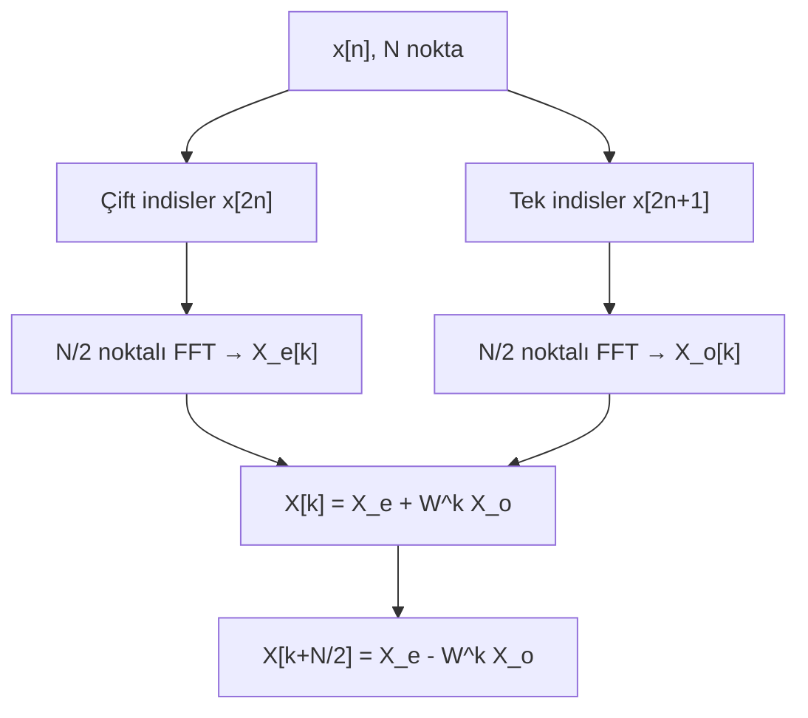

# 03 — DFT ve FFT

← [[SSI Ana Sayfa]]

## Özet

> DFT: sonlu uzunluklu ayrık sinyalin frekans analizi. FFT: DFT'yi hızlı hesaplayan algoritma. Döngüsel konvolüsyon: DFT domeninde çarpım = zaman domeninde döngüsel konvolüsyon.

---

## 1. DFT Tanımı

$N$ noktalı DFT çifti:

$$\boxed{X[k] = \sum_{n=0}^{N-1} x[n]\, e^{-j2\pi kn/N} = \sum_{n=0}^{N-1} x[n]\, W_N^{kn}}$$

$$\boxed{x[n] = \frac{1}{N} \sum_{k=0}^{N-1} X[k]\, e^{j2\pi kn/N} = \frac{1}{N}\sum_{k=0}^{N-1} X[k]\, W_N^{-kn}}$$

Burada $W_N = e^{-j2\pi/N}$ — döndürme faktörü (twiddle factor).

> [!tanim] DFT vs DTFT
> - **DTFT:** Sonsuz uzunluklu dizi → sürekli $\omega \in [-\pi,\pi]$ frekans
> - **DFT:** Sonlu uzunluklu ($N$ nokta) dizi → $N$ ayrık frekans $k = 0,1,...,N-1$
> - İlişki: $X[k] = X(e^{j\omega})\big|_{\omega=2\pi k/N}$

---

## 2. DFT Özellikleri

| Özellik | İfade |
|---------|-------|
| Doğrusallik | $ax[n]+by[n] \leftrightarrow aX[k]+bY[k]$ |
| Zaman kayması (döngüsel) | $x[(n-m)_N] \leftrightarrow W_N^{km} X[k]$ |
| Frekans kayması | $W_N^{-ln}x[n] \leftrightarrow X[(k-l)_N]$ |
| Döngüsel konvolüsyon | $x[n] \circledast h[n] \leftrightarrow X[k]\cdot H[k]$ |
| Çarpma | $x[n]\cdot h[n] \leftrightarrow \frac{1}{N}X[k]\circledast H[k]$ |
| **Parseval** | $\sum_{n=0}^{N-1}\|x[n]\|^2 = \frac{1}{N}\sum_{k=0}^{N-1}\|X[k]\|^2$ |
| Periyodiklik | $X[k] = X[k+N]$ |
| Simetri (gerçek $x$) | $X[N-k] = X^*[k]$ |

---

## 3. Döngüsel Konvolüsyon

> [!tanim] Döngüsel (Circular) Konvolüsyon
> $x[n] \circledast h[n] = \sum_{m=0}^{N-1} x[m]\, h[(n-m)_N]$
> 
> $(n-m)_N$: modulo $N$ alım

### Lineer vs Döngüsel Konvolüsyon

| | Lineer | Döngüsel |
|-|--------|----------|
| Uzunluk | $L_x + L_h - 1$ | $N$ (sabit) |
| Kullanım | Gerçek filtre | DFT hesabı |
| Sıfır dolgu | Gerekmez | $N \geq L_x + L_h - 1$ olmalı |

> [!sinav] Döngüsel → Lineer Konvolüsyon
> DFT ile lineer konvolüsyon yapmak için: her iki sinyali $N \geq L_x + L_h - 1$ olacak şekilde **sıfırla doldur** (zero-pad), sonra DFT al, çarp, ters DFT al.

---

## 4. FFT (Hızlı Fourier Dönüşümü)

### Karmaşıklık

- DFT: $O(N^2)$ işlem
- FFT: $O(N\log_2 N)$ işlem — **Cooley-Tukey** algoritması

### Decimation-in-Time (DIT) FFT

$N = 2^m$ için:

$$X[k] = \underbrace{\sum_{n=0}^{N/2-1}x[2n]W_{N/2}^{kn}}_{X_e[k]} + W_N^k\underbrace{\sum_{n=0}^{N/2-1}x[2n+1]W_{N/2}^{kn}}_{X_o[k]}$$

$$X[k] = X_e[k] + W_N^k X_o[k], \quad k=0,...,N/2-1$$
$$X[k+N/2] = X_e[k] - W_N^k X_o[k]$$

---

## 5. Pencereleme ve Spektral Sızıntı

### Dikdörtgen Pencere (Ecmel ders notlarından)

$$w[n] = \begin{cases}1 & 0 \leq n \leq N-1 \\ 0 & \text{diğer}\end{cases}$$

$$W(e^{j\omega}) = e^{-j\omega\frac{N-1}{2}} \cdot \frac{\sin(N\omega/2)}{\sin(\omega/2)}$$

- Merkez lob yüksekliği: $N$
- İlk sıfır: $\omega = 2\pi/N$
- Sinc benzeri Dirichlet çekirdeği

### Pencere Seçimi

| Pencere | Ana Lob Genişliği | Yan Lob Düzeyi |
|---------|-------------------|----------------|
| Dikdörtgen | Dar | Yüksek (sızıntı fazla) |
| Hanning | Orta | Orta |
| Hamming | Orta | Düşük |
| Blackman | Geniş | Çok düşük |

---

## 6. Ders Tahtası — İdeal Alçak Geçiren Filtre ve Filtre Tasarım Temeli

*İdeal filtre yanıtları [[04 Sayısal Filtre Tasarımı]] ile ilgilidir.*

**İdeal Alçak Geçiren Filtre (LPF):**

$$H_{LP}(e^{j\omega}) = \begin{cases}1 & |\omega| < \omega_c \\ 0 & \omega_c < |\omega| < \pi\end{cases}$$

İdeal LPF impuls yanıtı türetimi:

$$h_{LP}[n] = \frac{1}{2\pi}\int_{-\pi}^{\pi}H_{LP}(e^{j\omega})e^{j\omega n}d\omega = \frac{1}{2\pi}\int_{-\omega_c}^{\omega_c}e^{j\omega n}d\omega$$

$$= \frac{1}{2\pi jn}\left[e^{j\omega_c n} - e^{-j\omega_c n}\right] = \frac{\sin(\omega_c n)}{\pi n} = \frac{\omega_c}{\pi}\operatorname{sinc}(\omega_c n)$$

> [!warning] İdeallik Koşulları
> - Genlik bozumu yok → $|H(e^{j\omega})|$ pasabandda tam 1
> - Faz bozumu yok → $\angle H(e^{j\omega})$ pasabandda lineer
> - Frekans yanıtının keskin geçişleri olsun

**Filtre → LTI sistem bağlantısı:**

$$x[n] \xrightarrow{h[n]} y[n], \quad X(e^{j\omega}) \xrightarrow{H(e^{j\omega})} Y(e^{j\omega})$$

$$H(e^{j\omega}) = |H(e^{j\omega})| \cdot e^{j\angle H(e^{j\omega})}$$

$e^{j\omega n}$ girişi için çıkış: $H(e^{j\omega}) \cdot e^{j\omega n} = |H| e^{j(\omega n + \phi)}$

---

## Bağlantılı Notlar

- [[02 Z-Dönüşümü]]
- [[04 Sayısal Filtre Tasarımı]]
- [[../Sİnyaller ve Sistemler/03 Fourier Serisi|SS: Fourier Serisi]]
- [[../Sİnyaller ve Sistemler/04 Fourier Dönüşümü|SS: Fourier Dönüşümü]]
