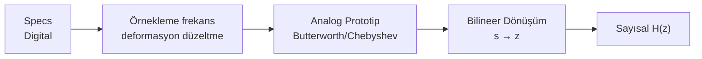

# 04 — Sayısal Filtre Tasarımı

← [[SSI Ana Sayfa]]

## Özet

> FIR: sonlu impuls yanıtı, her zaman kararlı. IIR: sonsuz, analog filtreyi dönüştürerek tasarla. Bilineer dönüşüm: analog → sayısal.

---

## 0. İdeal Sayısal Filtreler (Arş. Gör. Ecmel TERZİ Ders Notları)

### Alçak Geçiren (Low Pass — LP)

$$H_{LP}(e^{j\omega}) = \begin{cases}1, & |\omega| < \omega_c \\ 0, & \omega_c < |\omega| \leq \pi\end{cases}$$

İmpuls yanıtı: $h_{LP}[n] = \dfrac{\sin(\omega_c n)}{\pi n} = \dfrac{\omega_c}{\pi}\operatorname{sinc}(\omega_c n)$

### Yüksek Geçiren (High Pass — HP)

$$H_{HP}(e^{j\omega}) = \begin{cases}0, & |\omega| < \omega_c \\ 1, & \omega_c < |\omega| \leq \pi\end{cases}$$

$$H_{HP}(e^{j\omega}) = 1 - H_{LP}(e^{j\omega})$$

$$h_{HP}[n] = \delta[n] - \frac{\sin(\omega_c n)}{\pi n}$$

### Bant Geçiren (Band Pass — BP)

Pasaband: $\omega_a < |\omega| < \omega_b$

$$H_{BP}(e^{j\omega}) = H_{HP}^{(\omega_a)}(e^{j\omega}) \cdot H_{LP}^{(\omega_b)}(e^{j\omega})$$

$$h_{BP}[n] = h_{HP}[n] * h_{LP}[n]$$

Gerçekleme: $x[n] \to \boxed{h_{HP}[n]} \to \boxed{h_{LP}[n]} \to y[n]$

### Bant Söndüren (Band Stop — BS / Notch)

Stopband: $\omega_a < |\omega| < \omega_b$

$$H_{BS}(e^{j\omega}) = 1 - H_{BP}(e^{j\omega})$$

| Filtre | Pasaband | Stopband | İlişki |
|--------|---------|----------|--------|
| LP | $\|\omega\| < \omega_c$ | $\omega_c < \|\omega\| \leq \pi$ | — |
| HP | $\omega_c < \|\omega\| \leq \pi$ | $\|\omega\| < \omega_c$ | $1 - H_{LP}$ |
| BP | $\omega_a < \|\omega\| < \omega_b$ | Dışarısı | $H_{HP} \cdot H_{LP}$ |
| BS | Dışarısı | $\omega_a < \|\omega\| < \omega_b$ | $1 - H_{BP}$ |

> [!sinav] İdeal Filtreler Sınavda
> - İdeal LP impuls yanıtı sonsuzdur → gerçeklenemez → penceleleme (windowing) gerekir
> - $h_{LP}[n] = \omega_c/\pi \cdot \operatorname{sinc}(\omega_c n)$: çift simetrik, tüm $n$'de tanımlı
> - HP = $\delta[n] - LP$ ilişkisi sınavda çıkar

---

## 1. FIR vs IIR Karşılaştırması

| Özellik | FIR | IIR |
|---------|-----|-----|
| İmpuls yanıtı | Sonlu ($N$ terim) | Sonsuz |
| Kararlılık | Her zaman kararlı ✅ | Kutuplar tasarımla belirlenir |
| Faz | Doğrusal faz mümkün ✅ | Doğrusal faz zor |
| Verimlilik | Daha fazla katsayı | Daha az katsayı |
| Geri besleme | Yok | Var |
| Tasarım | Pencere metodu, Parks-McClellan | Analog prototip dönüşümü |

---

## 2. FIR Filtre Tasarımı — Pencere Metodu

İstenen ideal frekans yanıtı $H_d(e^{j\omega})$ verildiğinde:

1. İdeal impuls yanıtı hesapla: $h_d[n] = \frac{1}{2\pi}\int_{-\pi}^{\pi}H_d(e^{j\omega})e^{j\omega n}d\omega$
2. $h[n] = h_d[n] \cdot w[n]$ (pencele)

**İdeal Alçak Geçiren Filtre:**

$$h_d[n] = \frac{\sin(\omega_c n)}{\pi n}, \quad h_d[0] = \frac{\omega_c}{\pi}$$

**FIR Doğrusal Faz Koşulu:** $h[n] = h[N-1-n]$ (simetrik)

---

## 3. IIR Filtre Tasarımı

### Analog Prototip → Sayısal

### Bilineer Dönüşüm

$$s = \frac{2}{T}\cdot\frac{1-z^{-1}}{1+z^{-1}} = \frac{2}{T}\cdot\frac{z-1}{z+1}$$

veya (normalize edilmiş): $s \leftarrow \frac{1-z^{-1}}{1+z^{-1}}$

**Frekans ilişkisi:**
$$\Omega_{analog} = \frac{2}{T}\tan\left(\frac{\omega_{digital}}{2}\right)$$

> [!warning] Frekans Bükülmesi (Warping)
> Bilineer dönüşüm frekansları doğrusal olmayan şekilde eşler. Tasarımda hedef frekansları **önceden** düzelt (prewarping):
> $$\Omega_c = \frac{2}{T}\tan\left(\frac{\omega_c}{2}\right)$$

---

## 4. Butterworth Filtre

**Özellikler:** Geçiş bandında maximally flat (tüm kutuplar $s$ düzleminde birim çember üzerinde eşit aralıklı).

**Büyüklük yanıtı:**
$$|H_a(j\Omega)|^2 = \frac{1}{1+(\Omega/\Omega_c)^{2N}}$$

**Derecesi:**
$$N \geq \frac{\log\left[\dfrac{10^{0.1A_s}-1}{10^{0.1A_p}-1}\right]}{2\log(\Omega_s/\Omega_p)}$$

**Kutup konumları** ($N$. dereceden):
$$s_k = \Omega_c e^{j\pi(2k-1)/(2N)}, \quad k=1,...,N$$

---

## 5. Yüksek/Alçak/Band Geçiren Dönüşümler

| Dönüşüm | Formül |
|---------|--------|
| LP → LP | $s \leftarrow s/\Omega_p$ |
| LP → HP | $s \leftarrow \Omega_p/s$ |
| LP → BP | $s \leftarrow \frac{s^2+\Omega_0^2}{Bs}$ |
| LP → BS | $s \leftarrow \frac{Bs}{s^2+\Omega_0^2}$ |

---

## 6. Pratik Filtre Özellikleri

**Alçak geçiren filtre specs:**
- $A_p$: geçiş bandı dalgalanması (dB), $\omega_p$: geçiş frekansı
- $A_s$: durdurma bandı zayıflatma (dB), $\omega_s$: durdurma frekansı

> [!sinav] FIR Filtre Uzunluğu (Kural)
> Dikdörtgen pencere: $N \approx \dfrac{8\pi}{\Delta\omega}$ ($\Delta\omega = \omega_s - \omega_p$)
> Hamming pencere: $N \approx \dfrac{8\pi}{\Delta\omega}$ (yaklaşık)

---

---

## 7. Çözümlü Örnek — 2. Derece Butterworth Sayısal LP Filtre

**Şartlar:** $\omega_p = 0.2\pi$ (geçiş), $A_p = 3$ dB; $\omega_s = 0.4\pi$ (durdurma), $A_s = 20$ dB; $T = 1$ s

**Adım 1: Önceden Düzeltme (Prewarping)**

$$\Omega_p = \frac{2}{T}\tan\!\left(\frac{\omega_p}{2}\right) = 2\tan(0.1\pi) = 2\tan(18°) \approx 0.6498 \text{ rad/s}$$

$$\Omega_s = 2\tan(0.2\pi) = 2\tan(36°) \approx 1.4531 \text{ rad/s}$$

**Adım 2: Butterworth Derecesi**

$$N \geq \frac{\log\!\left(\sqrt{10^{0.1\times20}-1}/\sqrt{10^{0.1\times3}-1}\right)}{\log(\Omega_s/\Omega_p)} = \frac{\log(9.95/1.0)}{\log(1.4531/0.6498)} \approx \frac{0.998}{0.349} \approx 2.86 \implies N=3$$

*Ancak genellikle sınavda $N=2$ verilerek kutup hesabı yapılır:*

**$N=2$ için analog prototype** ($\Omega_c = \Omega_p = 0.6498$):

Kutuplar: $s_k = \Omega_c e^{j(2k+1)\pi/4}$, $k=0,1$

$$s_1 = 0.6498 e^{j135°} = 0.6498(-\tfrac{\sqrt2}{2}+j\tfrac{\sqrt2}{2}) \approx -0.4596 + j0.4596$$

$$s_2 = 0.6498 e^{j225°} \approx -0.4596 - j0.4596$$

Analog LP: $H_a(s) = \dfrac{\Omega_c^2}{(s-s_1)(s-s_2)} = \dfrac{0.4225}{s^2 + 0.9192s + 0.4225}$

**Adım 3: Bilineer Dönüşüm** $s = 2(1-z^{-1})/(1+z^{-1})$:

$s^2 = 4(1-z^{-1})^2/(1+z^{-1})^2$; $s = 2(1-z^{-1})/(1+z^{-1})$ koy:

$$\boxed{H(z) = \frac{0.4225(1+z^{-1})^2}{4(1-z^{-1})^2 + 0.9192\cdot2(1-z^{-1})(1+z^{-1}) + 0.4225(1+z^{-1})^2}}$$

Payı açarak sadeleştirince standart biçim:

$$H(z) = \frac{b_0 + b_1 z^{-1} + b_2 z^{-2}}{1 + a_1 z^{-1} + a_2 z^{-2}}, \quad b_0=b_2, \; b_1 = 2b_0 \text{ (LP için)}$$

> [!sinav] Butterworth Sınav Tüyosu
> - Kutuplar birim çemberde eşit aralıklı (asimptotik formül)
> - $N=2$: kutuplar $\pm 135°$ → $s^2 + \sqrt{2}\,\Omega_c s + \Omega_c^2 = 0$
> - Prewarping'i atlama! $\Omega_c \neq \omega_c/T$ — her zaman $2\tan(\omega/2)$ kullan
> - Bilinear dönüşüm tüm frekansları $[-\pi,\pi]$'ye eşler → aliasing yok

---

## 8. Çözümlü Örnek — Fark Denklemi → Z-TF → FIR/IIR Tayini

**Verilen:** $y[n] = x[n] + 0.5y[n-1]$

Z-dönüşümü:

$$Y(z) = X(z) + 0.5z^{-1}Y(z) \implies H(z) = \frac{1}{1-0.5z^{-1}} = \frac{z}{z-0.5}$$

- **Kutup:** $z = 0.5$ → $|0.5| < 1$ → **kararlı** ✓
- **IIR:** geri besleme ($y[n-1]$ terimi) var → sonsuz impuls yanıtı
- İmpuls yanıtı: $h[n] = (0.5)^n u[n]$ → üstel azalma

**FIR karşı:** $y[n] = x[n] + 0.3x[n-1]$ → $H(z) = 1 + 0.3z^{-1}$ → sıfır; kutup yok → FIR

---

## Bağlantılı Notlar

- [[03 DFT ve FFT]]
- [[02 Z-Dönüşümü]]
- [[SSI Formül Sayfası]]
