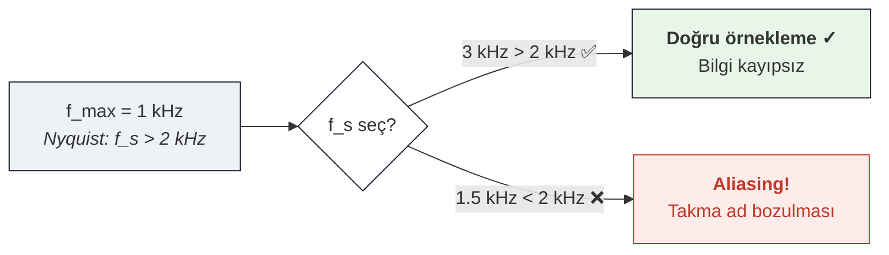

# 01 — Ayrık Zaman Sinyalleri ve Örnekleme (Teori)

← [[SSI Ana Sayfa]] | Örnekler: [[../Örnek Sorular/01 Örnekleme Örnekleri]]

## Özet

> $x[n]$: tam sayı indeksli dizi. Örnekleme teoremi: $f_s > 2f_{max}$ olmalı yoksa aliasing. Kuantizasyon: genliği de ayrıklaştırır.

---

## 1. Ayrık Zaman Sinyalleri — Temel Sinyaller

### Birim Dürtü ve Basamak

$$\delta[n] = \begin{cases}1 & n=0 \\ 0 & n\neq0\end{cases}, \qquad u[n] = \begin{cases}1 & n\geq0 \\ 0 & n<0\end{cases}$$

$$\delta[n] = u[n] - u[n-1], \qquad u[n] = \sum_{k=-\infty}^{n}\delta[k]$$

### Üstel Sinyal

$$x[n] = a^n u[n]$$

- $|a| < 1$: sönümlü ✅ kararlı
- $|a| > 1$: büyüyen ❌ kararsız
- $a$ karmaşık: $a = r e^{j\omega_0}$ → sinüzoidal × üstel

### Enerji ve Güç

$$E_\infty = \sum_{n=-\infty}^{\infty}|x[n]|^2, \qquad P_\infty = \lim_{N\to\infty}\frac{1}{2N+1}\sum_{n=-N}^{N}|x[n]|^2$$

---

## 2. Sistem Özellikleri

> [!tanim] Temel Testler (Sınavda Her Seferinde Uygula)

| Özellik                 | Test                                  | Bozucu Örnek                   |
| ----------------------- | ------------------------------------- | ------------------------------ |
| **Hafızasız**           | $y[n]$ sadece $x[n]$'e bağlı mı?      | $y[n]=x[n-1]$ → Hafızalı       |
| **Nedensellik**         | Gelecek: $x[n+k]$, $k>0$ var mı?      | $y[n]=x[n+1]$ → Nedensel değil |
| **Doğrusallik**         | Süperpozisyon + $x=0 \Rightarrow y=0$ | $y[n]=x^2[n]$ → Doğrusal değil |
| **Zamanla Değişmezlik** | Katsayıda $n$ var mı?                 | $y[n]=nx[n]$ → ZD değil        |
| **Kararlılık (BIBO)**   | $x\leq B_x$ → $y\leq B_y$             | $\sum[n]<\infty$ ↔ kararlı     |

> [!sinav] y[n] = nx[n] analizi
> - **Doğrusal**: $T\{ax_1+bx_2\} = n(ax_1+bx_2) = aTx_1+bTx_2$ ✅
> - **Zamanla Değişir**: $T\{x[n-n_0]\} = nx[n-n_0] \neq (n-n_0)x[n-n_0]$ ❌

---

## 3. Örnekleme Teoremi (Nyquist-Shannon)

> [!tanim] Nyquist Örnekleme Teoremi
> Maksimum frekansı $f_{max}$ olan bir bandlimitli sinyali **hatasız** yeniden oluşturmak için örnekleme frekansı şunu sağlamalı:
> $$f_s > 2f_{max}$$
> Nyquist frekansı: $f_N = f_s/2$

### Aliasing (Örtüşme)

$f_s < 2f_{max}$ olduğunda frekans bileşenleri birbirine örtüşür.

Gözlemlenen frekans:
$$f_{alias} = |f - k \cdot f_s|, \quad k \in \mathbb{Z}$$

### Örnekleme İlişkisi

$$x[n] = x_c(nT_s), \quad T_s = 1/f_s$$

Dijital açısal frekans: $\Omega = \omega T_s = 2\pi f/f_s$

---

## 4. Ders Tahtası — Arş. Gör. Ecmel TERZİ (SSI Dersi)

### Z-Dönüşümü Bağlantısı

Ayrık zaman sinyallerinin Z-dönüşümü üstel sinyal ilişkisi:

$$x[n] = a^n u[n] \implies X(z) = \frac{z}{z-a}, \quad |z| > |a|$$

- $|a| < 1$ ise hem $|z| > |a|$ bölgesi birim çemberi içerir → DTFT mevcut (Fourier dönüşümü var)
- $|a| \geq 1$ ise Fourier dönüşümü mevcut değil

**Z düzlemi:** $z = re^{j\omega}$, birim çember $r=1$

$$X(re^{j\omega}) = \mathcal{F}\{x[n] \cdot r^{-n}\}$$

### LCCDE ve Kayan Ortalama Filtre

Sabit katsayılı fark denklemi (FIR — sıfır kutuplu):

$$y[n] = \sum_{k=-N}^{M} b_k x[n-k] = b_{-N}x[n+N] + \cdots + b_0 x[n] + \cdots + b_M x[n-M]$$

**Kayan Ortalama (Moving Average) Filtre:**

$$y[n] = \frac{1}{N+M+1}\sum_{k=-N}^{M} x[n-k], \qquad b_k = \frac{1}{N+M+1}, \quad -N \leq k \leq M$$

İmpuls yanıtı ($x[n] = \delta[n]$ girişi):

$$h[n] = \frac{1}{N+M+1}\sum_{k=-N}^{M}\delta[n-k] \quad \text{(dikdörtgen pencere, -N'den M'ye kadar)}$$

Frekans yanıtı:

$$H(e^{j\omega}) = \frac{1}{N+M+1}\sum_{k=-N}^{M}e^{-j\omega k} = \frac{1}{N+M+1} \cdot e^{j\omega(N-M)/2} \cdot \frac{\sin\!\left[\omega(N+M+1)/2\right]}{\sin(\omega/2)}$$

> [!tanim] Kayan Ortalama Filtre
> Genlik bozumu (Genlik Spektrumu), Faz bozumu (Faz Spektrumu) olmayan ideal durumda alçak geçiren karakteristik.

---

## Bağlantılı Notlar

- [[02 Z-Dönüşümü]]
- [[../Örnek Sorular/01 Örnekleme Örnekleri]]
- [[../../Sİnyaller ve Sistemler/01 Sinyal Sınıflandırması|SS: Sinyal Sınıflandırması]]
- [[../../Sİnyaller ve Sistemler/02 LTI Sistemler ve Konvolüsyon|SS: LTI ve Konvolüsyon]]
