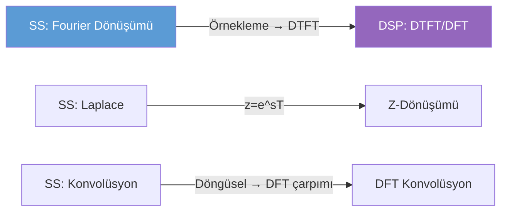

# 📡 Sayısal Sinyal İşleme — Ana Sayfa

← [[HOME]]

## Hızlı Özet

> DSP: ayrık zamanlı sinyallerin sayısal işlenmesi. Temel araç: **Z-dönüşümü** (Laplace'ın ayrık versiyonu) ve **DFT/FFT**.

---

## Konu Haritası

```mermaid
mindmap
  root((Sayısal Sinyal İşleme))
    Ayrık Zaman Sinyalleri
      x[n] gösterimi
      Örnekleme Teoremi
      Nyquist Frekansı
      Aliasing
    Z-Dönüşümü
      Tanım
      ROC
      Ters Z PFD
      Kutup-Sıfır
    DFT ve FFT
      DFT tanım N-noktalı
      Döngüsel Konvolüsyon
      FFT Butterfly
      Spektral Analiz
    Sayısal Filtre Tasarımı
      FIR vs IIR
      Pencere Metodu
      Bilineer Dönüşüm
      Butterworth Chebyshev
```

---

## Konular

| # | Konu | Bağlantı | Öncelik |
|---|------|----------|---------|
| 1 | Ayrık Zaman Sinyalleri & Örnekleme | [[01 Ayrık Zaman Sinyalleri ve Örnekleme]] | 🔴 |
| 2 | Z-Dönüşümü | [[02 Z-Dönüşümü]] | 🔴 |
| 3 | DFT ve FFT | [[03 DFT ve FFT]] | 🔴 |
| 4 | Sayısal Filtre Tasarımı | [[04 Sayısal Filtre Tasarımı]] | 🟡 |
| — | Formül Sayfası | [[SSI Formül Sayfası]] | ⭐ |

---

## SS ile Bağlantı



---

## Kaynaklar

- `DATASET/Sayısal Sinyal İşleme/Ecmel_notlar.pdf` — Temel sistem özellikleri + konvolüsyon + DTFT + Fourier Serisi
- `DATASET/Sayısal Sinyal İşleme/Sayısal Sinyal İşleme (DSP) Sınavı - Yazdırılabilir Sıkışık Formül Kartı.pdf`
- `DATASET/Sayısal Sinyal İşleme/sayisal_sinyal_isleme_ara_sinav.pdf` — Ara sınav soruları
- `DATASET/Sayısal Sinyal İşleme/Sinyal_Isleme_Bolum1_Matematiksel_Rapor.pdf`

## Sınav Kontrol Listesi

- [ ] Sistem özelliklerini (hafıza, nedensellik, doğrusal, ZD, kararlı) test edebiliyorum
- [ ] DT konvolüsyonu hesaplayabiliyorum
- [ ] DTFT çiftlerini ve ters DTFT'yi (PFD ile) yapabiliyorum
- [ ] Z-dönüşümü ve ters Z (PFD) yapabiliyorum
- [ ] DFT formülünü ve döngüsel konvolüsyonu yapabiliyorum
- [ ] Dikdörtgen pencere frekans yanıtını biliyorum
