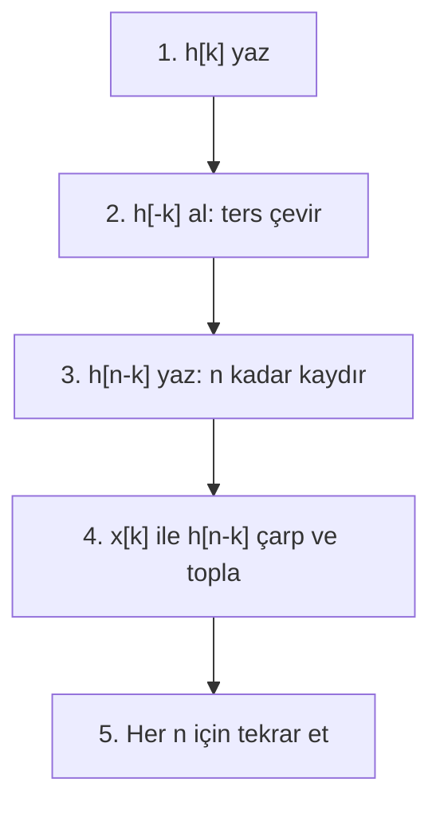

# 02 — LTI Sistemler ve Konvolüsyon

← [[SS Ana Sayfa]]

## Özet

> LTI = Doğrusal (Linear) + Zamanla Değişmez (Time-Invariant). Bu iki özellik bir araya gelince sistem tamamen **impuls yanıtı h(t)** ile tanımlanır ve konvolüsyon devreye girer.

---

## 1. Sistem Özellikleri — Hızlı Test Tablosu

| Özellik | Tanım | Test Yöntemi | Bozucu Örnekler |
|---------|-------|--------------|-----------------|
| **Hafızasız** | $y[n]$ sadece $x[n]$'e bağlı | Geçmiş/gelecek terim var mı? | $y[n]=x[n-1]$ → hafızalı |
| **Nedensellik** | $y[n]$ gelecek $x$ değerine bağlı değil | $x[n+k]$, $k>0$ var mı? | $y[n]=x[n+1]$ → nedensel değil |
| **Doğrusallik** | Süperpozisyon: $T\{ax_1+bx_2\}=ay_1+by_2$ | Kare/çarpım terimleri; sıfır girişe sıfır çıkış | $y[n]=x^2[n]$ → doğrusal değil |
| **Zamanla Değişmezlik** | $T\{x[n-n_0]\}=y[n-n_0]$ | Katsayıda bağımsız $n$ var mı? | $y[n]=nx[n]$ → ZD değil |
| **Kararlılık (BIBO)** | $\|x\|<B_x<\infty \Rightarrow \|y\|<B_y<\infty$ | $\sum|h[n]|<\infty$ mı? | Sonsuz birikimli sistem |

> [!sinav] LTI Testi — Sınavda Hızlı Yol
> 1. Sistemde $x[n+k]$ ($k>0$) var mı? → **Nedensel değil**
> 2. Sistemde $n \cdot x[n]$ var mı? → **Zamanla değişir**
> 3. Sistemde $x^2[n]$, $|x[n]|$ var mı? → **Doğrusal değil**
> 4. LTI ise: $\sum_{n=-\infty}^{\infty}|h[n]|<\infty$ → **Kararlı**

---

## 2. Konvolüsyon

### CT Konvolüsyon İntegrali

$$y(t) = x(t) * h(t) = \int_{-\infty}^{\infty} x(\tau)\,h(t-\tau)\,d\tau$$

### DT Konvolüsyon Toplamı

$$y[n] = x[n] * h[n] = \sum_{k=-\infty}^{\infty} x[k]\,h[n-k]$$

### Konvolüsyon Adımları (Grafik Yöntem)

### Önemli Konvolüsyon Özellikleri

| Özellik | İfade |
|---------|-------|
| Değişme | $x*h = h*x$ |
| Birleşme | $(x*h_1)*h_2 = x*(h_1*h_2)$ |
| Dağılma | $x*(h_1+h_2) = x*h_1 + x*h_2$ |
| Impuls | $x[n]*\delta[n] = x[n]$ |
| Kaydırılmış impuls | $x[n]*\delta[n-n_0] = x[n-n_0]$ |

### Boyut Kuralı

Eğer $x[n]$: $N_1 \le n \le N_2$ ve $h[n]$: $M_1 \le n \le M_2$ aralığında tanımlıysa:

$$y[n] \text{ tanım aralığı: } N_1+M_1 \le n \le N_2+M_2$$
$$\text{Uzunluk: } L_y = L_x + L_h - 1$$

---

## 3. Örnekler

### Örnek 1 — DT Konvolüsyon (Üstel)

**Soru:** $x[n] = a^n u[n]$, $h[n] = b^n u[n]$ ($a \neq b$) için $y[n]$ bul.

**Çözüm:**
$$y[n] = \sum_{k=0}^{n} a^k b^{n-k} = b^n \sum_{k=0}^{n} \left(\frac{a}{b}\right)^k = b^n \cdot \frac{1-(a/b)^{n+1}}{1-a/b}$$

$$\boxed{y[n] = \frac{a^{n+1} - b^{n+1}}{a-b}\,u[n]}$$

**Özel durum** $a = b$: $y[n] = (n+1)a^n u[n]$

### Örnek 2 — Sınav Sorusu (Oppenheim kitabından)

$x[n]$ belirli aralıkta tanımlı, $h[n] = u[n] - u[n-5]$ (dikdörtgen pencere):

$$y[n] = \sum_{k=0}^{4} x[n-k]$$

Bu bir **kayan ortalama (moving average)** filtredir.

### Örnek 3 — CT Konvolüsyon

$x(t) = u(t)$, $h(t) = e^{-at}u(t)$ ($a>0$):

$$y(t) = \int_0^t e^{-a\tau}d\tau = \frac{1-e^{-at}}{a}\,u(t)$$

---

## 4. Seri/Paralel Bağlantılar

**Seri (Cascade):** $h_{toplam}[n] = h_1[n] * h_2[n]$

**Paralel:** $h_{toplam}[n] = h_1[n] + h_2[n]$

---

## 5. Ders Tahtası — Arş. Gör. Ecmel TERZİ

### LTI Özdeger (Eigenvalue) Özelliği — İspat

> [!tanim] Temel Teorem
> LTI sisteme karmaşık üstel sinyal girilirse çıkış, **aynı frekans** ama $H(j\omega)$ ile ölçeklenmiş bir üsteldir:
> $$e^{j\omega t} \xrightarrow{\;h(t)\;} H(j\omega)\,e^{j\omega t}$$
> $H(j\omega) = \mathcal{F}\{h(t)\}$ sistemin **frekans yanıtı (transfer fonksiyonu)**dır.

**İspat** (konvolüsyon integrali ile):

$$y(t) = \int_{-\infty}^{\infty} x(t-z)\,h(z)\,dz = \int_{-\infty}^{\infty} e^{j\omega(t-z)}\,h(z)\,dz$$

$$= \int_{-\infty}^{\infty} e^{j\omega t}\,e^{-j\omega z}\,h(z)\,dz = e^{j\omega t}\underbrace{\int_{-\infty}^{\infty} h(z)\,e^{-j\omega z}\,dz}_{H(j\omega)}$$

$$\boxed{y(t) = H(j\omega)\,e^{j\omega t}}$$

---

### Fourier Serisi Girişi — Çıkış Formülü

Eğer $x(t) = \sum_{k=-\infty}^{\infty} a_k\,e^{jk\omega_0 t}$ ise her harmonik özdeger özelliğini karşılar:

$$\boxed{y(t) = \sum_{k=-\infty}^{\infty} a_k\,H(jk\omega_0)\,e^{jk\omega_0 t}}$$

Her harmonik katsayısı $H(jk\omega_0)$ ile çarpılır.

---

### Konvolüsyon Teoremi (Aperiodik Durum)

$x(t) = \dfrac{1}{2\pi}\int_{-\infty}^{\infty} X(j\omega)\,e^{j\omega t}\,d\omega$ olduğundan, LTI çıkışı:

$$y(t) = \frac{1}{2\pi}\int_{-\infty}^{\infty} X(j\omega)\,H(j\omega)\,e^{j\omega t}\,d\omega$$

$$\boxed{Y(j\omega) = X(j\omega)\cdot H(j\omega)}$$

> [!sinav] Konvolüsyon ↔ Çarpım
> Zaman domeninde konvolüsyon → frekans domeninde çarpım.
> $H(j\omega) = Y(j\omega)/X(j\omega)$ → sistemin frekans yanıtı.

---

### Frekans Domeninde Ters Analiz — Örnek

**Problem:** $H(j\omega) = \dfrac{1}{j\omega+3}$, $y(t) = e^{-t}u(t) - e^{-4t}u(t)$ verildiğinde $x(t) = ?$

**Adım 1** — $Y(j\omega)$:
$$Y(j\omega) = \frac{1}{j\omega+1} - \frac{1}{j\omega+4}$$

**Adım 2** — $X(j\omega) = Y(j\omega)/H(j\omega) = Y(j\omega)\cdot(j\omega+3)$:
$$X(j\omega) = \frac{j\omega+3}{j\omega+1} - \frac{j\omega+3}{j\omega+4}$$

**Adım 3** — Kısmi kesir ayrıştırma:
$$\frac{j\omega+3}{j\omega+1} = 1 + \frac{2}{j\omega+1}, \qquad \frac{j\omega+3}{j\omega+4} = 1 - \frac{1}{j\omega+4}$$

$$X(j\omega) = \frac{2}{j\omega+1} + \frac{1}{j\omega+4}$$

$$\boxed{x(t) = 2e^{-t}u(t) + e^{-4t}u(t)}$$

---

### Genlik Modülasyonu — Frekans Kaydırma

$$z(t) = x(t)\cdot\cos(\omega_c t) \;\longleftrightarrow\; Z(j\omega) = \frac{1}{2}\!\left[X\!\left(j(\omega-\omega_c)\right) + X\!\left(j(\omega+\omega_c)\right)\right]$$

**İspat:** $\cos(\omega_c t) = \tfrac{1}{2}(e^{j\omega_c t}+e^{-j\omega_c t})$, frekans kaydırma özelliğinden:
$$Z(j\omega) = \frac{1}{2\pi}X(j\omega)*\pi\left[\delta(\omega-\omega_c)+\delta(\omega+\omega_c)\right] = \frac{1}{2}\left[X(j(\omega-\omega_c))+X(j(\omega+\omega_c))\right]$$

Sonuç: Zaman domeninde $\cos$ ile çarpım → frekans spektrumunu $\pm\omega_c$'ye kaydırır ve ½ ile ölçekler.

---

### Temel CTFT Türetimleri

*Tablolar ve detaylar için: [[04 Fourier Dönüşümü]]*

**$\mathcal{F}\{\delta(t)\} = 1$:** Delta fonksiyonunun örnekleme özelliğinden doğrudan:
$$X(j\omega) = \int_{-\infty}^{\infty}\delta(t)\,e^{-j\omega t}\,dt = e^{0} = 1$$

**$\mathcal{F}\{e^{-at}u(t)\} = \dfrac{1}{a+j\omega}$ ($a > 0$):**
$$X(j\omega) = \int_0^{\infty}e^{-(a+j\omega)t}\,dt = \left[-\frac{e^{-(a+j\omega)t}}{a+j\omega}\right]_0^{\infty} = \frac{1}{a+j\omega}$$

$$|X(j\omega)| = \frac{1}{\sqrt{a^2+\omega^2}}, \qquad \angle X(j\omega) = -\arctan\!\left(\frac{\omega}{a}\right)$$

**$\mathcal{F}\{\mathrm{rect}_{[-T,T]}\} = 2T\,\mathrm{sinc}(\omega T/\pi)$:**
$$X(j\omega) = \int_{-T}^{T}e^{-j\omega t}\,dt = \frac{2\sin(\omega T)}{\omega}$$

**İdeal LP filtre ters FT** — $X(j\omega) = 1$ için $|\omega| \leq \omega_c$:
$$x(t) = \frac{1}{2\pi}\int_{-\omega_c}^{\omega_c}e^{j\omega t}\,d\omega = \frac{\sin(\omega_c t)}{\pi t} = \frac{\omega_c}{\pi}\,\mathrm{sinc}\!\left(\frac{\omega_c t}{\pi}\right)$$

---

### Fourier Serisi Katsayıları — Örnek

*Fourier serisi detayları için: [[03 Fourier Serisi]]*

$$x(t) = 1 + \sin(\omega_0 t) + 2\cos(\omega_0 t) + \cos\!\left(2\omega_0 t + \tfrac{\pi}{4}\right)$$

Euler özdeşlikleri kullanılarak karmaşık üstel forma dönüştürülür ve $a_k$ katsayıları:

| $k$ | $a_k$ | $|a_k|$ | $\angle a_k$ |
|-----|-------|---------|-------------|
| $0$ | $1$ | $1$ | $0$ |
| $+1$ | $1 - j/2$ | $\sqrt{5}/2$ | $-\arctan(1/2)$ |
| $-1$ | $1 + j/2$ | $\sqrt{5}/2$ | $+\arctan(1/2)$ |
| $+2$ | $e^{j\pi/4}/2$ | $1/2$ | $+\pi/4$ |
| $-2$ | $e^{-j\pi/4}/2$ | $1/2$ | $-\pi/4$ |

Gerçek $x(t)$ için $a_{-k} = a_k^*$ (büyüklük çift, faz tek simetri).

---

## Bağlantılı Notlar

- [[01 Sinyal Sınıflandırması]]
- [[03 Fourier Serisi]]
- [[../Sayısal Sinyal İşleme/02 Z-Dönüşümü|SSİ: Z-Dönüşümü]]
