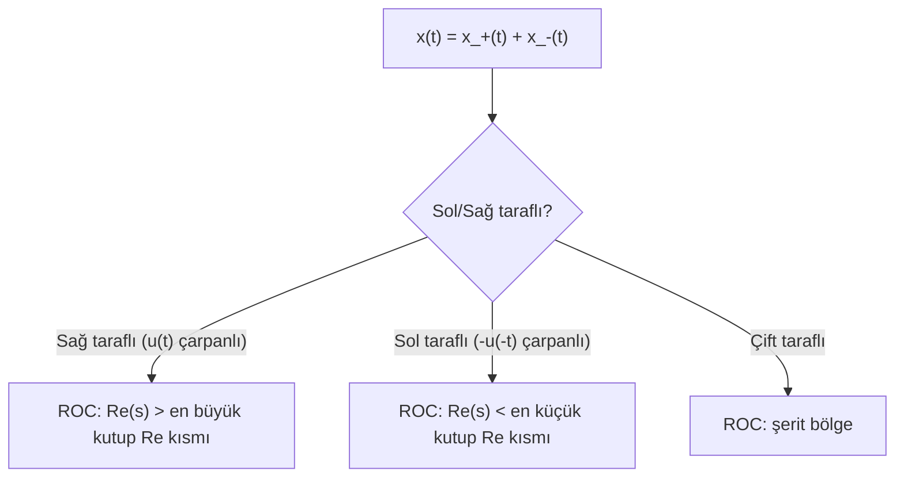

# 05 — Laplace Dönüşümü

← [[SS Ana Sayfa]]

## Özet

> Laplace, Fourier'in genellemesi: $s = \sigma + j\omega$. ROC kritik — sistem kararlılığını belirler. Transfer fonksiyonu $H(s) = Y(s)/X(s)$.

---

## 1. Tanım

### Çift Taraflı (Bilateral) Laplace

$$\boxed{\mathcal{L}\{x(t)\} = X(s) = \int_{-\infty}^{\infty} x(t)\, e^{-st}\, dt, \quad s = \sigma + j\omega}$$

### Tek Taraflı (Unilateral) Laplace

$$X(s) = \int_{0^-}^{\infty} x(t)\, e^{-st}\, dt$$

> Başlangıç koşulları varsa tek taraflı kullanılır.

### Ters Laplace (PFD Yöntemi)

$$x(t) = \mathcal{L}^{-1}\{X(s)\} = \frac{1}{2\pi j} \int_{\sigma-j\infty}^{\sigma+j\infty} X(s)\, e^{st}\, ds$$

Pratikte: **Kısmi Kesirler Ayrışımı (PFD)** + tablo.

---

## 2. Yakınsama Bölgesi (ROC)

> [!tanim] ROC (Region of Convergence)
> Laplace dönüşümünün anlamlı olduğu $s$ düzlemindeki bölge: $\text{Re}(s) > \sigma_0$ şeklinde yarı düzlem.

### ROC Kuralları

### ROC ve Kararlılık

| Sistem türü | ROC koşulu |
|-------------|-----------|
| Nedensel + kararlı | ROC, $j\omega$ eksenini içermeli, sağ yarı düzlemde kutup yok |
| Anti-nedensel | ROC sol yarı düzlem |

---

## 3. Temel Laplace Çiftleri

| $x(t)$ | $X(s)$ | ROC |
|--------|--------|-----|
| $\delta(t)$ | $1$ | Tüm $s$ |
| $u(t)$ | $\dfrac{1}{s}$ | $\text{Re}(s)>0$ |
| $e^{-at}u(t)$ | $\dfrac{1}{s+a}$ | $\text{Re}(s)>-a$ |
| $te^{-at}u(t)$ | $\dfrac{1}{(s+a)^2}$ | $\text{Re}(s)>-a$ |
| $t^n e^{-at}u(t)$ | $\dfrac{n!}{(s+a)^{n+1}}$ | $\text{Re}(s)>-a$ |
| $\sin(\omega_0 t)u(t)$ | $\dfrac{\omega_0}{s^2+\omega_0^2}$ | $\text{Re}(s)>0$ |
| $\cos(\omega_0 t)u(t)$ | $\dfrac{s}{s^2+\omega_0^2}$ | $\text{Re}(s)>0$ |
| $e^{-at}\sin(\omega_0 t)u(t)$ | $\dfrac{\omega_0}{(s+a)^2+\omega_0^2}$ | $\text{Re}(s)>-a$ |
| $e^{-at}\cos(\omega_0 t)u(t)$ | $\dfrac{s+a}{(s+a)^2+\omega_0^2}$ | $\text{Re}(s)>-a$ |

---

## 4. Laplace Özellikleri

| Özellik | $x(t) \leftrightarrow X(s)$ |
|---------|----------------------------|
| Doğrusallik | $ax+by \leftrightarrow aX+bY$ |
| Zaman kayması | $x(t-t_0)u(t-t_0) \leftrightarrow e^{-st_0}X(s)$ |
| Frekans kayması | $e^{s_0 t}x(t) \leftrightarrow X(s-s_0)$ |
| Zaman ölçekleme | $x(at) \leftrightarrow \frac{1}{|a|}X(s/a)$ |
| Türev | $x'(t) \leftrightarrow sX(s) - x(0^-)$ |
| $n$. türev | $x^{(n)}(t) \leftrightarrow s^n X(s) - s^{n-1}x(0^-) - \cdots$ |
| İntegral | $\int_{0^-}^t x d\tau \leftrightarrow \frac{X(s)}{s}$ |
| Konvolüsyon | $x*h \leftrightarrow X \cdot H$ |
| **Başlangıç değer** | $x(0^+) = \lim_{s\to\infty} sX(s)$ |
| **Son değer** | $x(\infty) = \lim_{s\to 0} sX(s)$ (kararlı sistemler için) |

---

## 5. Kısmi Kesirler Ayrışımı (PFD)

$$X(s) = \frac{N(s)}{D(s)} = \frac{A_1}{s-p_1} + \frac{A_2}{s-p_2} + \cdots$$

### Basit Kutuplar

$$A_i = \lim_{s \to p_i} (s-p_i)\,X(s)$$

### Tekrarlı Kutuplar ($m$. dereceden $p_i$)

$$A_{i,k} = \frac{1}{(m-k)!} \frac{d^{m-k}}{ds^{m-k}}\left[(s-p_i)^m X(s)\right]\bigg|_{s=p_i}$$

### Örnek

$$X(s) = \frac{s+3}{(s+1)(s+2)} = \frac{A}{s+1} + \frac{B}{s+2}$$

$A = \left.\frac{s+3}{s+2}\right|_{s=-1} = \frac{2}{1} = 2$

$B = \left.\frac{s+3}{s+1}\right|_{s=-2} = \frac{1}{-1} = -1$

$x(t) = (2e^{-t} - e^{-2t})u(t)$

---

## 6. Transfer Fonksiyonu

LTI sistem ODE'si Laplace ile:

$$\frac{d^n y}{dt^n} + \cdots + a_0 y = b_m \frac{d^m x}{dt^m} + \cdots + b_0 x$$

$$H(s) = \frac{Y(s)}{X(s)} = \frac{b_m s^m + \cdots + b_0}{s^n + \cdots + a_0}$$

### Kutup-Sıfır Analizi

- **Kutuplar** ($D(s)=0$): sistemin doğal frekansları
- **Sıfırlar** ($N(s)=0$): sistemin sönümlediği frekanslar
- Nedensel kararlı sistem: tüm kutuplar sol yarı $s$ düzleminde

> [!sinav] Kararlılık Kuralı
> Transfer fonksiyonu $H(s)$: tüm kutupların gerçek kısmı $< 0$ ise **kararlı**. ROC, $j\omega$ eksenini içeriyorsa Fourier dönüşümü var → frekans yanıtı mevcut.

---

## 7. Z-Dönüşümü ile İlişki

$$z = e^{sT} \qquad (T: \text{örnekleme periyodu})$$

$j\omega$ ekseni → birim çember ($|z|=1$), sol yarı $s$ düzlemi → birim çemberin içi.

→ [[../Sayısal Sinyal İşleme/02 Z-Dönüşümü|SSİ: Z-Dönüşümü]]

---

## Bağlantılı Notlar

- [[04 Fourier Dönüşümü]]
- [[../Otomatik Kontrol/OK Ana Sayfa|OK: Transfer Fonksiyonu]]
- [[MST Ana Sayfa|MST&B: Durum Uzayı]]
