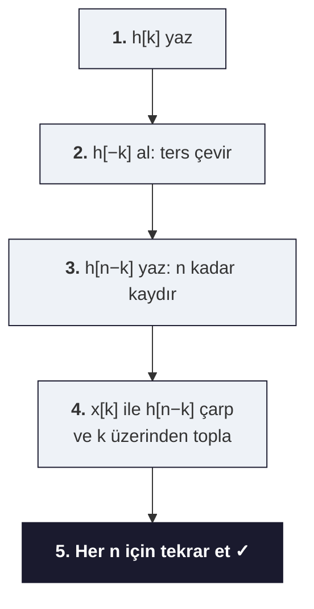

# 02 — LTI Sistemler ve Konvolüsyon

← [[SS Ana Sayfa]]  |  Örnekler: [[../Örnek Sorular/02 LTI Örnekleri]]

## Özet

> LTI = Doğrusal (Linear) + Zamanla Değişmez (Time-Invariant). Bu iki özellik bir araya gelince sistem tamamen **impuls yanıtı h(t)** ile tanımlanır ve konvolüsyon devreye girer.

> [!abstract] 🔰 Sıfırdan: Kısaltmalar, Semboller, Sezgi
> **Sistem nedir?** Giriş sinyalini $x$ alıp çıkış sinyali $y$ üreten kutu: $y=T\{x\}$.
>
> | Kısaltma / sembol | Açılım (İng.) | Türkçe / anlamı |
> |---|---|---|
> | **LTI** | Linear Time-Invariant | **Doğrusal & Zamanla-değişmez** |
> | **BIBO** | Bounded-Input Bounded-Output | **Sınırlı giriş → sınırlı çıkış** (kararlılık ölçütü) |
> | **TI / ZD** | Time-Invariant | **Zamanla-değişmez** |
> | $h(t),\ h[n]$ | impulse response | **dürtü yanıtı**: girişe $\delta$ verince çıkış |
> | $*$ | convolution | **konvolüsyon (evrişim)** |
> | $\delta$ | impulse | **birim dürtü** ("iğne") |
> | $T\{\cdot\}$ | transformation | sistemin giriş→çıkış işlemi |
>
> **Doğrusallık (superposition):** $T\{a x_1+b x_2\}=a\,T\{x_1\}+b\,T\{x_2\}$. "Girişleri ayrı ayrı geçir, topla — aynı sonucu verir."
> **Zamanla-değişmezlik:** girişi geciktirince çıkış da aynı kadar gecikir, şekli değişmez.
>
> **Konvolüsyon nereden geliyor?** Her giriş sinyali kaydırılmış dürtülerin toplamı olarak yazılabilir: $x[n]=\sum_k x[k]\,\delta[n-k]$. Sistem **doğrusal** olduğu için her dürtünün yanıtını ($x[k]\,h[n-k]$) toplayabiliriz; **zamanla-değişmez** olduğu için her dürtünün yanıtı aynı $h$'nin kaydırılmışıdır. İkisi birleşince: $y[n]=\sum_k x[k]\,h[n-k]=x*h$. **İşte konvolüsyon bu yüzden LTI sistemin tek formülüdür.**

---

## 1. Sistem Özellikleri — Hızlı Test Tablosu

| Özellik                 | Tanım                                           | Test Yöntemi                                    | Bozucu Örnekler                |
| ----------------------- | ----------------------------------------------- | ----------------------------------------------- | ------------------------------ |
| **Hafızasız**           | $y[n]$ sadece $x[n]$'e bağlı                    | Geçmiş/gelecek terim var mı?                    | $y[n]=x[n-1]$ → hafızalı       |
| **Nedensellik**         | $y[n]$ gelecek $x$ değerine bağlı değil         | $x[n+k]$, $k>0$ var mı?                         | $y[n]=x[n+1]$ → nedensel değil |
| **Doğrusallik**         | Süperpozisyon: $T\{ax_1+bx_2\}=ay_1+by_2$       | Kare/çarpım terimleri; sıfır girişe sıfır çıkış | $y[n]=x^2[n]$ → doğrusal değil |
| **Zamanla Değişmezlik** | $T\{x[n-n_0]\}=y[n-n_0]$                        | Katsayıda bağımsız $n$ var mı?                  | $y[n]=nx[n]$ → ZD değil        |
| **Kararlılık (BIBO)**   | $\|x\|<B_x<\infty \Rightarrow \|y\|<B_y<\infty$ | $\sum h[n]<\infty$ mı?                          | Sonsuz birikimli sistem        |

> [!sinav] LTI Testi — Sınavda Hızlı Yol
> 1. Sistemde $x[n+k]$ ($k>0$) var mı? → **Nedensel değil**
> 2. Sistemde $n \cdot x[n]$ var mı? → **Zamanla değişir**
> 3. Sistemde $x^2[n]$, $|x[n]|$ var mı? → **Doğrusal değil**
> 4. LTI ise: $\sum_{n=-\infty}^{\infty}|h[n]|<\infty$ → **Kararlı**

---

## 2. Konvolüsyon

### CT Konvolüsyon İntegrali

$$y(t) = x(t) * h(t) = \int_{-\infty}^{\infty} x(\tau)\,h(t-\tau)\,d\tau$$

### DT Konvolüsyon Toplamı

$$y[n] = x[n] * h[n] = \sum_{k=-\infty}^{\infty} x[k]\,h[n-k]$$

### Konvolüsyon Adımları (Grafik Yöntem)

*$y[n] = \sum_k x[k]\cdot h[n-k] = x[n] * h[n]$*

### Önemli Konvolüsyon Özellikleri

| Özellik | İfade |
|---------|-------|
| Değişme | $x*h = h*x$ |
| Birleşme | $(x*h_1)*h_2 = x*(h_1*h_2)$ |
| Dağılma | $x*(h_1+h_2) = x*h_1 + x*h_2$ |
| İmpuls | $x[n]*\delta[n] = x[n]$ |
| Kaydırılmış impuls | $x[n]*\delta[n-n_0] = x[n-n_0]$ |

### Boyut Kuralı

Eğer $x[n]$: $N_1 \le n \le N_2$ ve $h[n]$: $M_1 \le n \le M_2$ aralığında tanımlıysa:

$$y[n] \text{ tanım aralığı: } N_1+M_1 \le n \le N_2+M_2$$
$$\text{Uzunluk: } L_y = L_x + L_h - 1$$

---

## 3. LTI Özdeger (Eigenvalue) Özelliği

LTI sisteme karmaşık üstel sinyal girilirse çıkış **aynı frekans**ta, $H(j\omega)$ ile ölçeklenmiş bir üsteldir:

$$e^{j\omega t} \xrightarrow{\;h(t)\;} H(j\omega)\,e^{j\omega t}$$

$H(j\omega) = \mathcal{F}\{h(t)\}$ sistemin **frekans yanıtı (transfer fonksiyonu)**dır.

Fourier serisi girişi $x(t) = \sum_k a_k e^{jk\omega_0 t}$ için çıkış:

$$y(t) = \sum_{k=-\infty}^{\infty} a_k\,H(jk\omega_0)\,e^{jk\omega_0 t}$$

---

## 4. Seri/Paralel Bağlantılar

**Seri (Cascade):** $h_{toplam}[n] = h_1[n] * h_2[n]$

**Paralel:** $h_{toplam}[n] = h_1[n] + h_2[n]$

---

## 5. Frekans Domeninde Sistem Analizi

$$\boxed{Y(j\omega) = X(j\omega)\cdot H(j\omega)}$$

$H(j\omega) = Y(j\omega)/X(j\omega)$ → sistemin frekans yanıtı.

Fark denkleminden $H$:
- Her gecikme $x[n-k]$ → $e^{-j\omega k}X(e^{j\omega})$
- Denklemdeki tüm terimleri dönüştür, $H = Y/X$ çek.

---

## Bağlantılı Notlar

- [[../Örnek Sorular/02 LTI Örnekleri|Örnek Sorular — LTI ve Konvolüsyon]]
- [[01 Sinyal Sınıflandırması]]
- [[03 Fourier Serisi]]
