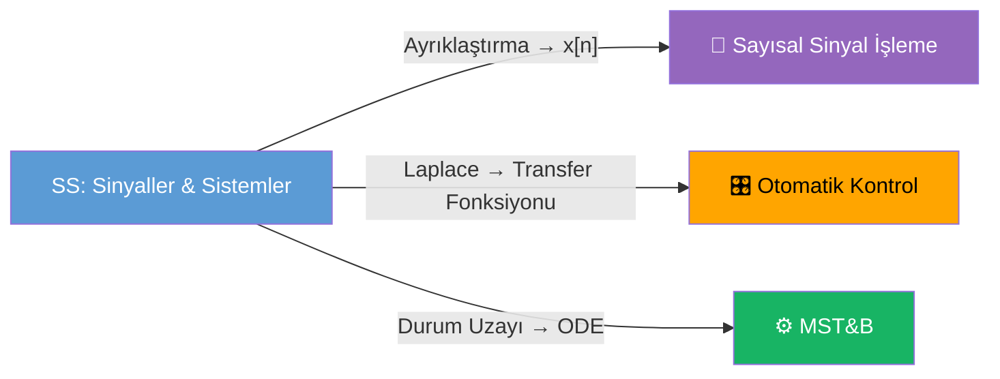

# 〰️ Sinyaller ve Sistemler — Ana Sayfa

← [[HOME]]

## Hızlı Özet

> Sinyaller & Sistemler: zamanın fonksiyonu olan işaretlerin matematiksel analizi. Temel araç: **Fourier** ve **Laplace** dönüşümleri.

---

## Sınav Kapsamı (Bütünleme)

> [!warning] Kapsam — Oppenheim kitabı bölüm bazlı
> - **Bölüm 1** — Tamamı (Sinyaller ve Sistemler)
> - **Bölüm 2** — 2.5 (Tekillik Fonksiyonları) **hariç**
> - **Bölüm 3** — **3.6'ya kadar** dahil (3.7+ yok)
> - **Bölüm 4** — **4.5'e kadar** dahil (Çarpma Özelliği) (4.6+ yok)
> - **Laplace yok · DTFT (Bölüm 5) yok · Z-dönüşümü yok**

---

## Konu Haritası

```mermaid
mindmap
  root((Sinyaller ve Sistemler))
    Sinyal Sınıflandırması
      CT x(t) / DT x[n]
      Enerji / Güç
      Periyodik / Aperiodik
      Çift / Tek
      Temel Sinyaller δ u ramp
    LTI Sistemler
      Doğrusallik
      Zamanla Değişmezlik
      Nedensellik
      Kararlılık
      Konvolüsyon
    Fourier Serisi
      CTFS katsayıları
      DTFS katsayıları
      Parseval
    Fourier Dönüşümü
      CTFT
      DTFT
      Özellikler
    Laplace Dönüşümü
      ROC
      PFD
      Transfer Fonksiyonu
```

---

## Konular

### Konu Anlatımları

| # | Konu | Bağlantı | Öncelik | Kapsam |
|---|------|----------|---------|--------|
| 1 | Sinyal Sınıflandırması | [[Konu Anlatımları/01 Sinyal Sınıflandırması]] | 🔴 | Tam |
| 2 | LTI Sistemler & Konvolüsyon | [[Konu Anlatımları/02 LTI Sistemler ve Konvolüsyon]] | 🔴 | 2.5 hariç |
| 3 | Fourier Serisi | [[Konu Anlatımları/03 Fourier Serisi]] | 🔴 | 3.6'ya kadar |
| 4 | Fourier Dönüşümü (CTFT) | [[Konu Anlatımları/04 Fourier Dönüşümü]] | 🔴 | 4.5'e kadar |
| ~~5~~ | ~~Laplace Dönüşümü~~ | — | ~~—~~ | **Kapsam dışı** |

### Örnek Sorular

| # | Konu | Bağlantı |
|---|------|----------|
| 1 | Sinyal Örnekleri | [[Örnek Sorular/01 Sinyal Örnekleri]] |
| 2 | LTI & Konvolüsyon Örnekleri | [[Örnek Sorular/02 LTI Örnekleri]] |
| 3 | Fourier Serisi Örnekleri | [[Örnek Sorular/03 Fourier Serisi Örnekleri]] |
| 4 | Fourier Dönüşümü Örnekleri | [[Örnek Sorular/04 Fourier Dönüşümü Örnekleri]] |

### Diğer

| Dosya | Bağlantı |
|-------|----------|
| Formül Sayfası | [[SS Formül Sayfası]] |
| Sınav Gecesi Özeti | [[SS Sınav Gecesi]] |

---

## Diğer Derslerle Bağlantı



---

## Sınav Kontrol Listesi

- [ ] Sinyal enerji/güç hesabı yapabiliyorum
- [ ] CT/DT konvolüsyon hesaplayabiliyorum
- [ ] Fourier serisi katsayılarını bulabiliyorum
- [ ] CTFT/DTFT çiftlerini biliyorum
- [ ] Laplace ile transfer fonksiyonu çıkarabiliyorum
- [ ] PFD (kısmi kesirler) yapabiliyorum
- [ ] ROC belirleyebiliyorum

---

## Kaynaklar

| Kaynak | Açıklama | Erişim |
|--------|----------|--------|
| **Dr. Cahit Karakuş (2018)** | CT/DT sinyal, enerji/güç, Fourier, Laplace, Z, MATLAB örnekleri — 240 sayfa | `DATASET/Sinyaller Ve Sistemler/Dr_Cahit_Karakus_SinyallerSistemler_2018.pdf` |
| Oppenheim 2nd Ed. | Klasik İngilizce ders kitabı | `DATASET/Sinyaller Ve Sistemler/Signals_and_Systems_2nd_Edition_by_Oppen.pdf` |
| Ders Notu (taranmış) | Türkçe ders notu | `DATASET/Sinyaller Ve Sistemler/SinyallerveSistemlerDersNotu.pdf` |
| Cevap Anahtarı 2026 | Sınav soruları + çözümler | `DATASET/Sinyaller Ve Sistemler/sinyaller ve sistemler cevap anahtarı_260613_195039.pdf` |
| Ankara Üni. DSP Açık Ders | 14 haftalık Türkçe kurs | [acikders.ankara.edu.tr](https://acikders.ankara.edu.tr/course/view.php?id=837) |

> **Dr. Karakuş notundaki önemli bölümler:**
> - Bölüm 1.1: Periyodik sinyaller → `T1/T2` rasyonel sayı testi
> - Bölüm 1.2: Enerji/Güç sinyalleri → E∞ ve P∞ formülleri + 7 alıştırma
> - Bölüm 3: Fourier transform (MATLAB uygulamalı)
> - Bölüm 4: Laplace transform (özellikler + diferansiyel denklem çözümü)
> - Bölüm 5: Z-dönüşümü (ters Z-dönüşüm dahil)
> - Bölüm 7: Konvolüsyon

[[../Sayısal Sinyal İşleme/SSI Ana Sayfa|SSİ ← bağlantılı ders]] · [[../00 Dış Kaynaklar ve MSÜ Rehberi|Tüm Dış Kaynaklar]]
